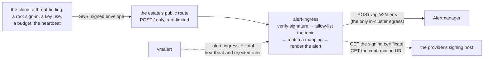

# alert-ingress: events born outside the cluster

Design for `cmd/alert-ingress` and `charts/alert-ingress`: a small HTTP
service that turns a cloud provider's signed notifications into alerts in
the same Alertmanager everything else reaches a person through. The image
is `ghcr.io/truvity/observability/alert-ingress`, built by this
repository's release at the chart's own tag; `image.tag` left empty pulls
the matching build.



## The problem it closes

Some events an estate must hear about are born in the cloud provider,
not in a cluster: a threat-detection finding, a sign-in to the root
account, a signing operation on a key that should never sign, a budget
crossing its line. The provider will publish each to a topic. What it
will not do is route them through the same tree, with the same
silences, grouping and channels, as everything the cluster raises.

The alternatives are all a second router: the provider's own chat
integration (one channel per configuration, raw payloads for anything it
does not natively format), a serverless function per event (code in the
provider's runtime that nobody tests), or email (a route that cannot be
proven to deliver). Each is a second place an alert can go and a second
place a silence has to be kept. The design here has one router, and
reduces the cloud to "POST JSON at us".

## The shape

A small HTTP service, one container, behind a public route the estate's
edge provides. It knows two things: the envelope a cloud notification
service wraps a message in, and Alertmanager's `POST /api/v2/alerts`.
It knows nothing about the estate.

```yaml
# charts/alert-ingress values
alertmanager:
  url: http://vmalertmanager-observability-stack.observability.svc:9093

# The NetworkPolicy is on by default and names Alertmanager's pods as the
# one in-cluster egress; it is refused empty while the policy is on.
networkPolicy:
  alertmanagerPeer:
    - podSelector:
        matchLabels: {app.kubernetes.io/name: vmalertmanager}

# Topics this receiver will confirm a subscription from. A public
# endpoint that confirms anything can be subscribed to anyone's topic
# and fed alerts, so this list is required and refused empty.
topics:
  - "<the security-alerts topic ARN>"
  - "<the budgets topic ARN>"

# Mapping rules, in order; the first whose `match` and `matchRegex` hold
# is applied. `match` is a set of JSON-path equalities against the message
# body; `matchRegex` is a set of RE2 patterns searched in the text at a
# path. The signed envelope is under `_sns` (see "What a mapping can read").
# `alert` fields are Go templates over the same data.
mappings:
  - name: guardduty
    match: {"detail-type": "GuardDuty Finding"}
    alert:
      alertname: CloudSecurityFinding
      severity: '{{ if atLeast .detail.severity 7 }}critical{{ else }}warning{{ end }}'
      labels:
        source: guardduty
        k8s_cluster_name: cloud            # so the routing tree has a key to route on
        account: '{{ .account }}'          # what tells two findings apart: Alertmanager
        region: '{{ .region }}'            # de-duplicates on the whole label set
        finding_type: '{{ .detail.type }}'
        finding_id: '{{ .detail.id }}'
      annotations:
        summary: '{{ .detail.title }}'
        runbook: cloud-security-finding
  - name: root-login
    match: {"detail-type": "AWS Console Sign In via CloudTrail", "detail.userIdentity.type": "Root"}
    alert: {alertname: RootConsoleLogin, severity: critical, labels: {source: cloudtrail, k8s_cluster_name: cloud}}
  - name: budget
    match: {"_sns.TopicArn": "<the budgets topic ARN>"}
    matchRegex: {"_sns.Message": "Budget Name: "}   # plain text, not JSON
    alert:
      alertname: CloudBudgetThreshold
      severity: warning
      labels:
        source: budgets
        k8s_cluster_name: cloud
        topic: '{{ ._sns.TopicArn }}'
        subject: '{{ ._sns.Subject }}'
        budget_name: '{{ reFind "Budget Name: (\\S+)" ._sns.Message }}'
      annotations: {summary: '{{ ._sns.Subject }}', text: '{{ ._sns.Message }}'}
  - name: cost-anomaly
    match: {"_sns.TopicArn": "<the cost anomaly topic ARN>", "anomalyId": "*"}
    alert:
      alertname: CloudCostAnomaly
      severity: warning
      labels:
        source: cost-anomaly
        k8s_cluster_name: cloud
        monitor_name: '{{ .dimensionalValue }}'
        account_id: '{{ .accountId }}'
      annotations:
        summary: '{{ ._sns.Subject }}'
        impact: '{{ .impact.totalImpact }}'
        details: '{{ .anomalyDetailsLink }}'

# Optional: make CloudEventUnmapped routable. Static strings added to every
# such alert (never templates); `severity` empty means warning.
unmapped:
  severity: warning
  labels:
    k8s_cluster_name: cloud

# The heartbeat: a scheduled event the estate publishes through the same
# path, and the rule that fires when it stops arriving.
heartbeat:
  match: {"source": "alert-ingress-heartbeat"}
  interval: 15m
```

`k8s_cluster_name` on a cloud alert is not a cluster; it is the routing
key the tree groups and routes on, and `cloud` (or whatever the estate
names it) is how those alerts get their own channel without a second
tree. The chart documents this rather than inventing a second label.

`CloudEventUnmapped` would otherwise carry nothing but `alertname` and
`severity: warning`, so a tree that routes cloud alerts on that key would
never see it. `unmapped.labels` adds the same key (or any others) to every
such alert. Names must be Prometheus label names; `alertname` and `severity`
are refused (the latter is `unmapped.severity`), as are names starting with
`__`. Left at the default, nothing changes.

## What a mapping can read

`match`, `matchRegex` and every `alert` template see one object: the
message's own JSON (the envelope's `Message` field, parsed one level;
empty when the text is not a JSON object) plus the signed envelope under
`_sns`:

| Path | Value |
|---|---|
| `_sns.TopicArn` | the topic the message was published to |
| `_sns.Subject` | the subject, empty if the publisher set none |
| `_sns.Message` | the raw `Message` text, whatever it is |
| `_sns.MessageId`, `_sns.Type` | the envelope's own fields |

`_sns` is written after the body is parsed, so a message cannot forge it by
carrying a key of that name. That is what makes plain-text publishers
(budget notifications, alarm notifications on a custody topic) matchable:
select the topic with `match: {"_sns.TopicArn": ...}` and the text with
`matchRegex: {"_sns.Message": "..."}`. Patterns are RE2, searched
(unanchored) in the text, and compiled when the configuration loads; one
that does not compile is refused at start.

Labels are templates, so they are how distinct findings stay distinct: a
GuardDuty finding's `account`, `region`, `detail.type` and `detail.id` in
the labels make two findings two alerts, where a fixed label set would
collapse them into one that Alertmanager de-duplicates. Template helpers
beyond Go's builtins: `atLeast VALUE THRESHOLD` (numeric `>=`; int, float
or numeric string; an absent value is false, a non-numeric one fails the
render and the message becomes `CloudEventUnmapped`), `num VALUE`, and
`reFind PATTERN TEXT` (the first capture group of the first RE2 match, the
whole match if the pattern has no group, and `""` when nothing matches, so a
reworded publisher degrades one label instead of failing the render).

## AWS Budgets and Cost Anomaly Detection

Both publish to an SNS topic in the account that owns the budget or the
monitor, and both reach this receiver through the mappings above. Allow-list
each topic ARN under `topics`.

**Budgets** publishes a plain-text `Message` (not JSON) with a Subject of the
form `AWS Budgets: <budget name> has exceeded your alert threshold`. AWS does
not document the body layout as a contract; in practice it carries
`Budget Name:`, `Budget Type:`, `Budgeted Amount:`, `Alert Type:`,
`Alert Threshold:` and `ACTUAL Amount:` / `FORECASTED Amount:` lines. The
`budget` mapping above therefore keys on the topic and a loose
`Budget Name: ` substring, and carries the topic and Subject as labels, which
are reliable; `budget_name` comes from `reFind` and is empty rather than
wrong if the text ever changes. Drop the `matchRegex` line if the topic only
ever carries budgets.

**Cost Anomaly Detection** publishes JSON. Fields (from the AWS-published
sample): `accountId`, `anomalyId`, `anomalyStartDate`, `anomalyEndDate`,
`dimensionalValue` (the service or dimension value), `monitorArn`,
`anomalyScore{maxScore,currentScore}`, `impact{maxImpact,totalImpact}`,
`rootCauses[{service,region,linkedAccount,usageType}]` and
`anomalyDetailsLink`; the Subject reads
`AWS Cost Management: Cost anomaly detected on <timestamp>`. The monitor's
display name is not in the message, so `monitor_name` above carries
`dimensionalValue`; use `monitorArn` in a label if a stable monitor key is
needed.

What the AWS side must configure:

- The topic policy must allow the publisher, in the same account as the
  budget or monitor (Budgets does not support cross-account topics):
  principal service `budgets.amazonaws.com` (conditions
  `aws:SourceAccount` and an `ArnLike` on `aws:SourceArn` scoped to the budgets of that account)
  or `costalerts.amazonaws.com`, action `SNS:Publish`, resource the topic.
- Topic region: an anomaly subscription needs the SNS topic in the same
  region as the Cost Explorer endpoint it is created through (`us-east-1`);
  Budgets is a global service and publishes to a topic in the region the
  ARN names. Topics must not use SSE with the default AWS-managed key;
  Budgets refuses encrypted topics unless the KMS key policy grants it.
- Anomaly subscriptions: SNS subscribers require frequency `IMMEDIATE`
  (daily and weekly digests go to email only).
- The HTTPS subscription on each topic leaves `RawMessageDelivery` at
  `false`: this receiver verifies the SNS signature, which only the wrapped
  envelope carries.

## CloudWatch alarms

A CloudWatch alarm publishes to a topic through its `AlarmActions`
(state `ALARM`), `OKActions` (`OK`) and `InsufficientDataActions`
(`INSUFFICIENT_DATA`). The `Message` is a JSON object, so a mapping reads it
directly:

| Field | Meaning |
|---|---|
| `AlarmName`, `AlarmDescription` | the alarm's name (unique per account and region) and its free text, `null` when unset |
| `AWSAccountId`, `AlarmArn` | the account, and an ARN carrying the region code (`Region` is a display name such as `EU (Frankfurt)`, so the code is taken from the ARN) |
| `NewStateValue`, `OldStateValue` | `OK`, `ALARM` or `INSUFFICIENT_DATA` |
| `NewStateReason`, `StateChangeTime` | the sentence CloudWatch gives for the change, and when |
| `Trigger` | the metric alarm's `Namespace`, `MetricName`, `Dimensions`, `Threshold`, `TreatMissingData`; absent on a composite alarm |

```yaml
mappings:
    - name: cloudwatch-alarm
      match: {"AlarmName": "*", "NewStateValue": "*", "AlarmArn": "*"}
      # An alarm sends ONE message per state change, then nothing for as long
      # as the state holds, so the alert must outlive the 1h default; the OK
      # message is what normally ends it.
      resolveAfter: 24h
      alert:
        alertname: '{{ .AlarmName }}'
        severity: '{{ $s := "" }}{{ with .AlarmDescription }}{{ $s = reFind "severity=(critical|warning|info)" . }}{{ end }}{{ or $s "warning" }}'
        resolved: '{{ eq .NewStateValue "OK" }}'
        labels:
          source: cloudwatch
          k8s_cluster_name: cloud-security
          account: '{{ .AWSAccountId }}'
          region: '{{ reFind "^arn:[a-z-]+:cloudwatch:([a-z0-9-]+):" .AlarmArn }}'
        annotations:
          summary: '{{ .AlarmName }} is {{ .NewStateValue }}'
          reason: '{{ .NewStateReason }}'
          state: '{{ .NewStateValue }}'
          previous_state: '{{ .OldStateValue }}'
          description: '{{ with .AlarmDescription }}{{ . }}{{ end }}'
          metric: '{{ with .Trigger }}{{ .Namespace }}/{{ .MetricName }}{{ end }}'
```

How each part behaves:

- **Identity.** `alertname` is the `AlarmName`; `source`, `account` and
  `region` are labels, and the reason, states and metric are annotations.
  Every label is state-independent, on purpose: the `OK` message must carry
  the same label set as the `ALARM` one, because that is how Alertmanager
  knows which alert it clears. Never put `NewStateValue` in a label.
- **Firing and resolved.** `alert.resolved` is a template; when it renders
  to `true` the alert is posted already ended (`endsAt` = now), which
  clears the alert with the same labels. `ALARM` and `INSUFFICIENT_DATA`
  fire, `OK` resolves. Anything but an explicit `true` leaves the alert
  firing, so a template that stops matching its payload fails toward
  noise, not silence.
- **Expiry.** An alarm sends one message per state change and nothing while
  the state holds, so the 1h default would end the alert of an alarm that
  is still in `ALARM`. `mappings[].resolveAfter` overrides the global value
  for that mapping (24h above; a Go duration, no `d`). The `OK` message is
  the normal way out; the expiry only covers a lost one.
- **Severity.** The notification does not carry the alarm's tags, only its
  description. The mapping reads `severity=critical|warning|info` from
  `AlarmDescription` and defaults to `warning`; put that token at the end of
  the description in the stack that creates the alarm.
- **INSUFFICIENT_DATA** fires at the same severity: a monitor that cannot
  see is not known to be healthy. Whether the message is sent at all is
  the alarm's `InsufficientDataActions`, so an alarm that is routinely
  sparse should leave the topic out there, or set `treat_missing_data`
  to `notBreaching`; otherwise a freshly created alarm raises a brief
  alert before its first datapoint.
- **The topic** is allow-listed like any other (`topics`), and an
  alarm in another account publishes to a topic in its own account, whose
  topic policy must allow `cloudwatch.amazonaws.com` to `SNS:Publish`,
  with an HTTPS subscription whose `RawMessageDelivery` is `false`.

The test payloads under `cmd/alert-ingress/testdata/` (`cloudwatch-alarm.json`,
`cloudwatch-ok.json`, `cloudwatch-insufficient-data.json`) are the shape
CloudWatch sends, with `ARN_PREFIX` and `ACCOUNT_ID` standing in for the ARN
prefix and account id that the test fills in (this repository is public and
carries no ARN or account id), and `cloudwatch-mapping.yaml` there is the text above.

## SQS input

The webhook is one way in. The other is a queue: the topics publish to one SQS
queue and alert-ingress polls it, so no public endpoint is needed. Set
`input.mode` to `sqs` (queue only), `both` (queue and webhook), or leave the
default `http`, which renders exactly as before.

```yaml
input:
  mode: sqs
  sqs:
    queueURL: https://sqs.eu-west-1.amazonaws.com/ACCOUNT/alerts   # required
    region: ""                    # derived from the URL when empty
    waitTimeSeconds: 20           # long polling, 0-20
    maxMessages: 10               # 1-10 per receive
    visibilityTimeoutSeconds: 60  # a failed message returns after this
    concurrency: 1                # polling workers per pod
```

**The flow.** Each SQS message body is the SNS notification envelope (create the
subscription with raw message delivery OFF). It goes through the same pipeline
as an HTTP delivery: verify the signature, check the topic allow-list, apply
the mappings, POST to Alertmanager. The message is deleted only after
Alertmanager answered 2xx. If it did not, the message is left alone, becomes
visible again after the visibility timeout, and is retried; after the queue's
redrive policy's `maxReceiveCount` receives, SQS moves it to the dead-letter
queue. That policy, the queue and the subscriptions belong to whoever owns the
queue; alert-ingress only consumes.

A rejected message is counted (`alert_ingress_sqs_rejected_total{reason}` and
`alert_ingress_rejected_total{reason}`) and logged by message id and reason only,
never with its body. What happens to it depends on why. A message that is not an
envelope (or has no body), or has an unsupported type, can never succeed and
carries nothing worth keeping: it is deleted. A message whose topic is not on the
allow-list, or whose signature does not verify, is **kept**: it is left on the
queue and ends in the dead-letter queue through the redrive policy. A topic
missing from `topics` is usually our own configuration mistake and the alert it
carries must not be lost (fix the list, then redrive the dead-letter queue); a
bad signature is evidence worth keeping. A `SubscriptionConfirmation` or
`UnsubscribeConfirmation` inside the queue is logged and deleted, never
followed: an SNS to SQS subscription needs no confirmation, and following a URL
because of a queue message would be a request made for whoever can write to the
queue. The webhook still confirms as before.

**Credentials** are the default AWS SDK chain only: EKS Pod Identity, or IRSA
(set `serviceAccount.annotations` to the role annotation). There is no key in
the values.

**Queue policy** (lets the topic send to the queue; one statement per topic):

```json
{
  "Version": "2012-10-17",
  "Statement": [{
    "Effect": "Allow",
    "Principal": {"Service": "sns.amazonaws.com"},
    "Action": "sqs:SendMessage",
    "Resource": "<the queue ARN>",
    "Condition": {"ArnEquals": {"aws:SourceArn": "<the topic ARN>"}}
  }]
}
```

**Dead-letter queue.** Give the queue a redrive policy
(`deadLetterTargetArn`) pointing at a second queue. Use a high `maxReceiveCount`,
for example 100 with a 300 s visibility timeout, which is about 8 hours of
retries, so that an Alertmanager outage does not push real alerts into the
dead-letter queue; what does arrive there is then mostly the rejected-but-kept
messages above. The queue's owner should alarm on the dead-letter queue's depth.
Keep the visibility timeout above how long a batch can take to deliver
(`maxMessages` times Alertmanager's 10s timeout, in the worst case).

**IAM** for the pod's role, on the queue: `sqs:ReceiveMessage`,
`sqs:DeleteMessage`, `sqs:GetQueueAttributes`; plus `kms:Decrypt` on the key when
the queue uses SSE-KMS with a customer key.

### Provisioning the queue with deploy/pulumi/alertqueue

The Pulumi Go package `github.com/truvity/observability/deploy/pulumi/alertqueue`
creates everything above that belongs to the consumer, so an install does not
hand-write it. Call it from a stack that has an AWS provider for the queue's
account and region:

```go
out, err := alertqueue.Deploy(ctx, alertqueue.Inputs{
    Name: "alerts",
    TopicARNs: []string{
        "arn:aws:sns:eu-west-1:111111111111:security",
        "arn:aws:sns:us-east-1:111111111111:budgets", // another region is fine
    },
    AlarmTopicARN: "arn:aws:sns:eu-west-1:111111111111:security", // optional
}, pulumi.Provider(provider))
```

| Input | Default | Meaning |
|---|---|---|
| `Name` | required | queue name; the dead-letter queue is `<Name>-dlq` |
| `TopicARNs` | required, non-empty | topics allowed to publish (any account, any region); each must be an SNS topic ARN, no duplicates |
| `KMSKeyARN` | empty | customer key (`key/<id>`) for both queues; empty means SQS-managed SSE |
| `MaxReceiveCount` | 100 | redrive threshold, 1-1000 |
| `VisibilityTimeoutSeconds` | 300 | 0-43200 |
| `RetentionSeconds` | 1209600 (14 days) | on both queues, 60-1209600 |
| `AlarmTopicARN` | empty | no alarm when empty; must be in the queue's region |

It creates the queue, the dead-letter queue (both encrypted), the redrive
policy, and one queue policy that allows `sqs:SendMessage` from
`sns.amazonaws.com` only when `aws:SourceArn` is one of `TopicARNs`. Outputs:
`QueueARN`, `QueueURL` (the value for `input.sqs.queueURL`), `DeadLetterQueueARN`
and `ConsumerPolicy`, an IAM policy document (JSON) for the polling role:
`sqs:ReceiveMessage`, `sqs:DeleteMessage`, `sqs:GetQueueAttributes` on the queue,
plus `kms:Decrypt` on the key when `KMSKeyARN` is set. Attach it to the role
the chart's ServiceAccount assumes. The package creates no role and no Pod
Identity association, and no SNS subscription: the owner of each topic
subscribes the queue's ARN (protocol `sqs`, raw message delivery off).

**Customer key.** The key is the caller's, so its key policy is too. SNS must be
allowed to encrypt what it delivers to the queue:

```json
{
  "Sid": "AllowSNSToUseTheKey",
  "Effect": "Allow",
  "Principal": {"Service": "sns.amazonaws.com"},
  "Action": ["kms:GenerateDataKey*", "kms:Decrypt"],
  "Resource": "*"
}
```

When a topic is itself encrypted with a customer key, that key's policy must let
the publisher (for a CloudWatch alarm, `cloudwatch.amazonaws.com`) use it, as
for any encrypted topic.

**Dead-letter alarm.** With `AlarmTopicARN` set, a CloudWatch alarm
`<Name>-dlq-not-empty` watches the dead-letter queue's
`ApproximateNumberOfMessagesVisible` (maximum over 5 minutes, greater than 0;
missing data is not breaching) and notifies that topic on both ALARM and OK.
Pointing it at a topic that is itself in `TopicARNs` is fine: the notification
is delivered through the main queue, and alert-ingress maps CloudWatch alarms
(see "CloudWatch alarms"), so a mapping on `AlarmName` turns it into an
Alertmanager alert. The one case it cannot cover is the main queue being
unreadable, since then the alarm travels the same path; keep the deadman and the
`rules.sqsReceiveFailing` / `rules.sqsMessageAge` rules for that.

**Network.** The NetworkPolicy already allows HTTPS to anywhere
(`networkPolicy.allowCloudHTTPS`), which covers the SQS endpoint. If you turn
that off, list the peers that reach SQS (for example a VPC endpoint's subnet)
in `networkPolicy.egress.sqs`; the render is refused with neither. Default-deny
stays. In `sqs` mode the webhook answers 404, and the Service stays for health
and metrics; the public route to the webhook can be removed.

**Metrics.** `alert_ingress_sqs_received_total`, `_processed_total`,
`_deleted_total`, `_failed_total` (left for retry), `_rejected_total{reason}`,
`_receive_errors_total`, `_delete_errors_total`, and the gauge
`alert_ingress_sqs_oldest_message_age_seconds` (by `SentTimestamp`, 0 after an
empty receive). A queue rejection is also counted in
`alert_ingress_rejected_total{reason}`. Two rules, both off by default and
refused while `input.mode` is `http`: `rules.sqsReceiveFailing`
(`AlertIngressSQSReceiveFailing`, receive errors for 10m) and
`rules.sqsMessageAge` (`AlertIngressSQSMessageAge`, the oldest message older than
`minutes`).

**Cutover recipe.**

1. Create the queue, dead-letter queue, queue policy and the SNS subscriptions
   (raw delivery off), and the pod's IAM.
2. Set `input.mode: both` with the queue URL, and enable the two SQS rules.
   Alerts now arrive on both paths; Alertmanager de-duplicates on the label set.
3. Verify: `alert_ingress_sqs_processed_total` and `_deleted_total` move, the
   heartbeat counter moves, `_rejected_total` and `_failed_total` stay flat, the
   dead-letter queue is empty.
4. Set `input.mode: sqs`, remove the topics' HTTPS subscriptions and the public
   route.

## What it does with a message, in order

1. **Verify the signature.** Every message carries one; the certificate
   is fetched only from a URL under the provider's own signing domain
   (`sns.<region>.amazonaws.com`), pinned by pattern in the binary. A
   message that fails is counted `rejected` and answered 403. Parsed
   certificates are cached in a bounded, mutex-guarded map (32 entries,
   6 hours), and only ever from the pinned host.
2. **Confirm a subscription** only if its topic is on the allow-list;
   otherwise count `rejected` and answer 403. Confirmation is the one
   outbound request the service makes.
3. **Match** the body against the mapping rules; render the alert.
4. **Unmapped is still an alert.** A message no rule matches becomes
   `CloudEventUnmapped`, `severity: warning`, with the body in an
   annotation. It carries no label beyond `alertname` and `severity`
   unless `unmapped.labels` adds some (see below), so the routing tree
   can route it. Never a drop: a drop is the failure mode this repository
   exists to close.
5. **POST** to Alertmanager with a `startsAt` of now and an `endsAt` of
   now + `resolveAfter` (default 1h, or the mapping's own): most cloud
   events do not resolve, so the alert expires rather than lingering. A
   mapping whose source does say when a state ends (a CloudWatch alarm
   back to `OK`) sets `alert.resolved`, and the alert is posted already
   ended.
6. **Count** it: `alert_ingress_messages_total{outcome=received|mapped|unmapped|rejected,mapping=…}`.
   Every 403 is also counted in `alert_ingress_rejected_total{reason}`, where
   `reason` is one of `malformed`, `signature`, `unknown_topic`,
   `confirmation`, `unsupported_type`.

## Its own deadman

A notification service retries and then gives up quietly; nothing on
the estate's side is told that a topic stopped delivering. So the chart
asks for one more thing from the estate — a scheduled event, published
through the same topic and path every `heartbeat.interval` — and renders
a `VMRule` beside the Deployment:

```
absent_over_time(alert_ingress_messages_total{mapping="heartbeat"}[2 × interval])
  or  increase(alert_ingress_messages_total{mapping="heartbeat"}[2 × interval]) == 0
```

That rule fires through the router like any other, and it is the only
way to know the path itself died. A second rule,
`AlertIngressMessagesRejected` (warning), fires when
`sum by (reason) (rate(alert_ingress_rejected_total[5m]))` stays above
`rules.rejectedMessages.ratePerSecond` (0.05) for 15m: either something that
is not the provider is posting to the public route, or a real topic is being
turned away. Each group is switched off with `rules.heartbeat.enabled` and
`rules.rejectedMessages.enabled`.

## Values

The whole surface, beside the example above: `image.{repository,tag,pullPolicy}`
(the tag defaults to the chart's own version), `replicaCount` (2),
`resources`, `service.port` (8080) and `service.metricsPort` (0: one port;
set it to serve `/healthz` and `/metrics` on a second port the Service does
not expose), `selfMonitor` (true: a `PodMonitor` on the metrics port),
`alertmanager.url` (required), `topics`, `mappings`, `unmapped.{severity,labels}` (empty: warning, no extra labels),
`heartbeat.{match,interval}`,
`rules.heartbeat.enabled` and `rules.rejectedMessages.{enabled,ratePerSecond,window,for}`,
`input.{mode,sqs.*}` (see "SQS input"), `serviceAccount.annotations`, `rules.sqsReceiveFailing.{enabled,window,for}`, `rules.sqsMessageAge.{enabled,minutes,for}`, `networkPolicy.egress.sqs`,
`resolveAfter` (1h; also per mapping, `mappings[].resolveAfter`), `mappings[].alert.resolved` (a template; `true` ends the alert), `networkPolicy.{enabled,alertmanagerPeer,egress.dns,egress.allowCloudHTTPS}`.
A `match` value of `"*"` tests only that the path is present.

## Refusals

Each has a fixture under `tests/invalid/alert-ingress/`.

| Shape | Why |
|---|---|
| `topics` empty | an open subscription endpoint |
| a mapping with no `alert.alertname` or no `severity` | an alert with no name, or one that routes to the default tier by accident |
| `heartbeat.match` empty | the path can die unnoticed |
| `networkPolicy.alertmanagerPeer` empty while `networkPolicy.enabled` | an egress rule with no peer admits nothing, and the render looks scoped |
| `service.metricsPort` equal to `service.port` | the second port would not be a second port |
| `input.mode` `sqs`/`both` with no `input.sqs.queueURL`, a queue URL with no derivable region and no `region`, `maxMessages` outside 1-10, an SQS rule enabled in `http` mode, or SQS polling with no HTTPS egress | a consumer that cannot poll, rules on series that never move, an endpoint the NetworkPolicy blocks |
| an `unmapped.labels` name that is not a Prometheus label name, starts with `__`, or is `alertname`/`severity` | a label Alertmanager rejects, or one that shadows a field the service owns |
| `alertmanager.url` or `image.repository` empty; an unknown key (schema) | nowhere to post, nothing to pull, a setting that applies to nothing |

Deliberately **not** refused: an empty `mappings` (every message becomes
`CloudEventUnmapped`, which is the honest shape for an install that has
not written its first mapping yet) and `selfMonitor: false` (an estate
that scrapes some other way; the counters still exist).

## Security properties, stated

- The protection is the signature and the topic allow-list, nothing
  else. The service accepts only signed messages from one provider's
  signing domain and accepts (and confirms) only allow-listed topics, on
  every message Type. An attacker who can reach the public route can make
  it count `rejected`, and nothing more.
- Publish only `POST /` of the webhook port, and rate-limit it at the edge:
  the service does no rate limiting of its own, and each unsigned request
  that carries a certificate URL on the signing domain costs one outbound
  fetch until the certificate is cached. The chart renders no route; the
  estate's gateway route must match the method and path `POST /` (or the path
  the topic subscribes to) and nothing broader. With the default single
  port, a route matching a path prefix would also reach `/metrics` and
  `/healthz`; set `service.metricsPort` to serve them on a second port that
  the chart's Service does not expose, so no route can reach them. A
  bounded certificate cache (32 entries) and a 1 MiB body cap bound what
  an anonymous sender can make the process hold.
- It holds no credential to the cloud. Confirmation is a GET to a URL
  the provider supplied inside a signed message — the only outbound
  request that changes anything in the cloud. Verifying a signature makes
  a second kind of outbound request, fetching the (public) certificate
  from the provider's signing domain; that one carries no credential
  either, and is pinned to the same domain by pattern in the binary.
- Inside the cluster it can reach one thing: Alertmanager. The chart
  renders a NetworkPolicy that says so, plus what verifying a signature
  and confirming a subscription both also need — cluster DNS, and HTTPS
  to the cloud provider. Vanilla Kubernetes NetworkPolicy cannot pin
  egress to a hostname, only to a podSelector, a namespaceSelector or a
  CIDR block, so that last rule is honest about being "HTTPS, to
  anywhere" rather than a hostname pin this layer cannot express; the
  actual pin is the one in the binary, above.
- The DNS rule (UDP and TCP 53) has no destination by default: it admits
  port 53 to any address, because a rule naming the `kube-system` namespace
  blocks every lookup on a cluster whose resolver is not a pod there
  (managed Kubernetes, node-local DNS). Narrow it with
  `networkPolicy.egress.dns`, a list of NetworkPolicy peers passed through
  verbatim, such as the resolver's service CIDR as an `ipBlock`.
- It runs as a non-root static binary from `scratch`.

## Proof

- a unit fixture per source shape (finding, sign-in, budget, alarm state
  change, heartbeat), each asserting the rendered alert;
- a signature fixture: a real signed message verifies, a tampered one
  is rejected, a message with a certificate URL outside the signing
  domain is rejected;
- the unmapped path produces `CloudEventUnmapped`;
- golden renders under `tests/golden/alert-ingress/`; a fixture for each
  refusal; `just rulecheck` parses the two rules on the real
  VictoriaMetrics binary.

In a consumer: a sample finding and a real sign-in reach the channel
through the router; suspending the scheduled heartbeat fires the deadman
rule.
