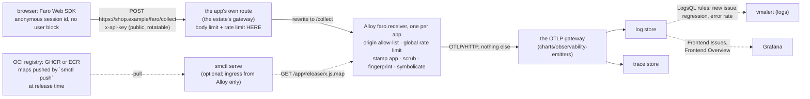

# Frontend telemetry

Design for `charts/observability-rum` and what it promises. The chart turns a
browser's errors, web vitals and traces into rows in the log and trace stores
this repository already runs, and builds a Sentry-shaped *issues* view on top
of the log store instead of adding an error tracker.



The chart writes to **the OTLP gateway and nothing else**. It has no store
credential, no vmauth entry and no knowledge of where the stores are; the
gateway stamps the cluster, buffers on disk and writes every replica, exactly
as for any other emitter ([emitting.md](emitting.md)).

## What it is made of

| Piece | What it is |
|---|---|
| Alloy | The official Grafana Alloy chart (Apache-2.0), pinned to an exact version and vendored as an archive in `charts/observability-rum/charts/`, like every dependency here. Moving the pin is `just vendor observability-rum` and a read of the golden diff. |
| One `faro.receiver` per app | Own port, own API key, own origin list, own limits. Which receiver accepted a request **is** the app's identity. |
| A generated pipeline | `faro.receiver` → `otelcol.receiver.loki` → `otelcol.processor.transform` (stamp, scrub, fingerprint) → `memory_limiter` → `batch` → `otelcol.exporter.otlphttp`; traces skip the Loki step. |
| A ClusterIP Service | One **named port per app**. No Ingress, no public host: how traffic arrives is the estate's gateway. |
| A Role | `get` on the named app-key Secrets, nothing else. |
| Optional: `smctl serve` | A small service that serves any app's source map from an OCI registry (GHCR, ECR) to Alloy inside the cluster. |
| Rules and dashboards | One VMRule (LogsQL, for the logs alerter) and two dashboards. |

## The values, and why the apps are under `global`

Helm cannot hand a parent chart's values to a subchart. The Alloy subchart
renders its configuration with `tpl` from `alloy.alloy.configMap.content`,
and in that context the parent's values do not exist but `global` does. So
what this chart is *for* lives under `global.observabilityRum` (the same
split, for the same reason, as [grafana.md](grafana.md)); what is about the
*pod* stays under `alloy:`.

```yaml
global:
  observabilityRum:
    otlp:
      endpoint: http://<gateway-service>.<namespace>.svc:4318   # required
    apps:
      - name: shop                         # required, slug, 15 characters at most
        apiKeySecret: {name: shop-rum-key, key: key}   # required, same namespace
        allowedOrigins: [https://shop.example]          # required, exact origins
        # optional: port, environment, serviceName, maxPayloadSize,
        #           rateLimit {rate, burst}, sampling {traces},
        #           sourcemaps {minifiedPathPrefixes}
```

[reference.md](reference.md) lists every value. The Service port of an app is
its `port` (default `defaults.firstPort` plus its position: **set it
explicitly** once a route points at it), and the port's *name* is the app's
name.

## What the receiver stamps, and what it deletes

The identity the platform trusts is decided by the receiver, never by the
payload. In the logs transform, after the line is parsed into attributes:

| | |
|---|---|
| Written, as resource attributes, from the receiver's own config | `service.name` (`<name>-browser`, or `serviceName`), `app` (the name), `telemetry.source` (`faro`), and `deployment.environment.name` when `environment` is set |
| Deleted, because a client claims it | `app_name`, `app_namespace`, and `app_environment` when `environment` is set; on traces the client's `service.name` is overwritten and `deployment.environment` removed |
| Dropped, because it has no use | Alloy's own `hash` (xxh3 of the unnormalised message: not a grouping key) |

Everything else the browser sends stays *untrusted telemetry*: a stray script
that knows an app's public key can write junk rows into **that app's** space
and no other (see "Authentication" below).

## What lands in the store

Log rows, one per event the SDK reports. Resource attributes (`service.name`,
`app`, `telemetry.source`, plus whatever the gateway stamps: `k8s.cluster.name`,
the namespace) and record attributes:

| Field | Meaning |
|---|---|
| `kind` | `exception`, `log`, `measurement` or `event` |
| `type`, `value`, `stacktrace` | Exceptions: the type, the message (URLs scrubbed), the stack, **symbolicated** when a map is found |
| `error.fingerprint`, `error.message`, `error.frame` | Exceptions: see below |
| `value_lcp`, `value_inp`, `value_cls`, … | Measurements: web vitals |
| `session_id` | The SDK's anonymous session id |
| `page_url` | Absolute URL, no query, no fragment |
| `app_release`, `app_version` | What the app reports (`release` selects the source maps) |
| `trace_id`, `span_id` | Structured (not attributes named `traceID`), so the log store's own correlation and Grafana's `trace_id` link work |
| the log body | A human line: `Type: message` for exceptions, the message for logs, `measurement web-vitals` and the like |

**Stream fields are not touched.** The gateway's list is short and fixed
(cluster, namespace, `service.name`); nothing here is added to it. A
per-error or per-session value as a stream field would mint a stream per
error, which is the failure this repository's emitters were built around
([safety.md](safety.md)). `error.fingerprint` is a record attribute on
purpose, and a test (`tests/observability_rum_test.go`) fails if any `error.*`
attribute is ever written as a resource attribute.

Browser traces go through the same stamp and scrub, with `traceparent` links
to backend spans intact. Sampling: the SDK's session sampling is the primary
control; `apps[].sampling.traces` additionally keeps a share of *browser*
traces in Alloy (it cannot drop backend spans: those follow the parent's
`sampled` flag).

## The fingerprint

One issue is one fingerprint. For every `kind=exception` row the pipeline
computes:

```
error.fingerprint = first 16 hex of sha256( app | type | message' | frame )
```

where

- **`message'`** is the message with, in this order: every URL replaced by
  `<url>`; every `"double"` and `'single'` quoted string by `<str>`; every UUID
  by `<uuid>`; every `0x…` or 8+-digit hex run by `<hex>`; every remaining
  number by `<n>`. `Cannot read properties of undefined (reading 'id') for
  order 12345` and `… (reading 'name') for order 99` become the same string.
  It is stored as `error.message` and is the stable title in the dashboard.
- **`frame`** is `<file>:<function>` of the **first frame that is the app's
  own code**, taken from the stack *after* symbolication. Frames from
  `node_modules`, browser extensions, anonymous code and other origins are
  skipped. An own-origin frame that was never mapped keeps its script path.
  The file loses its query string and a bundler's content hash
  (`assets/index-AbC123xy.js` → `assets/index.js`). **Line and column are not
  part of it**: a deploy that only moves code does not mint a new issue. It is
  stored as `error.frame`, so a surprising grouping can be read, not guessed at.
- **`app`** is the receiver's own name, so two apps never share an issue.

**Where it runs.** In Alloy, in each app's `otelcol.processor.transform`, as
statements in the OpenTelemetry Transformation Language (`replace_pattern`,
`ExtractPatterns`, `Concat`, `SHA256`, `Substring`), written out in the
generated configuration with a comment for each step. Alloy's `loki.process`
could have done the same with `stage.template`, but after
`otelcol.receiver.loki` the row is already an OTLP record and the processor
sees structured attributes instead of a line, so the transform is the closest
fit. Nothing is computed at query time, so a dashboard or an alert groups on a
field instead of repeating the algorithm. (Were the fingerprint ever lost, a
query-time fallback is `stats by (type, error.message)`; it groups by the same
normalised message but not by frame.)

Assumptions to know about, each one a reason a group might split or merge:

- Faro lists a stack's **top frame first**, which is the order Alloy prints
  and the transform reads. If a build of the SDK ever reversed it, every
  fingerprint would change at once; `error.frame` shows it immediately.
- A map the receiver cannot find leaves minified frames. They still group (the
  script path without its hash, and the minified function), but the same bug
  in two releases may split. `sourcemaps.cache.missRetry` (default 1m) is how
  soon a missing map is looked for again.
- The mapped function name is often `?` (the map has none). The file still
  separates most bugs.
- Messages that embed a long free-text value with no quote or number (a name,
  an address) stay distinct. That is the safe direction: two issues too many,
  never two bugs merged.

## Privacy

Defaults, each a value under `global.observabilityRum.privacy`:

| Default | What it does |
|---|---|
| `stripUrlQueryAndFragment: true` | Removes `?query` and `#fragment` from every absolute URL in every attribute: the page URL, error messages, stack-frame filenames (a cache-buster after a script's path), captured request URLs and every span attribute (`http.url`, `url.full`, `http.target`; `url.query` and `url.fragment` are deleted). A frame's `:line:col` after a query is kept. Relative URLs in free text are not touched. |
| `dropUserAttributes: true` | Deletes everything the SDK's user block carries (`user_id`, `user_email`, `user_username`, `user_attr_*`) and `user.*` / `enduser.*` on spans and resources. Never call `setUser` in the app. |
| (not configurable) | The anonymous session id **stays**: it counts sessions and is how an error rate per session is computed. The page path, the browser, its version, language and viewport also stay. |

What this does **not** do, so nobody assumes it does: it does not scrub a
message's own words (an exception that says `invalid email a@b.example` keeps
it), it does not scrub a path's own identifiers (`/users/123`; the
dashboards normalise numbers in a path when they *display* it, the store keeps
the original), and a user agent plus a session id may be personal data under
some regimes even with no user identity. Decide the purpose and the retention
for the log store with that in mind; the chart makes no retention decision.

## Authentication, or why there is none

A browser holds no secret. The model is four independent, weak-on-their-own
controls, in the order they act:

1. **A public per-app key** (`x-api-key`) from a Secret. It ships in the
   bundle, so it is an *identifier and a tripwire you can rotate*, not
   authentication. A wrong key is a `401`; a rotation needs no restart (the
   receivers re-read the Secret every minute). An empty key turns the check
   off, which the chart cannot see: keep the Secret's value non-empty.
2. **An origin allow-list.** Exact origins, never `*` (refused). With the
   same-origin route it is the app's own origin. Browsers enforce CORS;
   `curl` does not, so this is hygiene against *other sites*, not a boundary.
3. **A rate limit**, strategy `global` per receiver. `per_app` is refused: it
   keys its buckets on the app name in the *payload*, which the sender picks,
   so a client that varies it gets a fresh bucket per request. One receiver per
   app makes `global` a per-app limit.
4. **Server-side app stamping.** Nothing the payload says about which app it is
   survives; identity is the receiver's.

The ceiling of a forged request is junk rows in **one app's** space, bounded by
the payload cap and the rate limit. It cannot write as another app, cannot set
the cluster or namespace the gateway stamps, and cannot reach a store.

### What bounds a public write endpoint

Read this before exposing a receiver. Alloy v1.20.0's receiver bounds less
than its settings suggest, found by reading its source:

- `max_allowed_payload_size` is compared with the request's `Content-Length`
  **after** the body has been read and decoded. A chunked upload (no
  `Content-Length`) is not limited by it at all, and a gzip body is inflated
  with no cap.
- The API key is checked **after** the body is decoded, so an unauthenticated
  request still costs the decode.
- The rate limit is checked **before** the key, so an unauthenticated flood
  spends the bucket that legitimate browsers need.
- The limiter is per replica: the fleet's ceiling is `rate` × replicas.

What the chart does about it: two replicas and a PodDisruptionBudget; a
memory limit and Alloy's `memory_limiter` (past 80% the pipeline refuses data
instead of the pod being killed); one receiver per app so one app's flood
cannot starve another's bucket. What it cannot do, and the estate must:
**a request body limit and a request rate limit at the edge or gateway, in
front of the route**. Without them the memory limit is the only guard.

## Source maps

Alloy symbolicates from maps it can read by path or by URL, and
`sourcemaps.download` (Alloy's own default; `false` here) would make it fetch a
map from a URL the *browser* names, which means a server-side request an
anonymous poster steers and maps served publicly from the app. `download: true`
is **refused**. Maps come from **one** of two places; setting both is refused
too.

- **`sourcemaps.directory`** (default `/sourcemaps`). A directory inside the
  Alloy pod, one subdirectory per app:
  `<directory>/<app>/<release>/assets/index.js.map`. Mount it yourself: add a
  volume to `alloy.controller.volumes.extra` and a mount to
  `alloy.alloy.mounts.extra`. A list you set replaces the chart's, so keep its
  `storage` entry (an `emptyDir` at `/tmp/alloy`) in both.
- **`sourcemaps.smctl`** (off by default). The maps are OCI artifacts in the
  registry the app's image goes to, and `smctl serve` (from `ocictl`, image
  `ghcr.io/truvity/ocictl/smctl`, pinned by digest) is the one small service
  that serves any of them: `GET /<app>/<release>/<path>.map`, which is the
  request Alloy's `location` makes. It pulls a release's artifact on first use,
  unpacks it into a bounded cache (an `emptyDir`) and answers from disk. The
  chart renders its ConfigMap from the values, a Deployment (non-root,
  read-only root filesystem), a Service on `:8080` named
  `<fullname>-sourcemaps` (Alloy's `location` points at
  `http://<fullname>-sourcemaps:8080/<app>/{{ .Release }}`, with each app's
  `minifiedPathPrefixes`), and a NetworkPolicy: ingress from the Alloy pods
  only (smctl has no authentication of its own, and a map can carry the app's
  source), egress to DNS and 443 (plus the Pod Identity agent's link-local
  address in mode `ecr`).

  ```yaml
  global:
    observabilityRum:
      sourcemaps:
        smctl:
          enabled: true
          # REQUIRED, no default: where each app's maps are pushed; {app} is
          # the app's `name`. An app can override it: apps[].sourcemaps.repository.
          repositoryTemplate: ghcr.io/<org>/sourcemaps/{app}
          auth:
            mode: anonymous          # anonymous | ecr | dockerConfig
  ```

  **Credentials**: none in the chart. `anonymous` is a public package.
  `ecr` uses the pod's ServiceAccount (Pod Identity binds by the
  ServiceAccount's name, `<fullname>-sourcemaps`; IRSA by an annotation under
  `smctl.serviceAccount.annotations`); the role needs
  `ecr:GetAuthorizationToken` and `ecr:BatchGetImage` /
  `ecr:GetDownloadUrlForLayer` on the map repositories, nothing else.
  `dockerConfig` mounts a Secret you name (`auth.dockerConfigSecret`, key
  `config.json`), for a private GHCR package. The cache (`cache.maxSize`,
  `limits.*`, `negativeCache.*`) is smctl's own and all of it is a value.

  Why a Deployment of its own rather than a sidecar of the Alloy pod: the
  subchart cannot be given a per-release container.

The earlier object-store sync (`sourcemaps.sync`, an `aws s3 sync` loop beside
a busybox server) is gone: `smctl` serves from the registry the image already
lives in, with the same retention tooling, and it has nothing of its own to
keep in sync. The key is refused by the schema.

### Publishing

The release job pushes the maps right after `goreleaser release`, so a release
that did not publish cannot push maps for it, and the maps never ride in the
application image:

```bash
smctl push --goreleaser-dist dist/<project> --image <image> --maps dist-sourcemaps
# or, for a build GoReleaser did not run
smctl push --repository ghcr.io/<org>/sourcemaps/<app> --version 1.4.0 --maps dist-sourcemaps
```

(`--repository-template` defaults to `{registry}/{owner}/sourcemaps/{app}`,
the shape `repositoryTemplate` above takes.) Authentication is `GITHUB_TOKEN`
for `ghcr.io` and the Docker credential store for anything else. The artifact
is tagged with the release version and read back by that tag alone: see
ocictl's `docs/sourcemaps.md` for the artifact format and the full flags.

The `<release>` is the SDK's `app.release`. With `smctl` it must **equal the
version the maps were pushed under** (for GoReleaser, `{{ .Version }}`, without
the `v`; smctl turns `+` into `_` the way the publisher does). With a directory
it is whatever names the uploaded maps (a commit hash). A map that is not there
yet is an unsymbolicated row, not a lost one: Alloy remembers the miss for
`sourcemaps.cache.missRetry`, smctl for `smctl.negativeCache.ttl`.

## The gateway side

The browser posts to **a path on the app's own host**, so the page and the
collector share an origin: no CORS preflight, no third-party host, no `Origin`
that needs a list longer than one entry. The Service has no host of its own;
the estate's gateway routes the path. Alloy's receiver serves `/collect`, so
the route rewrites:

```yaml
apiVersion: gateway.networking.k8s.io/v1
kind: HTTPRoute
metadata:
  name: shop-faro
spec:
  parentRefs: [{name: <the gateway>}]
  hostnames: [shop.example]             # the app's own host
  rules:
    - matches:
        # Exact, never a prefix: a prefix would publish Alloy's other paths.
        # POST sends the data; OPTIONS answers a preflight if a page is ever
        # embedded cross-origin. Forgetting OPTIONS breaks that silently.
        - {path: {type: Exact, value: /faro/collect}, method: POST}
        - {path: {type: Exact, value: /faro/collect}, method: OPTIONS}
      filters:
        - type: URLRewrite
          urlRewrite:
            path: {type: ReplaceFullPath, replaceFullPath: /collect}
      backendRefs:
        - name: observability-rum-faro   # <fullname>-faro
          namespace: rum                 # needs a ReferenceGrant in that namespace
          port: 12347                    # the app's port, as set in `apps[].port`
```

A `ReferenceGrant` in the receivers' namespace must allow `HTTPRoute`s of the
app's namespace to reference the Service. Rate limiting *per path* belongs at
the edge in front of the host (the receiver's limiter bounds CPU per replica,
not bandwidth), together with a request body limit; see "What bounds a public
write endpoint". If the app's route has an authentication policy for people,
exclude `/faro/collect` from it: a browser's beacon cannot sign in.

`networkPolicy` (off by default) is the allow-list of who may reach the app
ports; the first policy that selects a pod default-denies it, so with it on,
the gateway's pods must be listed and an empty list is refused. It is ingress
only: the pods need the Kubernetes API (their Secrets), the OTLP gateway and
DNS, whose addresses differ per cluster, so restrict egress in the estate's own
policy.

## Alerts

One VMRule, `observability.rule-type: vlogs`, each group `type: vlogs`
(see [reference.md](reference.md): the label chooses the alerter, the type
chooses the language). Every query starts `_time:<window>` and
`telemetry.source:faro`: vmalert adds no time filter to a LogsQL rule. All
windows and thresholds are values under `rules`.

| Alert | Fires when | Defaults |
|---|---|---|
| `FrontendNewIssue` | A fingerprint is seen in the last `window` and **never** in the `history` before it, per cluster and app | 15m, 90d, `warning` |
| `FrontendIssueRegressed` | A fingerprint is seen in the last `window`, was silent for `quietFor`, and was seen before that within `history` | 15m, 7d, 90d, `warning` |
| `FrontendErrorRateHigh` (`basis: per-session`) | Exceptions per session over `window` exceed `perSession`, with at least `minSessions` sessions | 10m, 0.5, 20, `for: 10m` |
| `FrontendErrorRateHigh` (`basis: per-minute`) | Exceptions per minute over `window` exceed `perMinute`; off at 0 | 10m, 0, `for: 10m` |

The two issue rules are disjoint by construction: *new* means no sighting
anywhere in `history`, *regressed* means an old sighting plus a quiet gap, so
a long-quiet fingerprint pages once, as a regression. `history` should equal
the store's retention; older sightings cannot be read, and an issue older than
that looks new. A *new* alert resolves itself about one `window` after the
fingerprint gains history of its own.

**Cardinality.** An alert is one series per (cluster, app, fingerprint), and
fingerprints are the one unbounded thing here, so each issue rule keeps at most
`rules.maxFingerprints` (default 10, at most 100) per evaluation, highest volume
first: `sort by (recent desc) limit N`, then a final single-function `stats`
(a `stats` with several functions is one series per function, which would page
once per function). A release that introduces fifty new errors pages ten and
shows all fifty in the "Frontend Issues" table. The cap is global per rule per
evaluation, not per app.

`rules.recording.webVitals` (off) records p75 of LCP, INP and CLS per cluster
and app as `frontend:web_vitals_{lcp,inp,cls}_p75` in the metrics store.
**Does the logs vmalert support recording rules? Yes**, verified against
vmalert v1.152.0 and VictoriaLogs v1.52.0: a `type: vlogs` group takes `record:`
rules, runs the `stats` query and writes the result through the alerter's
`remoteWrite` (the series carries a `stats_result` label naming the statistic).
The dashboards do not need them, because they compute p75 from the log rows at
query time; turn them on for long ranges or to alert on a vital.

## What ArgoCD shows

Two things looked like drift on a live cluster, and neither is the Application
being wrong.

- **The VMRule was `OutOfSync` for good.** The VMRule CRD defaults `record` (on an
  alert) and `alert` (on a recording rule) to the empty string, the API server
  stores the default, and ArgoCD diffs the rendered manifest with the stored
  object field for field. A rule that left the key out could never match. The
  chart writes both keys on every rule, one of them empty
  (`tests/vmrule_defaults_test.go`); the operator reads an empty one as unset.
- **The `VMServiceScrape` showed no status.** The Alloy subchart's
  ServiceMonitor is converted by the VictoriaMetrics operator, which copies the
  object's annotations onto the VMServiceScrape, ArgoCD's tracking id included.
  ArgoCD then counts the converted object as part of the Application, with no
  desired state to compare. The remedy is the operator's, not a field of this
  chart: `charts/observability-stack` sets
  `VM_PROMETHEUSCONVERTERADDARGOCDIGNOREANNOTATIONS`, which marks what it
  converts `IgnoreExtraneous`. An estate that runs its own operator sets it
  there; the converted object keeps existing and keeps being scraped.

## Dashboards

Two, in the folder `dashboards.folder`, under the contract in
[dashboards.md](dashboards.md) (a `datasource` variable every panel uses, a
`cluster` variable populated by a field-values query, `$cluster` in the title),
rendered as ConfigMaps for Grafana's sidecar in `dashboards.namespace`. The
datasource is the VictoriaLogs plugin; the UIDs are `dashboards.datasources`.
They are optional here (`dashboards.enabled`, on by default) and ALSO ship from
`charts/observability-dashboards` (`dashboards.frontend-issues`,
`dashboards.frontend-overview`, off by default, folder `folders.frontend`): a
Grafana loads dashboards from its own namespace only, so the Grafana that is not
in this chart's cluster takes them from there, and a viewer picks the logs
datasource (the `datasource` variable is of type VictoriaLogs; its default is
that chart's `datasources.logs`). The two copies carry the same uid; use one.
`hack/dashboards/frontend.py` generates the JSON (committed); a query's time
range is the dashboard's.

- **Frontend Issues.** Exceptions, distinct issues, sessions with an exception,
  exceptions without a fingerprint (a defect indicator); exceptions over time;
  a table with one row per fingerprint: app, type, normalised message, one real
  message, events, sessions, first and last seen *within the range*, the
  latest release and trace; a link on the fingerprint to its raw events (below,
  on the same dashboard) and on the trace to Explore on the traces datasource;
  the raw events panel.
- **Frontend Overview.** Sessions, exceptions, exceptions per session; LCP,
  INP and CLS at p75 as stats and over time, with the Core Web Vitals
  thresholds; a per-page table (path normalised, numbers and ids collapsed to
  `:id`) of the vitals and of the top pages.

## Refusals

Each has a fixture under `tests/invalid/observability-rum/`.

| Refused | Why |
|---|---|
| An empty or non-http(s) `otlp.endpoint` | Browser data going nowhere |
| No apps; a name that is not a short slug, is `http-metrics`, or repeats | The name is the port name and the identity |
| An app with no `apiKeySecret` name or key | A receiver with no key accepts anyone |
| `allowedOrigins` empty or missing; a `*` anywhere in one; a value that is not scheme://host[:port] | A wildcard lets any site post |
| A malformed `maxPayloadSize`, or above 1MiB | The limit is already soft |
| A port outside 1024–65535, `12345`, or shared by two apps | One receiver per port |
| `rateLimit.strategy` other than `global`; a zero rate or burst | `per_app` keys on the payload |
| `sourcemaps.download: true` | The receiver would fetch a URL the browser names |
| `sourcemaps.directory` with `sourcemaps.smctl.enabled`; smctl with no `repositoryTemplate` (or one without `{app}`), a `dockerConfig` mode with no Secret, a credential for a mode that does not read it; the removed `sourcemaps.sync` | One source of maps; a template that serves one app's maps for another's; a credential nothing reads |
| `sampling.traces` outside (0, 1] | |
| `alloy.rbac.create: true` | The subchart's Role reads every Secret and pod in the namespace |
| `alloy.alloy.configMap.content` replaced, or `create: false` | A hand-written configuration drops the stamping, the privacy rules and the fingerprint |
| `networkPolicy.enabled` with no `ingressFrom` | Default-deny with no one allowed |
| An alert window that is not a LogsQL duration; `maxFingerprints` outside 1–100; every rule off | |
| An unknown key anywhere | A typo is a limit that never applies |

## What was verified, and what was not

Verified against the real binaries: the generated Alloy configuration passes
`alloy validate` and `alloy fmt` (v1.20.0) and was run in a container with a
read-only root filesystem and a non-root user, posting Faro payloads to a local
OTLP sink: both signals reach the exporter, the app is stamped and the payload's
claim deleted, user attributes and URL queries are gone, two exceptions that
differ only in numbers, ids and strings get the same fingerprint, a source map
read from a directory symbolicates a frame (including the `{{ .Release }}`
template), a wrong key is a `401`, and a preflight with browser-sorted headers
is answered for an allowed origin and not for another. The LogsQL of the three
alerts, the recording rules and every dashboard query run on VictoriaLogs
v1.52.0 (the alerts also parse under `just rulecheck`); the recording rule was
run under vmalert v1.152.0; both dashboards import into Grafana 13 with the
VictoriaLogs plugin and every panel query returns data through the plugin.

Not verified, and the first things to look at on a real cluster:

- The Role and `remote.kubernetes.secret` against a live API server, and a
  receiver that starts only once its Secret exists (the design is fail-closed:
  an unreadable key leaves the receiver unstarted; a present but empty key is
  *not* caught).
- `smctl serve` against a real registry and Pod Identity (the chart renders
  what ocictl documents; the render is not evidence that a map is served), and
  its behaviour with a read-only root filesystem.
- How the two Grafana tables render: the queries return what the
  transformations expect, but the panels were not opened in a browser.
- The SDK's frame order (top first) and `app.release` handling against a real
  bundle.
- The gateway route, the edge limits and the real request ceiling of the
  receiver under load.
- The trace link target (Explore on a Jaeger-type traces datasource).

Not built, deliberately: alerts on the collector itself (receiver down, exporter
failing; scrape `:12345`, which carries `faro_receiver_*` and the exporter's
counters), egress policy, and a Cloudflare rule; each depends on an estate's
own shape.

## Licences

Grafana Alloy and the Grafana Faro Web SDK are Apache-2.0. The chart vendors
the Alloy chart as an archive and modifies nothing in it; the Apache-2.0 text is
in `LICENSES/Apache-2.0.txt`. The dashboards are authored here and carry no
upstream work.
