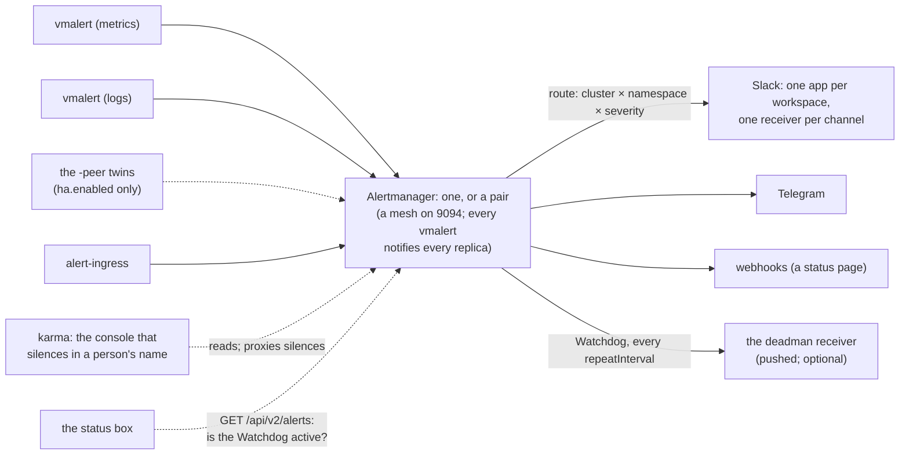
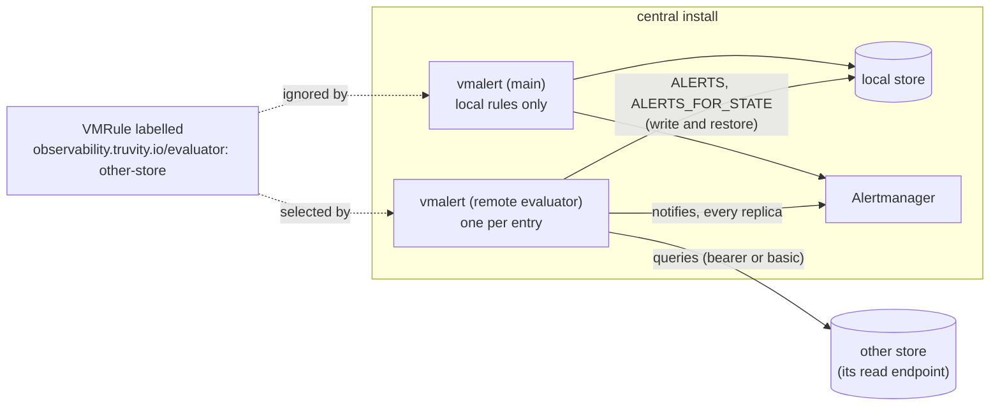

# Notifications: the one router

Design for the `notifications:` block of `charts/observability-stack`:
the one router every alert an install evaluates, and every event the
cloud publishes about it, reaches a person through.



## The problem it closes

The chart used to ship with Alertmanager routing to a receiver named
`blackhole`. That was honest — the chart cannot know a channel — but it
meant a consumer who installed the stack, the collectors and the rules
had a system that evaluated every rule and told nobody. Nothing about
it was unhealthy. It is the most expensive shape a monitoring system can
have, because it looks exactly like a quiet estate.

`alertmanager.config` was a free-form object the consumer filled with
Alertmanager's own syntax. That had three costs: the chart could not
refuse the blackhole shape, the consumer wrote a routing tree by hand
that every other consumer wrote again, and the message template — which
is where the cluster name, the runbook link and the Grafana link live —
was copied rather than shipped. `notifications` replaced it; the chart
refuses `alertmanager.enabled` with none of it configured.

## The shape

```yaml
notifications:
  # vmalert's -external.url. Without it every link in a notification is
  # the alerter pod's hostname, which resolves nowhere a person is.
  externalUrl: https://grafana.example

  # Receiver kinds. Each is a mechanism (how the secret is mounted, what
  # the message looks like); none carries a value.
  slack:
    workspaces:
      - name: acme
        appTokenSecret: {name: example-slack-bot, key: token}
    failureReceiver: status-page
  webhook:
    - name: status-page
      urlSecret: {name: example-status-webhook, key: url}

  # Severity tiers, and where each goes when no route says otherwise.
  # `info` goes nowhere: an alert that pages nobody is a dashboard.
  severities:
    critical: {receiver: slack, channel: "#alerts-critical"}
    warning:  {receiver: slack, channel: "#alerts"}

  # Routes, in order. The first match wins per severity; a route that
  # names only `critical` sends its warnings to the default. The estate
  # renders this list from wherever it derives projects from namespaces.
  routes:
    - match: {k8s_cluster_name: example-cluster}
      critical: "#alerts-example-cluster"
      warning:  "#alerts-example-cluster"
    - match: {k8s_namespace_name: example-app}
      critical: "#example-app"
      warning:  "#example-app"

  # Which alerts also reach a webhook receiver or a Slack channel,
  # beside their normal route.
  also:
    - receiver: status-page
      match: {severity: critical, customer_facing: "true"}
    - receiver: slack              # mirror one cluster to a second workspace
      match: {k8s_cluster_name: my-cluster}
      workspace: partner
      channel: "#partner-alerts"

  # Where THIS Alertmanager's UI is reachable from outside the cluster.
  # Set, the message carries a `Silence` link on it; empty, no link.
  alertmanagerUrl: https://alertmanager.example
```

The chart renders from this an Alertmanager configuration with:

- `group_by: [alertname, k8s_cluster_name, k8s_namespace_name]`, so one
  failing namespace on one cluster is one notification (a value since
  0.11.0: `groupBy`);
- `group_wait: 30s`, `group_interval: 5m`, `repeat_interval: 4h` as the
  defaults, each a value;
- an inhibit rule so a `critical` on a cluster + namespace silences the
  `warning` on the same pair (`inhibit`, a value since 0.11.0 — see
  "Inhibition" below), and a rule that `Watchdog` inhibits
  nothing and is routed only by `deadman` (below);
- one Slack receiver per distinct (workspace, channel), posting with the
  workspace's bot token ("Slack", below);
- the Slack template: the cluster and the namespace in the title, the
  alert's `summary`, a link to the runbook from `runbookBaseUrl` +
  `runbook` annotation, a link to Grafana built from `externalUrl` and
  the alert's labels, and the silence link (only when
  `alertmanagerUrl` is set, below);
- the `Watchdog` route to the deadman receiver, when one is configured
  (`deadman.urlSecret`), with `repeat_interval` equal to the heartbeat
  interval the far end expects.

A deadman whose far end wants a bearer token (a Gatus `external-endpoints`
entry does: `Authorization: Bearer <token>`) sets `alertmanager.watchdog.tokenKey`
to a second key of the SAME Secret; it is read with `credentials_file`,
like the URL. It is unset by default, which renders the receiver exactly as before.

The receiver secret is **mounted**, never templated: the Slack bot
token arrives as a file the way the watchdog URL already does, and the
rendered configuration names the file. A manifest that contains a
token is a token in git.

## Refusals

| Shape | Why it is refused |
|---|---|
| `alertmanager.enabled` with no `notifications` | the blackhole: rules evaluated into nothing |
| a route or a severity naming a receiver that is not configured | a route to nowhere looks like a route |
| a receiver with no secret | a receiver that cannot send |
| a leftover `slack.webhookSecret`; a `workspace` no entry declares; `workspace` left out with two or more declared; an empty channel; a `mention` on a non-Slack receiver or outside `here`/`channel`; a duplicate workspace name; a workspace with an empty secret name or key; `slack.failureReceiver` naming Slack or an unconfigured receiver | the Slack shapes that look wired up and deliver nowhere; see "Slack" |
| a route matching on a label outside `notifications.routeLabels` (and `ownerLabel`): `tenant`, `env`, …, or `source` before it is listed | matches nothing, pages nobody; the vocabulary is `routeLabels`, by default cluster × namespace |
| `externalUrl` unset | every link dead |
| `karma.enabled` with no `karma.authentication.header.name` and no `authentication.none: true`; `none` beside a header name; a header name with no `valueRe`; a groups header with no `groupValueRe`; groups with no header; an ACL naming an undeclared group or an unknown action; no Alertmanager for karma to read; `history.enabled` with no `uri` | an anonymous console that silences pages, or a config karma refuses at start; see "Console: karma" |
| `notifications.console: karma` without `consoleUrl` or without `karma.enabled`; a `consoleUrl` that is not an absolute `http(s)://` URL without a trailing slash | a silence link that points at nothing |
| `repeat_interval` on the deadman route longer than the far end's heartbeat | the far end alerts on healthy silence |
| `notifications.mode` outside `route` or `evaluate-only` | an unknown mode, refused by the schema rather than falling back to a guess |
| `notifications.mode: evaluate-only` with `alertmanager.enabled` true, or a receiver, severity, route, `also` bridge, `catchAll` or `drop` configured, or `alertmanager.notifierUrl` set | a channel or an Alertmanager configured beside a mode that mutes vmalert, which looks wired up and is never reached |
| `inhibit.equal` empty (schema) | any critical would mute every warning |
| a `drop` entry with no key (schema) | an empty matcher matches, and drops, every alert |
| `catchAll` naming a receiver that is not configured | every alert no tier claimed routed to nowhere |

Each has a fixture under `tests/invalid/observability-stack/`.

## Routing an alert that has no cluster

`notifications.routeLabels` is the ordered list of label names a
`routes[].match` may use. The default is `[k8s_cluster_name,
k8s_namespace_name]`, plus `ownerLabel` when set: the vocabulary a route
always had, and the render of an install that does not set it is
byte-for-byte unchanged.

An alert born outside a cluster (a GuardDuty finding, a budget, a
cost anomaly, through `alert-ingress`) has no cluster. Until now its
mapping set a made-up `k8s_cluster_name` (`cloud-security`, `cloud-cost`)
so the cluster-based router had something to match. Instead, the mapping
sets `source`, and the router is told it may match on it:

```yaml
notifications:
  routeLabels: [k8s_cluster_name, k8s_namespace_name, source]
  routes:
    - match: {source: aws-guardduty}
      critical: "#alerts-security"
      warning: "#alerts-security"
    - match: {source: aws-cost}
      warning: "#alerts-cost"
```

A match key outside the list is refused at render time, so a route on
`source` with `source` unlisted cannot look wired up and match nothing.

What does not assume a cluster: routing (matchers are plain labels),
`groupBy` and `inhibit.equal` (Alertmanager compares a label missing on
both alerts as equal, and the default `requireLabels` makes a critical
without them inhibit nothing), and the rule lint (`pkg/rulecheck`
applies its cluster checks only to a VMRule that names the cluster
label). The Slack title and the Telegram message name the cluster, or,
for an alert with no `k8s_cluster_name`, its `source` (`FIRING
GuardDutyFinding on aws-guardduty`); an alert with a cluster reads as it
always did. The Grafana links still carry `var-cluster`, which is empty
for a sourced alert. While `groupBy` is left at its default and
`routeLabels` lists `source`, `source` is added to the grouping, so two
sources do not share one notification; an explicit `groupBy` is used as
written.

## Slack

Slack is one **Slack app per workspace**, posting with the app's bot
token. Each `notifications.slack.workspaces` entry names an existing
Secret holding that token; it is mounted and read with Alertmanager's
`app_token_file`, never interpolated into the config.

```yaml
notifications:
  slack:
    workspaces:
      - name: acme
        appTokenSecret: {name: example-acme-slack-bot, key: token}
      - name: globex
        appTokenSecret: {name: example-globex-slack-bot, key: token}
    failureReceiver: status-page     # a webhook name, or telegram
  severities:
    critical: {receiver: slack, channel: "#alerts-critical", workspace: acme}
    warning:  {receiver: slack, channel: "#alerts", workspace: acme}
  catchAll: {receiver: slack, channel: "#alerts-everything-else", workspace: acme}
  routes:
    - match: {k8s_namespace_name: example-partner}
      critical: {channel: "#partner-critical", workspace: globex}
```

**Why not a webhook.** Before this, `notifications.slack.webhookSecret`
was one incoming webhook shared by every channel, with the channel
chosen per route. A Slack-app incoming webhook ignores the `channel` a
message asks for and always posts to the one channel it was created
for, so routing to several channels through it could not work, and
looked as if it did. A bot token honours `channel`. Several workspaces
are supported; the webhook is gone, and a leftover `webhookSecret` is
refused at render with the migration.

**Destinations.** Every place that picks a Slack destination — a
severity tier, `catchAll`, a route's per-tier override — may carry
`workspace`. With exactly one workspace declared it may be omitted and
means that one; with two or more it is required (refused otherwise, as
is a workspace nothing declares). A route's per-tier value is a channel
string (the tier's workspace and mention are kept) or
`{channel, workspace, mention}`, anything omitted defaulting to the
tier's. One Alertmanager receiver renders per distinct (workspace,
channel, mention), named `slack-<workspace>--<channel>` with the channel
lower-cased and reduced to `[a-z0-9-]`, so two tiers landing in one
channel with the same mention are one receiver.

**Mentions.** `mention: here` or `mention: channel` on a destination
(beside `channel`/`workspace`, in `severities.<tier>`, `catchAll` or the
object form of a route override) starts the message text with Slack's
`<!here>` (people online in the channel) or `<!channel>` (everyone in
it). Unset, the default, is no mention. Only FIRING notifications carry
it; the resolved message does not ping anyone. A mention is part of the
receiver's text, so the receiver is keyed by (workspace, channel,
mention): a destination WITHOUT a mention keeps exactly the name it had
before, and `critical` pinging `@here` while `warning` posts quietly to
the same channel is two receivers, `slack-acme--alerts--here` and
`slack-acme--alerts`.

```yaml
  severities:
    critical: {receiver: slack, channel: "#alerts", workspace: acme, mention: here}
    warning:  {receiver: slack, channel: "#alerts", workspace: acme}
```

A `mention` on a non-Slack receiver, or any value other than `here` and
`channel`, is refused.

**The Slack app.** One app per workspace. Create it from a manifest with
only what posting needs:

```yaml
display_information:
  name: Alerts
features:
  bot_user:
    display_name: Alerts
    always_online: false
oauth_config:
  scopes:
    bot:
      - chat:write
      - chat:write.public
settings:
  org_deploy_enabled: false
  socket_mode_enabled: false
  token_rotation_enabled: false
```

No events, no interactivity, no redirect URLs: nothing calls back into
the cluster. Install it to the workspace and store the **Bot User OAuth
Token** (`xoxb-...`) in the Secret the workspace names. `chat:write`
lets the bot post where it is a member; `chat:write.public` lets it post
to any **public** channel without being invited, which is why alert
channels should be public. A private channel needs the bot invited
(`/invite @Alerts`), or Slack answers `not_in_channel` and the
delivery fails.

**`update_message` is not used.** Alertmanager v0.32.0 added
`update_message` to edit an earlier message instead of posting a new
one. In v0.34.0 (the version the pinned operator deploys) setting it
together with `app_token_file` makes Alertmanager crash while loading
the config — its check dereferences an `api_url` that is unset for a
bot token — and `api_url` may not be set beside an app token. The chart
therefore does not render it, and a test holds that line. Revisit when
an Alertmanager release fixes the check.

**The operator path.** The receivers reach Alertmanager through
`VMAlertmanager.spec.configRawYaml`, not through `VMAlertmanagerConfig`.
The operator (v0.74.1) only validates that text against Alertmanager's
own config types (v0.33.1, which has `app_token_file`, since v0.30.0)
and stores it; the running Alertmanager is v0.34.0.

**When Slack itself fails.** Alertmanager counts failed deliveries in
`alertmanager_notifications_failed_total{integration="slack"}` and
retries; a revoked token, a channel the bot may not post in or an outage
otherwise looks like a quiet estate. The rule `SlackNotificationsFailing`
(`selfAlerts.slackDelivery`) fires when that counter increases over 15
minutes. It renders whenever a workspace is declared, without
`selfAlerts.enabled`. Its series exists because the chart scrapes
Alertmanager itself: `templates/alertmanager-scrape.yaml` renders a
`ServiceMonitor` whenever Alertmanager is rendered (selecting the labels
the operator puts on the VMAlertmanager's Service, port 9093, no
credentials — Alertmanager's `/metrics` is unauthenticated here), and the
VMAlertmanager sets `disableSelfServiceScrape: true` so the operator's own
`VMServiceScrape` is not created beside it. No NetworkPolicy of this chart
selects the Alertmanager pods, so the metrics agent is not refused. The
operator's Prometheus converter must be on, as for every other
ServiceMonitor this chart renders; it is refused otherwise.

It is never routed to Slack. A route for it sits first in the tree, with
`continue: false`, and goes to `notifications.slack.failureReceiver`: a
`notifications.webhook` name, or `telegram`. `failureReceiver` naming
Slack, or a receiver that is not configured, is refused. **Unset, the
alert still renders, so it is visible in vmalert, but the route sends it
to the null receiver and it reaches nobody.** That gap is deliberate —
refusing would block installs whose only receiver is Slack — and it is
why `failureReceiver` is worth setting.

## Telegram

Added in 0.10.0: Telegram as a third receiver kind, beside `slack` and
`webhook`. Any combination is accepted, each severity tier picks one,
and a `telegram` block on its own is enough to satisfy the "no
receiver" refusal.

```yaml
notifications:
  externalUrl: https://grafana.example
  telegram:
    # An EXISTING Secret: its name and the key holding the bot token.
    # Never a value in these values, never in the rendered config.
    botTokenSecret: {name: example-telegram-bot, key: token}
    # The default destination. An integer, as Alertmanager takes it;
    # negative for a group or channel.
    chatId: -1000000000001
    # Optional: a forum topic in that chat. Unset or 0 is none.
    messageThreadId: 0
    # Optional: HTML (default), MarkdownV2 or Markdown.
    parseMode: HTML
    # Optional: default true, the same as the Slack and webhook receivers.
    sendResolved: true
  severities:
    critical: {receiver: telegram}
    # A tier may land somewhere else: its own chatId and/or thread.
    warning: {receiver: telegram, messageThreadId: 42}
```

What the chart renders from it:

- a Secret volume `notifications-telegram` on the VMAlertmanager pod,
  mounted at `/etc/alertmanager/notifications-telegram`, and every
  Telegram receiver reading the token with `bot_token_file` from there
  — the same mounted-file rule as `api_url_file` and `url_file`, so the
  token is never in the release's manifest;
- one Alertmanager receiver per distinct (chat, thread) any tier
  resolves to, named `telegram-<chat>[-<thread>]` with a negative chat
  id's sign spelled `n` (`telegram-n1000000000001-42`), so two tiers in
  one chat are one receiver;
- `telegram_configs` with `chat_id`, `message_thread_id` (only when
  set), `parse_mode` and `send_resolved`;
- the shipped message: the Slack template's facts — status, alert name,
  cluster/namespace, each alert's `summary`, the runbook link when
  `runbookBaseUrl` is set, the Grafana link, the silence link — written
  in Telegram's HTML.

Why HTML is the default and the only mode with a shipped message:
Alertmanager executes a Telegram message through Go's `html/template`
when `parse_mode` is `HTML`, so every value interpolated from an alert
(a summary with a `<` or an `&` in it) is escaped by Alertmanager
itself. Markdown and MarkdownV2 have no such escaping: one `_` or `*`
in an alert name and Telegram refuses the whole message, so the
notification is lost rather than garbled. The schema therefore requires
`telegram.message` — your own Alertmanager template, written for that
mode — whenever `parseMode` is not `HTML`.

**The chat id from a Secret (0.11.0).** A chat id is not a credential —
without the bot token it sends nothing — but some estates keep it out
of git anyway. `chatIdSecret: {name, key}` replaces `chatId`: the Secret
is mounted at `/etc/alertmanager/notifications-telegram-chat` and read
with Alertmanager's `chat_id_file`, which exists since Alertmanager
v0.31.0 (the pinned operator deploys v0.34.0). The chart never sees the
value, so the receiver is named `telegram-chatfile` (plus the thread),
not after the chat. It may be the same Secret as the bot token.

```yaml
notifications:
  telegram:
    botTokenSecret: {name: example-telegram-bot, key: token}
    chatIdSecret: {name: example-telegram-bot, key: chat_id}
```

### Named links in Slack

Slack links are named mrkdwn links instead of raw URLs. Grafana is about
one alert, so it ends that alert's summary line; Silence and View are about
the alert group, so they are ONE line after the alerts, separated by ` · `:

```
disk almost full · <https://grafana.example/?var-cluster=...|Grafana>
disk almost full · <https://grafana.example/?var-cluster=...|Grafana>

<https://alertmanager.example/#/silences/new?filter=...|Silence>
```

The group line has `Silence` and `View` with `console: karma`, `Silence`
with `alertmanagerUrl`, and is absent with neither. The message title is a
link too (Alertmanager's `title_link`): the `View` URL with
`console: karma`, the Grafana URL otherwise. The Telegram message is
unchanged.

Escaping follows Slack's "Escaping text" rules
(<https://docs.slack.dev/messaging/formatting-message-text/#escaping>):
`&`, `<` and `>` are written `&amp;`, `&lt;`, `&gt;` and Slack decodes
them back, so the `&` between query parameters inside a link is written
`&amp;` (the `title_link` field is a plain URL, not mrkdwn, and keeps `&`).
A raw `|` or `>` would end the link early, so every label-derived part of
a URL goes through `urlquery`, which escapes both; the Alertmanager
silence filter turns `urlquery`'s `+` back into `%20`. The chart does not
set `mrkdwn_in`, so Alertmanager's default (`fallback`, `pretext`,
`text`) applies and `text` is rendered as mrkdwn.

### The silence link and `alertmanagerUrl`

`notifications.alertmanagerUrl` is the externally reachable base URL of
this Alertmanager's UI, with no trailing slash. Set, it is the
VMAlertmanager's `externalURL` and the base of the message's `Silence`
link; the filter is built from the alert group's common labels. Empty,
the message has no `Silence` link.

There is no default on purpose. The only address the chart can guess is
Alertmanager's own pod (`http://vmalertmanager-<release>-0:9093`), which
nobody outside the cluster can open. The Grafana base (`externalUrl`) is
no better: the chart refuses Grafana-managed alerting, so Grafana has no
silence page. `vmalert.externalUrl` is the Grafana base too, so it no
longer feeds the VMAlertmanager's `externalURL`; it keeps its own use, the
links vmalert puts on an alert's source.

### Console: karma

Alertmanager has no notion of a user. A silence's `createdBy` is free
text the caller types (prometheus/alertmanager#1196), so on a bare
Alertmanager anyone who can reach its UI can silence a page in someone
else's name, and nothing says who did. [karma](https://github.com/prymitive/karma)
closes that when it is the only way to silence: with header
authentication it **rewrites `createdBy` to the authenticated user on
every silence it proxies**, and it enforces silence ACLs (who may silence
what, and whether a regex matcher is allowed).

The chart renders karma (`karma.enabled`, off by default; see
docs/reference.md) but not the gateway in front of it. The shape it is
built for:

- an SSO gateway in front of karma sets an identity header on every
  request (`karma.authentication.header.name`, for example
  `X-Auth-Request-Email`) and, optionally, a groups header;
- `networkPolicy.karmaFrom` admits that gateway and nothing else, because
  karma trusts the header it is sent: anyone who can reach the pod
  directly can claim any name;
- Alertmanager stays reachable read-only (GET) on its own host, so people
  can look but only karma can write. The chart does not render that host.

```yaml
karma:
  enabled: true
  authentication:
    header:
      name: X-Auth-Request-Email
      groupName: X-Auth-Request-Groups
      groupValueRe: ^(.+)$
      groupValueSeparator: ","
  authorization:
    groups:
      - name: admins
        members: [alice@example.com]
  acl:
    silences:
      - action: block
        reason: regex silences are not allowed
        scope:
          filters: [{name_re: .+, value_re: .+, isRegex: true}]
      - action: allow
        reason: admins may silence anything
        scope: {groups: [admins]}
networkPolicy:
  karmaFrom:
    - namespaceSelector: {matchLabels: {kubernetes.io/metadata.name: gateway}}
notifications:
  console: karma
  consoleUrl: https://karma.example.com
```

`console: karma` changes the Slack message (the Telegram one keeps the
Alertmanager link):

- `Silence` opens karma's silence form prefilled: `?m=` is karma's own
  base64 JSON, `{"am": [{"label": "alertmanager", "value": ["alertmanager"]}],
  "m": [{"n": name, "r": false, "e": true, "v": [value]}, ...], "d": <minutes>,
  "c": ""}`, one exact matcher per common label of the alert group, for
  `notifications.silenceMinutes` (default 60). `am` is karma's option for
  this release's Alertmanager, the name the chart gives it in karma's config;
  karma resets the field if it does not match. Alertmanager's `base64encode`
  is the URL-safe alphabet and karma decodes with the browser's `atob`, which
  is not, so the template converts back before escaping the value. A label
  value that is not ASCII reaches the form with its encoded bytes read one by one as Latin-1 characters
  (a limit of `atob`), so the matcher must be corrected by hand.
- `View` opens karma filtered to the group, one `q=<label>%3D<value>` per
  common label.
- `Grafana` is unchanged.

`console: karma` is refused without `consoleUrl` or without
`karma.enabled`, and `karma.enabled` is refused without
`authentication.header.name` unless `authentication.none: true` says an
anonymous console is meant. Header authentication needs `valueRe` (karma
refuses to start without it), and a groups header needs `groupValueRe`.
`karma.extraConfig` is merged last and is **not validated**.

NetworkPolicy: karma gets its own policy (ingress on 8080 from
`networkPolicy.karmaFrom`, defaulting to the release's namespace like
`proxyFrom`). This chart restricts no egress anywhere, so there is none
for karma. No policy selects the Alertmanager pods, so they already accept
karma's traffic, and the chart does not add one: a first policy on those
pods would default-deny everything else they receive, vmalert's alert
pushes and the mesh port included.

### `also` to Slack

An `also` entry with `receiver: slack` takes `channel` (required),
`workspace` (required with two or more workspaces, as for a tier) and an
optional `mention`. It reuses the receiver a primary route renders for
the same (workspace, channel, mention), so a destination named twice is
one receiver. `match` stays free-form. Every `also` route renders
`continue: true`, so each entry adds its delivery independently: an alert
matching two entries (a cluster mirror and a status-page webhook, say)
reaches both, beside its primary route.

What differs from Slack, on purpose:

- a Telegram tier has no `channel`, and a route cannot override one: a
  route's per-tier value is a Slack channel name, so on a Telegram tier
  it would be read by nothing, and it is refused. Send a project to a
  different chat by giving it a Slack tier, or, for a whole tier, with
  that tier's own `chatId`/`messageThreadId`;
- `also` does not deliver to Telegram: it names a webhook or `slack`.

Compatibility: before 0.10.0 `telegram` was not a keyword, so an
install could have a `notifications.webhook` entry NAMED `telegram` (a
webhook bridge to Telegram) with tiers pointing at it. That install
renders exactly as before: `receiver: telegram` means the Telegram kind
only once `notifications.telegram` is configured, and configuring it
beside a webhook of that name is refused as ambiguous.

The shipped HTML message was checked end to end against the
Alertmanager this chart's operator runs (`prom/alertmanager:v0.34.0`,
bot API pointed at a local stand-in): the token is read from the
mounted file, `message_thread_id` and `parse_mode` arrive as rendered,
and a summary of `disk <90% & rising_fast` arrives as
`disk &lt;90% &amp; rising_fast`.

| Shape | Why it is refused |
|---|---|
| `telegram` without `botTokenSecret`, or with an empty `name`/`key` (schema) | a receiver that cannot authenticate cannot send |
| `telegram` with neither or both of `chatId` and `chatIdSecret` (schema) | a bot with nowhere to post, or two defaults for one chat |
| `parseMode` other than `HTML` without `message` (schema) | the shipped message is HTML; under Markdown it fails on the first `_` |
| a tier with `receiver: telegram` and no `notifications.telegram` (and no webhook of that name) | a route to a receiver that is not configured |
| `chatId`/`messageThreadId` on a tier that is not Telegram | read by nothing |
| `channel` on a Telegram tier, or a route overriding a Telegram tier | a Slack channel where no Slack receiver reads it |
| `notifications.telegram` beside a webhook named `telegram` | `receiver: telegram` would be ambiguous |

## Inhibition

One rule: a `critical` silences a `warning` whose values are equal for
every label in `notifications.inhibit.equal` (default
`[k8s_cluster_name, k8s_namespace_name]`).

**The hazard.** Alertmanager compares a label that is missing on both
alerts as EQUAL. An alert that carries none of the `equal` labels
therefore matches every other alert that carries none of them, and one
such `critical` mutes every such `warning` in the install — with
nothing anywhere saying so. It is easy to hit: an estate whose alerts
carry `namespace` rather than `k8s_namespace_name` hits it on every
alert, and a rule that aggregates `by (namespace, …)` drops
`k8s_namespace_name` from its own alerts even on an estate that stamps
it.

**The guard (0.11.0, on by default).** `inhibit.requireLabels: true`
renders a source matcher `<label> =~ ".+"` for every `equal` label: a
critical that does not carry them inhibits nothing, and `equal` then
requires the warning to carry the same non-empty values. It errs loud —
a warning the unguarded rule muted by accident now arrives — which is
why it is the default rather than documentation alone: this chart's own
`platform-alerts` hit the hazard on a default install.
`CronJobNotSucceeding` (critical) and `BackupJobFailed` (warning)
aggregate `by (namespace, …)`, which drops `k8s_namespace_name`, so one
CronJob not succeeding muted every failed backup Job's warning on its
cluster. `requireLabels: false` renders the 0.10.0 rule byte for byte.

Beyond the guard, name labels your alerts actually carry
(`inhibit.equal`, and `groupBy` for the same reason), or turn the rule
off (`inhibit.enabled: false`). `groupBy` has the milder form of the same
trap: a label no alert carries groups every alert together into one
notification.

```yaml
notifications:
  groupBy: [alertname, namespace]
  inhibit:
    equal: [namespace]
```

## Beyond `critical` and `warning`

This chart's rules carry only `critical` and `warning`, and by default
only those two are routed: an alert that pages nobody is a dashboard.
An estate that wants more says so:

- `notifications.catchAll` — a severity target (`slack`, `telegram` or a
  webhook, the same shape as a `severities` entry) for every alert no
  tier claimed: `info`, no `severity`, or a tier `severities` leaves out.
  It is the fallback of EVERY node in the primary tree, so an `info`
  alert inside a project route lands there too. Set, the two tiers are
  no longer required. With no deadman receiver configured, `Watchdog`
  — which fires for as long as the install is healthy — is routed to
  nobody first, or it would arrive every `repeatInterval`.
- `notifications.drop` — exact matchers routed to nobody, ahead of every
  other route: for an alert the estate has decided it will never act
  on, without editing the rule set that ships it. Other always-firing
  vendored rules (`InfoInhibitor`) belong here.

```yaml
notifications:
  catchAll: {receiver: telegram}
  drop:
    - {alertname: InfoInhibitor}
```

## Evaluate, notify nobody yet

`notifications.mode: evaluate-only` is the other accepted shape, for a
consumer who does not yet have a Slack webhook or a status-page
credential and wants every rule evaluated anyway rather than turning the
whole alerting path off. It exists because the two components this
value touches used to leave exactly one way to avoid the refusals above
without a receiver: `alertmanager.enabled: false` **and**
`vmalert.enabled: false` — which stops every rule from being evaluated
at all, the least useful shape a monitoring stack can be in, silently
reached by disabling two unrelated-looking toggles together.

Use it when: a receiver is coming but is not wired up yet, or an install
genuinely has nowhere to page (a personal cluster, a demo) but the rules
should still run so their state is visible somewhere.

What it renders:

- both vmalerts (`metrics` and `logs`, if `vmalert.logs.enabled`) keep
  running, with no change to `evaluationInterval`, `datasource`,
  `remoteWrite` or `remoteRead` — every rule is evaluated on schedule,
  exactly as in `route` mode;
- neither renders a `notifiers:` block; both instead carry
  `-notifier.blackhole` in `extraArgs`, the flag vmalert has shipped
  since v1.93.0 for evaluating alerting rules "without sending any
  notifications to external receivers" (VictoriaMetrics
  `CHANGELOG_2023.md`; the flag's own help text, unchanged through the
  v1.152.0 this chart's operator defaults to, adds that `-notifier.url`,
  `-notifier.config` and `-notifier.blackhole` are mutually exclusive —
  `app/vmalert/notifier/init.go`). The VictoriaMetrics operator refuses
  the same combination at the CustomResource level
  (`api/operator/v1beta1/vmalert_types.go`, `validateNotifierConfigs`):
  `spec.notifier`, `spec.notifiers` and `spec.notifier.notifierConfigRef`
  must all be absent when `notifier.blackhole` is one of `extraArgs`;
  this chart simply never renders them in this mode, so that CRD-level
  refusal is never reached;
- Alertmanager (the `VMAlertmanager` object) is **not rendered** in this
  mode, refused if `alertmanager.enabled` is left at its default `true`
  or set explicitly: with nothing to route — vmalert sends its result
  nowhere on purpose — an Alertmanager beside it would be a component
  with no job, which is its own way to look more configured than it is.

What stays visible: every alert vmalert evaluates shows up in that
vmalert's own `/vmalert/` UI and `/api/v1/alerts` API, state included,
the same as in `route` mode. And because both vmalerts here already
carry `-remoteWrite.url` unconditionally (see below), the `ALERTS` and
`ALERTS_FOR_STATE` time series vmalert writes for every active alert
(`app/vmalert/rule/alerting.go`, `toTimeSeries`) land in the metrics
store regardless of the notifier — that write does not go through the
notifier at all, blackholed or not — so `ALERTS{alertname="..."}` is a
query away in this mode exactly as it would be in `route` mode.

Why this is not the blackhole `alertmanager.enabled` with nothing
configured used to render: that shape was never a decision — the
default rendered it whether anyone meant to or not, and looked exactly
like a working install because Alertmanager itself was healthy and
routing, just to a receiver with no configuration. `evaluate-only` is a
value nobody reaches by omission: it is refused the moment it disagrees
with `alertmanager.enabled`'s own default, so setting it is the only way
to get it, and the render it produces has no Alertmanager to look
healthy in the first place — the absence is the whole visible fact,
not a receiver quietly doing nothing behind a passing health check.

## An Alertmanager pair

`alertmanager.replicaCount: 2` (or more) is one mesh: the operator joins
the replicas on 9094, and the chart renders what a pair needs to be safe
to run rather than merely to exist:

- a `PodDisruptionBudget` (`maxUnavailable: 1`), preferred anti-affinity
  on `kubernetes.io/hostname` and a soft zone spread, each overridable
  (`alertmanager.podDisruptionBudget`, `.affinity`,
  `.topologySpreadConstraints`);
- **every vmalert notifies every replica** — one `notifiers` entry per
  pod through the operator's headless Service, as vmalert's own HA
  guidance asks, instead of one load-balanced URL; the replicas
  deduplicate through the mesh. A set `alertmanager.notifierUrl` still
  wins;
- `--cluster.reconnect-timeout` (`alertmanager.cluster.reconnectTimeout`,
  default `5m`, a Go duration): a rescheduled replica comes back at a new
  IP, and with Alertmanager's own 6h the survivor kept the old address as
  a failed peer, so `alertmanager_cluster_failed_peers` stayed above 0 and
  `AlertmanagerClusterFailedPeers` fired on a healthy mesh;
- karma lists each replica as a server with the same `cluster` value, as
  its documentation asks for an HA cluster; those names are reserved
  against `karma.alertmanagers`.

No NetworkPolicy selects the Alertmanager pods: the first policy that did
would default-deny the mesh (9094 TCP and UDP) and vmalert's pushes. One
replica renders none of the above, byte for byte as before.

## Evaluating another store's rules

An estate that runs a second, separate metrics store (another environment)
may have one whose own stack runs `notifications.mode: evaluate-only`: its
rules evaluate and nobody hears about them. `vmalert.remoteEvaluators`
lets the CENTRAL install evaluate selected rule groups against that other
store and notify through its own Alertmanager. The first use is a
heartbeat-missing alert on a metric that exists only in the other store:
it cannot be written on the central store (the metric is absent there, for
ever) and is worth nothing in a stack that notifies nobody.



One entry renders one extra `VMAlert`, named `<release>-remote-<name>`:

- **datasource** is the other store's read endpoint (`datasource.url`),
  authenticated with a bearer token or basic auth read from an EXISTING
  Secret (`datasource.auth`), optionally with a private CA
  (`datasource.caBundle`, a ConfigMap or Secret key).
- **notifiers** are the main alerter's, rendered by the same helper: the
  Alertmanager pair (one notifier per replica), or `alertmanager.notifierUrl`.
- **remoteWrite and remoteRead** are the LOCAL store, like the main
  alerter's. Alert state (`ALERTS`, `ALERTS_FOR_STATE`) is then visible in
  the central store and Grafana, and a restarted evaluator restores its
  `for:` timers instead of re-arming them. The other store is only read.
- **externalLabels** are `vmalert.externalLabels` with the entry's own on
  top: set the source cluster label here so routing (`cluster` is a route
  dimension) and the alert text say which environment the alert is about.

### The label contract

A VMRule is owned by an evaluator by carrying, on the VMRule object's
metadata, `observability.truvity.io/evaluator: <name>`. The evaluator
selects exactly that value; the main metrics alerter (and the logs
alerter) select only rules that do NOT carry the key at all, whatever its
value. So a rule is never evaluated by two alerters, none of these is ever
evaluated against the wrong store, and the selector cannot be empty. The
exclusion renders only when `remoteEvaluators` is non-empty: with the list
empty the render is byte-identical to before. A rule labelled with a name
no entry declares is evaluated by nobody: keep the label and the entry
together. Rules are PromQL (`observability.rule-type: vlogs` is not
supported on an evaluator and such a rule is evaluated by nobody).

### Refusals

An empty, non-DNS-label, too-long or duplicate `name`; a missing or
non-http(s) `datasource.url`; `datasource.auth` that is not exactly one
of `bearer` / `basic` with every Secret name and key set; a `caBundle`
naming both or neither of `configMap` / `secret`; `notifications.mode:
evaluate-only` (nobody would be notified); an install that renders no
vmalert (`mode: replica` or `operator-only`, or `vmalert.enabled:
false`); and, through the existing notifier refusal, an install with no
Alertmanager and no `alertmanager.notifierUrl`.

### High availability

One replica per entry, also under `ha`, with no `-peer` twin. A pair keeps
alerting through the loss of one STORE; an evaluator reads one remote
store, its only source of truth, and a twin would read the same data and
notify the same Alertmanager twice. A rescheduled pod restores its timers
from the local store (the primary's, on a pair). The loss of the remote
store is the failure the self-alert below is for.

### Self-monitoring

`RemoteEvaluatorFailing` (`selfAlerts.remoteEvaluator`, on by default,
rendered whenever the list is non-empty and independent of
`selfAlerts.enabled`): rule-evaluation error counters of the evaluator
pods, from the local store, firing through the local Alertmanager. An
unreachable datasource or a refused credential is therefore not silent.
Each evaluator pod is scraped like the main alerters (the operator's own
VMServiceScrape for a VMAlert).

### What the consumer provides

1. A read credential for the other store, as a Secret in the release's
   namespace (`datasource.auth` names it and its keys). Read-only: the
   chart never writes there.
2. Network reachability. The chart renders ingress policies only, and its
   vmalert policy already selects every vmalert pod, evaluators included.
   If the namespace has default-deny egress, allow the evaluator pods
   (`app.kubernetes.io/name: vmalert`, name `vmalert-<release>-remote-<name>`)
   to reach the other store's hostname (typically TCP 443), the local
   store, and Alertmanager (TCP 9093).
3. The rules: VMRules carrying the evaluator label, wherever the
   operator selects rules from (the evaluator uses an empty namespace
   selector, like the main alerter).

```yaml
vmalert:
  remoteEvaluators:
    - name: other-store
      datasource:
        url: https://metrics.other-store.example
        auth:
          bearer: {secretName: other-store-read, key: token}
      externalLabels:
        k8s_cluster_name: edge
```

### End to end: a scoped read token for the evaluator

When the other store is itself an install of this chart, mint the read
credential there with `tenancy.readers` instead of reusing a person's
identity. Both sides, with one token:

1. Create a Secret holding a long random token, once on each side: on the
   OTHER store's cluster (the one the reader's `tokenSecret` names) and on
   the central cluster (the one the evaluator's `datasource.auth.bearer`
   names). Same value, different clusters, so the chart never sees it.
2. On the OTHER store's install, add a reader. The grant is what the
   evaluator may see; it is enforced by the proxy, not by trust.

   ```yaml
   tenancy:
     readers:
       - name: central-evaluator
         tokenSecret: {name: central-evaluator-read, key: token}
         grants:
           - cluster: edge
             allNamespaces: true      # or: namespaces: [example-app]
   ```

3. On the CENTRAL install, add the evaluator. The datasource URL is the
   other proxy's host WITH the `/prometheus` path, which is where the
   reader's two routes live (vmalert appends `/api/v1/query`):

   ```yaml
   vmalert:
     remoteEvaluators:
       - name: other-store
         datasource:
           url: https://metrics.other-store.example/prometheus
           auth:
             bearer: {secretName: central-evaluator-read, key: token}
   ```

A reader gets `/prometheus/api/v1/query` and `/prometheus/api/v1/query_range`
and nothing else: no write, series, labels, vmui, log, trace, alert or admin
route. Its grant arrives as literal `extra_filters` query arguments the
caller cannot override (one per granted cluster, ORed by the store; a
namespace list narrows further). The evaluator's remoteRead and remoteWrite
target its own local store, so no other route is needed. The edge in front
of the other proxy must route its hostname to vmauth and admit those paths.
Refusals are listed in docs/safety.md.

## What stays the consumer's

The channel names, the webhook, the route list, the external URL. And
the *policy* of what is `critical`: the chart ships severities on its own
rules and documents the convention — `critical` means a person should
look now, `warning` means a person should look today, `info` is for a
dashboard — but a consumer's own rules carry whatever severity the
consumer gives them.

## The vmalert settings that make routing true

Not values; fixed defaults, because each has a wrong upstream default
that fails in a way that looks like something else:

- every vmalert carries `-remoteWrite.url` and `-remoteRead.url` to the
  metrics store, so `for:` timers survive a restart. Without them, a
  rolling upgrade resets every pending alert and a slow-burning one
  never fires.
- one evaluation interval, equal to the store's deduplication interval,
  equal to the scrape interval — 30s — so a rule never reads a window
  the store has already deduplicated differently.
- the logs alerter's `evalDelay` reduced, since the log store has no
  search latency offset.

## Store self-alerts

Shipped inside this chart because they name the stack's own counters,
scraped directly and never through the proxy. Each is a rule in a
`VMRule` the chart renders, following the `platform-alerts` contract:
the failure it catches, the healthy range it was measured against, the
threshold's headroom, a negative fixture.

| Rule | Catches |
|---|---|
| `MetricStoreIgnoringRows` | `vm_rows_ignored_total` rising — a series past the label limit is discarded and the write answers 200; a sender can report millions written with zero errors while the store holds none |
| `MetricStoreCardinalityNearLimit`, `MetricStoreDailyCardinalityNearLimit` | hourly, or daily, series at 90% of the limit — two rules, different windows |
| `LogStoreDroppingRows`, `TraceStoreDroppingRows` | `vl_rows_dropped_total`, `vt_rows_dropped_total` rate above zero |
| `LogStoreStreamsChurning`, `TraceStoreStreamsChurning` | streams created faster than a partition explains — the shape a non-constant stream field produces, one rule per store since each keys streams differently |
| `WriterBufferGrowing`, `WriterDroppingPackets` | a collector's remote-write buffer growing, or packets dropped — the write path is blocked and the loss is proportional to how long it takes to look |
| `GatewayQueueFilling`, `GatewayExportFailing`, `GatewayEnqueueFailing` | the OpenTelemetry gateway's queue above 80%, a destination refusing a batch already accepted, or the gateway's own queue refusing at the door — three different moments of "sending queue is full" running for hours |
| `ProxyAtConcurrencyLimit` | vmauth refusing requests |
| `MetricStoreDiskNearGuard`, `LogStoreDiskNearGuard`, `TraceStoreDiskNearGuard` | free disk approaching the store's own minimum, one rule per store |
| `MetricStoreSnapshotOlderThanWindow`, `LogStoreSnapshotOlderThanWindow`, `TraceStoreSnapshotOlderThanWindow` | the newest snapshot older than the backup schedule allows, one rule per store |
| `SlackNotificationsFailing` | Alertmanager's own failed-delivery counter for Slack rising — routed to `slack.failureReceiver`, never to Slack ("When Slack itself fails", above); renders whenever a workspace is declared |
| `StoreMemoryNearLimit` | a store container's working set above 80% of its memory limit for 15m (`selfAlerts.storeMemory`, either half of a pair) |
| `MetricStoreReplicaDivergence`, `LogStoreReplicaDivergence`, `TraceStoreReplicaDivergence` | the two halves of a pair ingesting at rates that differ by more than a tolerance (`selfAlerts.divergence`, primary only; see [high-availability.md](high-availability.md#divergence)) |

Every rule that watches one specific store is named for that store —
three stores exist, and a rule named just "Store..." does not say which
one paged you. Every metric name is a value with no default, because a
name nobody confirmed against the store is a rule that never fires;
[reference.md](reference.md#selfalerts) has each, and
[safety.md](safety.md#the-self-alerts-nineteen-rules-and-what-a-live-install-did-to-eleven-of-the-original-twelve)
has the measurement behind that rule.

## Proof

- golden renders for a Slack-only install and a Slack + webhook +
  deadman install, a Telegram-only install and a Telegram + Slack +
  webhook install, and an Alertmanager pair;
- one fixture per refusal;
- `just rulecheck` parses every rendered rule, the self-alerts included,
  on the real VictoriaMetrics binary;
- the template renders against a fixture alert with every link
  resolving to a URL with no pod hostname in it.

In a consumer: a synthetic critical reaches the right channel within
five minutes; a warning in a project's namespace reaches that project's
channel; scaling Alertmanager to zero fires the far end.
