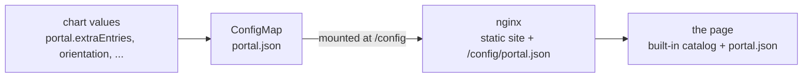

# Portal

The entrypoint page of an estate: what it serves, by tier, with the terminal
recipes and the documentation a newcomer needs. `apps/portal` is the page (a
TypeScript, React and Vite single-page app), `charts/observability-portal`
deploys it, and `ghcr.io/truvity/observability/portal` is the image — a built
static site behind an unprivileged nginx, published at every tag beside the
charts.

The page carries a **generic** built-in catalog and nothing about any estate.
Everything estate-specific is a document, `/config/portal.json`, that the page
fetches when it loads. The chart renders that document from values into a
ConfigMap, so an estate extends the page without forking it.



## What the page does

1. Shows the built-in catalog: a "Start here" note saying the catalog is the
   default and how to extend it, and no entries.
2. Fetches `/config/portal.json` with `no-cache`.
   * Not mounted (404): the built-in catalog only, quietly.
   * Present and valid: merged into the built-in catalog.
   * Present and invalid, or the fetch failed: the built-in catalog, and a
     visible notice that says why. A page that silently ignored a bad file
     would be the page that is wrong without anybody knowing.

The document is validated in the browser against
[`apps/portal/schema/portal.schema.json`](../apps/portal/schema/portal.schema.json),
the same schema the chart's `values.schema.json` reuses and the tests hold both
to. URLs must be `http(s)://` or a path on the host: a `javascript:` URL is
refused by the schema, and React escapes every string on the page.

## The schema (version 1)

Every key is optional. `{}` leaves the built-in catalog as it is.

| Key | Type | Meaning |
|---|---|---|
| `version` | `1` | The schema version. |
| `title` | string | The page heading. Default `Platform`. |
| `lede` | string | The sentence under the heading. |
| `issuer` | URL | The sign-in URL shown in the footer. |
| `replaceDefaults` | boolean | Drop the built-in notes instead of adding to them. Default `false`. |
| `tierOrder` | string[] | Tier names in display order; tiers not listed follow in order of first appearance. |
| `entries` | entry[] | Things somebody can open, grouped on the page by `tier`, in the order given. |
| `orientation` | `{title, body}`[] | Notes under "Start here". |
| `commandLine` | `{title, body, command}`[] | Terminal recipes. |
| `guides` | `{title, links: [{title, url}]}`[] | Documentation links. |

An **entry** has `name`, `title`, `url` and `tier` (required) and
`description`, `host`, `tailnet`, `catalog`, `requires`, `runbook` (optional).
`name` is the identity: a later entry with the same `name` replaces an earlier
one, which is how an estate overrides a built-in. `tailnet` and `catalog` add a
badge; `requires` renders as "held by ...".

Extra notes, recipes and guides follow the built-in ones.

## Deploying

```yaml
# values.yaml
portal:
  title: Example estate
  issuer: https://login.example.test
  replaceDefaults: true
  tierOrder: [ops, dev]
  extraEntries:
    - name: dashboards
      title: Dashboards
      url: https://dash.example.test/
      host: dash.example.test
      tier: ops
      requires: ["ops:viewer"]
  commandLine:
    - title: Cluster
      body: Reach the API.
      command: kubectl get pods -A
```

The chart renders exactly the keys that were set (`extraEntries` is the file's
`entries`); a default install renders `{"version": 1}`. The catalog is read per
request, so a ConfigMap change shows on the next page load with no restart.
The Service listens on `service.port` (8080) and the page answers
`/healthz` for probes. Routing and sign-in are the estate's: the chart renders
no route, no policy and no ingress.

The image's server has no cache for the page or the catalog (a stale entrypoint
is worse than a slow one), a strict Content-Security-Policy (the only
`unsafe-eval` is the schema validator), and `404` for everything that is not
the page, its hashed assets, `/config/portal.json` or `/healthz`.

## Developing

```sh
just portal                       # install --immutable, typecheck, test, build
yarn --cwd apps/portal dev        # vite dev server (404 for /config/portal.json: defaults only)
```

Node and yarn come from devbox, pinned in `devbox.json` with the node plugin
disabled so the yarn pin is the yarn that runs (the plugin's corepack shims
would otherwise shadow it). The release builds `apps/portal/dist` in a
GoReleaser `before` hook and `dockers_v2` copies it into the image.

To try a catalog locally, serve it where the page expects it: put a document at
`apps/portal/public/config/portal.json` (not committed) and run `yarn dev`.
