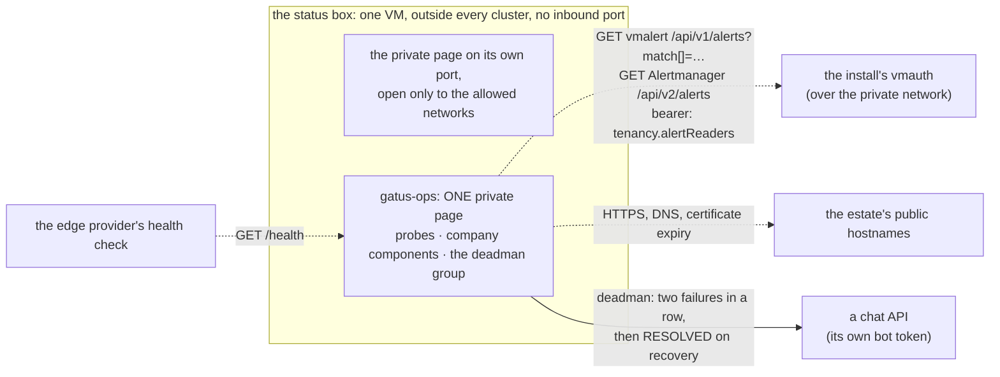
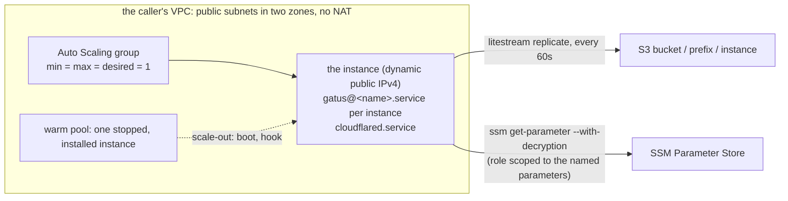

# The status box: the watcher outside

Design for `pkg/statusbox` and `pkg/statusbox/ec2` (Pulumi, Go) and the
templates they carry. The box runs on EC2 only: the Lightsail backend and
its `setup.sh` release asset are gone (CHANGELOG, `**Removed**`).



## The problem it closes

Four jobs are conventionally bought from one vendor: a deadman that
notices when the alerting pipeline has died; probes from outside that
answer "can a customer reach us"; a public status page; and a way for an
internal alert to turn a status component red. Each needs to run
somewhere the estate's own failure cannot reach, and each is small.

Gatus does all four from one static binary and one YAML file: it
probes, it renders a page, and it alerts. Two different mechanisms carry
the first two jobs into it, and the difference between them is worth
being precise about, because an earlier design here picked the wrong one
for the second job:

- Gatus accepts pushed results on an *external endpoint* and alerts when
  the pushes stop (`heartbeat.interval`) — a bare heartbeat, no payload
  shape to agree on, which is genuinely "no adapter": whatever the
  install's alerting pipeline is, "a request landed" or "a request did
  not land" is the entire vocabulary.
- Turning an *internal* alert into a status component's colour is not
  that shape. Alertmanager's own webhook receiver POSTs a fixed JSON
  body — the same shape whether an alert is firing or resolved — to ONE
  URL it is configured with; Gatus's external-endpoint mechanism reads
  success from a QUERY PARAMETER on the request it receives instead
  (`success=true` / `success=false` on the URL Alertmanager would POST
  to). Neither side speaks the other's shape: something would have had
  to sit between them, translating a POST body's alert state into that
  query parameter. That translator is an adapter, and an earlier
  revision of this page did not count it as one — it read "no adapter"
  for the deadman above and assumed the same held here. It does not.
  The design below counts it, and picks PULL instead for exactly this
  job: Gatus's own `[BODY]` conditions read the alerting pipeline's read
  API directly, in its own vocabulary, so there is nothing to translate.
  See "internal → status, pulled" below.

This repository turns "run one or more Gatus instances, joined to a
private network, on a small box" into a package an estate calls.

## The shape

One virtual machine (an Auto Scaling group of exactly one, see "EC2
backend"), provisioned by Pulumi from a package here, with no inbound port
open to the internet. Today, on it:

```
gatus-ops    ONE page, PRIVATE, reachable only from the allowed networks: every company's own component (red/green) alongside cluster infrastructure (every hostname, every certificate's expiry) and the deadman — both read, not received, see "internal → status, pulled"
```

No public page unless the estate adds one: a public, per-company status
page — `gatus-<company>`, on that company's own domain — is a SEPARATE
instance (`Instance.Public`, one `cloudflared` ingress rule per `Public`
instance), added once that hostname is delegated; see "a new company page"
in the table below. Taking that step does not change the private page: it
keeps every company's own component and every piece of cluster
infrastructure, in one page, for whoever is watching from inside the
estate's own network.

Each Gatus is the same binary, its own YAML, its own SQLite file (replicated
to S3 by Litestream). There is no shared database and there are no replicas:
Gatus has no clustering or leader election, and two instances on one
database are two independent probers that both alert. Availability of
the watcher is a second, independent box in another place — never a
shared store — and it is not the starting point.

### The deadman group (`Catalogue.Deadman`)

Three pulled checks in the `platform` group, every two minutes, paging after
two consecutive failures and again when resolved, through their OWN
provider (`DeadmanChecks.Post`, a Gatus `custom` provider that POSTs
`{"channel","text"}` with `Authorization: Bearer <bot token>` to a chat
API such as Slack's `chat.postMessage`). `Providers` is not shared with
them: the company signals keep it and never reach the deadman channel.
The post is `<group>/<name> - <state text>`, and the two states read
differently (`placeholders.ALERT_TRIGGERED_OR_RESOLVED`): a recovery says
"RESOLVED: the check is passing again", never "failed twice in a row".

- `deadman`: the Watchdog is present in vmalert (`/api/v1/alerts`);
- `alertmanager-watchdog` (`AlertmanagerWatchdog`): the Watchdog is ACTIVE
  in Alertmanager, from `GET /api/v2/alerts?filter=alertname="Watchdog"
  &active=true&silenced=false&inhibited=false` on `AlertsRead.Host`
  (the response is a JSON array; the condition reads
  `[BODY][0].labels.alertname == Watchdog`). The route must admit GET
  only: see `tenancy.alertReaders[].alertmanager`;
- one check per `NotFiring` entry: that alert is NOT firing in vmalert.

**Telegram (optional).** `Catalogue.Telegram` (a `TelegramProvider`: two
`AlertURLParameters` keys, the bot token and the chat id) renders Gatus's
native `alerting.telegram` and adds a `telegram` alert to every endpoint the
deadman group pages through, with the same failure threshold and
send-on-resolved as the deadman's other channel. `Providers.Telegram` adds it
to the company signals as well. Nil renders no telegram provider. In
`deploy/pulumi/status` the keys are `deadman_telegram_token` and
`deadman_telegram_chat_id`, enabled only on the instance that pages.

A chat API answers 200 even for a refusal (Slack's `not_in_channel`),
which Gatus cannot see: the bot must already be in the channel.
`hack/gatus-deadman-proof.sh` proves the three checks, the threshold, the
bot token in the header and the resolved message on the real image.

A Config built from `external-endpoints:` alone refuses to start: Gatus
panics at boot ("configuration should contain at least one endpoint or
suite") unless at least one ordinary `endpoints:` or `suites:` entry is
present too, and separately refuses any `external-endpoints:` entry with
no `token` ("you must specify a token for each external endpoint") — the
credential the pushing side has to send back on every push. Neither
constraint is optional and neither is enforced by this package; Config
is the estate's own YAML, so both are on the estate to get right. For
`gatus-ops` the first constraint costs nothing: its ordinary `endpoints:`
entries are the same hostname and certificate probes the table below
already asks it to run, so external-endpoints is never actually alone
there — but a Config that tries to make an instance JUST a deadman
receiver, with nothing else configured, will not boot.

### `pkg/statusbox`

```go
// The provider-neutral core: the instance list, its validation, and the
// Gatus renderer. Nothing of the estate is in this package; everything of
// the estate is in the arguments. pkg/statusbox/ec2 turns it into a box.
type Instance struct {
    Name   string // gatus-<name>
    Port   int
    Public bool   // in the tunnel's ingress, or reachable only privately
    Config string // the Gatus YAML, rendered by the estate
}
```

A secret reaches a Config by name, never as a literal: Gatus substitutes
`${VAR}` inside its own YAML at start-up, so a Config writes
`${ALERT_URL_<NAME>}` (an alert key, upper-cased) wherever it wants a
push-alert credential, such as an external endpoint's `webhook-url`, and
`${<NAME>}` (a whole variable name, such as `OIDC_CLIENT_SECRET`) for any
other secret, such as Gatus's own `security.oidc.client-secret`. In the EC2
backend each is the NAME of an SSM parameter (`AlertURLParameters`,
`EnvParameters`) that the box reads at boot into a tmpfs; see "EC2
backend". A name colliding with `TUNNEL_TOKEN` or the `ALERT_URL_`
namespace is refused (`ValidateSecretNames`): two secrets landing in a
Config under the same `${...}` reference is worse discovered at deploy
time than in a process's environment after the fact.

### Building the Config: `RenderGatus` (0.9.0)

Every `Instance.Config` above is a Gatus YAML string the ESTATE renders
and hands in — until 0.9.0, entirely: this package took the string and
never inspected it. The combined ops page ("internal → status, pulled"
below) is the same shape for every consumer that builds one, though, so
0.9.0 moves that RENDERING — never the estate's own catalogue
derivation — into this package too:

```go
// The estate-neutral input: what to probe, and how to alert. Nothing
// here is derived by this package — every field is a plain value or a
// slice the caller already worked out from its own configuration
// (which hostnames are public, which company owns which, where the
// alerts-read path answers).
type Catalogue struct {
    PlatformHosts []string          // infrastructure hosts, the "platform" group
    HostProbes    map[string]Probe  // optional per-host probe {Path, ExpectStatus}; absent = GET / expecting 200
    Companies     []Company         // one group per company, in render order
    AlertsRead    AlertsRead        // the one pull path — see "internal → status, pulled"
    Providers     DeadmanProviders  // optional Slack/PagerDuty AlertURLs keys (company signals)
    Deadman       DeadmanChecks     // the deadman group's own provider and checks
    Security      *OIDCSecurity     // nil = private/breakglass instance
    StoragePath   string            // Gatus storage.path
}

type Company struct {
    Code, DisplayName string
    Hosts             []CompanyHost
}

type CompanyHost struct {
    Host, Env, StatusPath string // StatusPath "" = the lenient fallback condition
    Component             string // caller-side label, carried but never rendered
}

func RenderGatus(c Catalogue) (string, error)
```

What stays the ESTATE's own, deliberately: deriving a `Catalogue` from
that estate's OWN configuration (which public hostnames exist, which
one belongs to which company, where the alerts-read private name
resolves) — the same split `pkg/tenancy` already draws between "render
a filter" (this repository) and "know what a person may read" (the
estate's `cfg/access.yaml`). A consumer with its own catalogue format
writes its own small mapping from that format to `Catalogue` and calls
`RenderGatus` once per `Instance` it needs (typically two — a Public
one with `Security` set, and a private/breakglass twin with `Security:
nil`, sharing every other field so the two pages can never show two
different answers about the SAME estate).

### Trusting a private root

Most probes are ordinary public HTTPS: the box's Gatus containers verify
them against whatever public trust bundle the release image ships, the
same as any other client on the internet. One shape does not fit that:
an `endpoints:` entry whose URL is an HTTPS service inside the estate's
own private network, whose certificate is issued by the estate's own
private root rather than a publicly-trusted one — "internal → status,
pulled" above is exactly this case, and it also carries a bearer token
in its `Authorization` header. Skipping TLS verification (`-k`,
Gatus's own `insecure: true`) is not an acceptable answer here: it would
send that token to whatever answered on the address, verified or not.

`TrustedCAs` (on `ec2.Args`, `Inputs.TrustedCAs` in `deploy/pulumi/status`)
is a PEM bundle of one or more extra CA certificates every instance should
trust ALONGSIDE the system bundle — never instead of it. Left empty, the
ordinary case, nothing changes at all. Set, it is validated at render time
(`ValidateTrustedCAs`): each PEM block must parse as an X.509 certificate
and must itself be a CA (`BasicConstraints.IsCA`). It travels as a
content-addressed S3 object like an instance's Config, and the setup
script's `setup_trusted_cas` installs it for the Gatus units, whose
`SSL_CERT_DIR` then names the directory holding it. That is additive, a
property of Go's `crypto/x509` on Linux: `SSL_CERT_FILE` and
`SSL_CERT_DIR` are independent overrides, so the system bundle keeps
loading from its file while the directory adds the estate's roots.

### Checksum at deploy, verify at boot

The consumer pins only `Version`. The package fetches that release's
`checksums.txt` at deploy time (`statusbox.FetchChecksums`, replaceable for
an estate with no general internet egress) and renders the sha256 of the
Gatus binary into the setup parameters; the box downloads the binary from
the release and refuses to install it if the sha does not match. One input,
no hand-copied hashes.

## EC2 backend

`pkg/statusbox/ec2` is the place the pages run: an Amazon Linux 2023 instance in an Auto Scaling group of exactly one, with a warm pool of one stopped instance. It has no Docker, no Tailscale and no attached disk, and no secret in user-data.



**What it creates.** A launch template (Amazon Linux 2023 image from the public SSM parameter for the architecture, IMDSv2 required, an encrypted gp3 root volume, a public IPv4 address and no Elastic IP), an instance profile and role, a security group with no inbound rule except the private page's port from `PrivateIngressCIDRs` (and TCP 22 from `SSH.IngressCIDRs` when SSH is on, below), and the Auto Scaling group with its launch hook declared on the group, so the hook exists before the first launch. `InstanceType` defaults to `t4g.nano`; a Graviton family is arm64, anything else amd64. The image is looked up when Pulumi runs and pinned in the launch template, so a newer Amazon Linux release shows up as a diff and a rolling refresh, never as a change on the next launch.

**The input is parameter names, not secrets.** `TunnelTokenParameter`, `AlertURLParameters` (the Config's `${ALERT_URL_<KEY>}`, the alerts-read token and a deadman's chat token among them) and `EnvParameters` (a whole variable name, such as `OIDC_CLIENT_SECRET`) are SSM Parameter Store names. The instance reads them at boot with `aws ssm get-parameter --with-decryption` and writes them to a tmpfs under `/run`, mode 0600, never to the root volume. The role's policy names exactly those parameter ARNs, the bucket's prefix, the one Auto Scaling group and, if `KMSKeyARN` is given, that one key; there is no managed policy on it unless `SessionManager` is set (below). A test fails if `Args` ever grows a field a secret value could be handed in through.

**Configs and the setup script are S3 objects, not user-data.** EC2 caps user-data at 16,384 bytes. An estate's two Gatus configurations (the public `ops` and the private `ops-breakglass`, near-identical) plus the setup script, SSH and self-registration do not fit even gzipped, and compressed data does not compress again. So `NewEC2` writes each rendered file as an object in the box's own bucket, `s3://<Bucket>/<BucketPrefix>/config/<sha256>.<yaml|pem|sh>` (content-addressed; `s3.BucketObjectv2`, encrypted with `KMSKeyARN` when it is set, else SSE-S3), and the user-data carries only each object's name, sha256 and key, plus the setup script's. That covers every instance's `Config`, `TrustedCAs` and the setup script itself. A test builds an estate-sized catalogue (about 40 endpoints, both instances, Telegram, ping, SSH and SelfRegister on) and asserts the user-data stays at or under 12 KiB; it was 17 KB on the same fixture before.

- **Boot ordering.** The user-data writes `params.sh`, the SSH and self-register files, then fetches the setup script (`aws s3 cp` with the instance role, five attempts) and verifies its sha256 before it runs. The install phase then fetches every config the same way, verifies each, and only then unpacks them, writes the units and starts the boot phase. Gatus starts later, from the boot phase, so it never sees an unverified file. A warm-pool instance does all of this at its first boot too.
- **Fail closed.** A fetch that fails or whose digest differs after the retries completes the lifecycle hook with `ABANDON` (and exits non-zero), so the group replaces the instance and a bad config never goes InService. Nothing unverified is staged.
- **Rolling.** The sha256 is in the user-data, so a changed config is a new launch template version and the group's instance refresh rolls the instance, as before. The launch template and the group depend on the objects, so they exist before any instance launches. An old object is deleted by Pulumi once nothing references it.
- **IAM.** No change: the role's `ReplicaObjects` statement already allows `s3:GetObject` on `<BucketPrefix>/*`, which covers `config/`. With no `BucketPrefix` it is the whole bucket, as it was. The Pulumi caller needs `s3:PutObject` (and the key, with `KMSKeyARN`) on that prefix. An instance may not be named `config` (the directory is reserved).
- **No secrets in the objects.** A Config references its secrets as `${ENV}` names (`${ALERT_URL_<KEY>}`, `${OIDC_CLIENT_SECRET}`) that the boot phase fills from SSM into `/run`; the objects hold those references only, and a test checks that no `token:` or `secret:` value in a rendered object is a literal.

**Gatus and cloudflared are systemd units.** `gatus@<instance>.service` runs each instance as `litestream replicate -exec gatus` under a dedicated user, with the instance's directory bind-mounted at `/data` so a Config's `storage.path: /data/ops.db` is the same path a container would have had. The Config must say `storage.type: sqlite` with a file directly under `/data`; `Args.validate` refuses anything else. The listener is not the Config's: the setup script writes a second file into the instance's config directory, which Gatus merges over the first, binding a public instance to `127.0.0.1` (where cloudflared dials it) and the private one to every interface (where the security group admits the peer). `cloudflared.service` runs `cloudflared tunnel run` with the token from the environment. Both are `Restart=always`. Neither unit is enabled: only the boot phase starts them, which is what the next section depends on.

**The binaries are pinned.** Gatus is built in this repository's release from the upstream tag `GatusVersion` (`pkg/statusbox/ec2/pins.go`) for linux/arm64 and linux/amd64, attached as `gatus_<tag>_linux_<arch>` and listed in `checksums.txt`. The checksum is read from that file when Pulumi runs and rendered into the user-data. Litestream and cloudflared are downloaded from their upstream releases; their versions and sha256 sums per architecture are constants in `pkg/statusbox/ec2/pins.go`. Every download is verified before it is installed.

**Storage: SQLite on the root volume, replicated by Litestream.** Gatus opens its SQLite database in WAL mode (`PRAGMA journal_mode=WAL` in its store, set when it opens the file), which is the mode Litestream requires, so no change to Gatus is needed. Each instance replicates to `s3://<Bucket>/<BucketPrefix>/<instance>` with `sync-interval: 60s`: a replaced instance loses at most the last minute of probe history. Gatus is not a source of truth, so that is the accepted window.

**One writer, by construction.** The user-data installs everything on the first boot, then a `statusbox-boot` unit runs on every boot and reads the Auto Scaling group's target lifecycle state from the metadata service.

- A warm-pool instance (`Warmed:*`) completes its launch hook and stops. It restores nothing, starts nothing and reads no secret.
- An instance going `InService` (a scale-out from the warm pool, or a cold launch) reads the secrets, runs `litestream restore -if-replica-exists` for each database, and only then starts the Gatus units and cloudflared. It completes the hook once every instance answers `/health`, then turns on the health timer. If any step fails it abandons the launch, and the group replaces the instance.

The replica is therefore written only by the one in-service instance. The group is `min = max = desired = 1` and the instance refresh uses `MinHealthyPercentage: 0`, so a replacement stops the old instance before the new one launches. A restore goes to a temporary file and replaces the local database only if it produced one, so a first-ever start with no replica begins empty and a failed restore never leaves half a database.

**Health.** `Restart=always` handles a crashing process. A timer runs a local check every minute: each Gatus unit active and answering `/health`, and cloudflared active when there is a tunnel. If that fails continuously for `HealthFailMinutes` (default 5), the instance calls `aws autoscaling set-instance-health --health-status Unhealthy` on itself and the group replaces it. A 1 GiB swap file and a 100 MiB journald cap keep a nano instance alive.

**Telegram and the dead-man ping (optional).** `AlertURLParameters` may carry the Telegram bot token and chat id (the keys above; see "The deadman group"), and `PingURLParameter` is an SSM SecureString holding a healthchecks.io-style ping URL. With the latter, the setup script installs `statusbox-ping.service` and `.timer`; the boot phase reads the URL into `/run/statusbox/ping.url` (mode 0600, root) and starts the timer once the instance is in service. Every 60 seconds the service GETs the URL when every local Gatus answers `/health` with 200, and `<url>/fail` otherwise. curl gets the URL on stdin (never on its command line), with a 5 s connect and 10 s total timeout and three retries; the URL appears in no unit file and no log. If the box dies, the pings stop and the external service alerts. Empty `PingURLParameter`: no ping units. In `deploy/pulumi/status`, `EC2Inputs.TelegramTokenParameter` and `TelegramChatIDParameter` (both or neither) and `EC2Inputs.PingURLParameter` carry them.

**Not in this box.** Tailscale: the instance reaches its peer over private routing (VPC peering) that the caller provides, and the private page is reachable on its own port from `PrivateIngressCIDRs`, not over a tailnet on port 80. The private page's port is the private instance's `Port` (`EC2Inputs.PrivatePort`, default 8081); setting it to 80 serves the page at plain `http://<name>/`. The security group opens exactly that port, the health, ping and lifecycle probes dial it, and for a port below 1024 the setup script adds a drop-in to that instance's `gatus@<name>.service` with `AmbientCapabilities=CAP_NET_BIND_SERVICE` (the unit still runs as the unprivileged user with `NoNewPrivileges`). Changing the port changes the security group rule (the group is replaced only if its description changes, which this does not) and rolls the instance. Outside checks and the Gatus metrics push follow separately.

**Permissions boundary (optional).** `Args.PermissionsBoundary` (`EC2Inputs.PermissionsBoundary` in `deploy/pulumi/status`) is the full ARN of an IAM permissions boundary set on the instance role; an account that denies creating a role without its boundary needs it. Empty: the role has none. The instance role is the only IAM resource the box creates.

**Session Manager shell (optional).** `Args.SessionManager` (`EC2Inputs.SessionManager`) attaches the AWS managed policy `AmazonSSMManagedInstanceCore` to the instance role, so the SSM agent that Amazon Linux 2023 ships registers the instance with Systems Manager and `aws ssm start-session --target <instance-id>` gives a break-glass shell with no inbound port; no user-data change is needed. Without it the agent logs credential errors and the instance has no shell. Default false, so existing stacks do not change on upgrade. A permissions boundary on the role (see above) is the caller's: it must allow the `ssm:`, `ssmmessages:` and `ec2messages:` actions, or the attached policy is capped to nothing.

**Proof.** The package's tests cover `Args.validate`, a golden of the rendered user-data, the resource shapes (group, launch template, security group, role policy) and the absence of any secret value from it. `just statusbox-ec2` runs the setup script inside an `amazonlinux:2023` container: the pinned downloads, the units and Litestream configs, a database round trip through `litestream replicate` and the script's restore, and the boot phase's ordering with `systemctl`, `aws` and the metadata service replaced by shims. It does not run systemd or an instance; the first real boot is the one thing left unproved.

### SSH (optional)

`Args.SSH` (`EC2Inputs.SSH`, an `*ec2.SSHArgs`) gives the box SSH through the estate's opkssh (OIDC sign-in) and OpenBAO-signed host certificates, installed by `pkg/hostaccess` of `github.com/truvity/tailscale` (pinned at v1.24.2; `ec2.HostaccessVersion` is the same number, and a test fails if it drifts from `go.mod`). Nil changes nothing: the user-data, the security group and its description are exactly what they were. The `ec2-user` key pair stays off, so opkssh is the only way in.

**Inputs.**

- `SSH.OPKSSH` (`hostaccess.OPKSSHPreset`): `Issuer`, `ClientID`, `Expiration` (empty: 24h), `User` (`ec2-user`) and `Group` (admitted as `oidc:groups:<Group>`).
- `SSH.HostCert` (`*hostaccess.HostCertPreset`, optional; nil renders opkssh only, with no OpenBAO and no host certificate): OpenBAO `Address`, `CABundle`, `Namespace`, `AuthMount`, `AuthRole`, `ServerIDHeader`, `SSHMount`, `SSHRole` and `PrincipalPatterns`. The principal is the instance's private DNS name, from IMDS `local-hostname`, so the patterns are of the form `ip-*.<region>.compute.internal`.
- `SSH.HostKeyParameter` (optional): the name of an SSM SecureString holding one fixed ed25519 host key in OpenSSH private-key format, normally generated by the caller's IaC. See "Fixed host key" below.
- `SSH.IngressCIDRs`: the networks allowed to reach TCP 22. Required, IPv4 only, never `/0`.

The pinned opkssh and host-certificate builds are arm64, so SSH needs a Graviton `InstanceType` (the default `t4g.nano` is one); an x86 type with SSH set is refused at validation.

**What the box does.** The bootstrap writes `Bundle.Files` (under `/etc/hostaccess`), then runs one small program that installs `Bundle.Packages` with `dnf` and runs `Bundle.Commands`: it downloads `hostaccess-setup-v1.24.2.sh` from the truvity/tailscale release, refuses it unless its sha256 is the one computed from the embedded copy, and runs it. That happens before the setup script's install phase, which is what starts the boot phase that completes the Auto Scaling lifecycle hook, so an instance is InService only after SSH setup was attempted. It is fail-safe: every step logs and carries on, and the whole program is limited to ten minutes, so a failed SSH setup leaves a box without SSH, never a box that does not come in service. Before the opkssh commands it also writes an sshd drop-in, `06-statusbox-kex.conf`, with `KexAlgorithms ^mlkem768x25519-sha256,sntrup761x25519-sha512@openssh.com`: the standardised ML-KEM hybrid key exchange is offered first, the sntrup hybrid is the fallback, and sshd's own defaults follow (the `^` prefixes the default list). Amazon Linux 2023's OpenSSH (9.9) supports it; the drop-in is kept only if `sshd -t` passes with it, otherwise it is removed and sshd keeps its defaults. A warm-pool instance gets it too, on its first boot. Delivery is by download, so SSH costs about 1.5 KB of the 16 KiB user-data limit; the estate-sized test asserts the whole user-data stays at or under 12 KiB with SSH on.

**Security group.** TCP 22 from `SSH.IngressCIDRs` only. The group's description then reads "no inbound except the private page and SSH (opkssh) from the listed networks". A description cannot change in place, so a box that turns SSH on has its security group replaced; a box without SSH keeps the old description and is untouched.

**IAM and egress.** Nothing is added to the instance role. The box authenticates to OpenBAO's AWS auth method with `sts:GetCallerIdentity`, which every role may call. It downloads the setup script and the opkssh and host-certificate artifacts from github.com; the security group already allows all egress, and OpenBAO must be reachable from the box at `HostCert.Address`.

**Fixed host key.** With `HostKeyParameter` set the instance role may read exactly that parameter (and decrypt it with `KMSKeyARN`, if set). Before the SSH setup restarts sshd, the box fetches the key, derives `/etc/ssh/ssh_host_ed25519_key.pub` with `ssh-keygen -y`, installs both (0600 and 0644, root) and writes `/etc/ssh/sshd_config.d/05-statusbox-hostkey.conf` with a single `HostKey` line, so sshd presents only that key, whatever instance it runs on. Every replacement and warm-pool takeover therefore shows the same key, and a laptop trusts it with one plain line, `<host> ssh-ed25519 AAAA...`, instead of a host CA. It is fail-safe: if the fetch, the key or `sshd -t` fails, the box logs `host key restore failed`, removes the drop-in, keeps the key sshd generated and still goes InService (clients then see a changed key and refuse, which is the safe outcome). The private key is never in the user-data; it is in SSM only.

**Operator flow.**

```sh
opkssh login --provider="https://<issuer>,opkssh"
sluisctl ssh known-hosts
ssh -o IdentitiesOnly=yes -i ~/.ssh/id_ecdsa ec2-user@<host>
```

`https://<issuer>` is `SSH.OPKSSH.Issuer`, and `<host>` is the instance's private DNS name (the host-certificate principal), reachable from one of `IngressCIDRs`. `sluisctl ssh known-hosts` trusts the OpenBAO host CA, so the first connection needs no fingerprint prompt.

### Self-registered DNS name (optional)

`Args.SelfRegister` (`EC2Inputs.SelfRegister`, an `*ec2.SelfRegisterArgs`) keeps a stable name pointing at the current in-service instance. The private address changes on every instance replacement and every warm-pool takeover, so the box writes it into a Route 53 hosted zone itself, at every boot into service. Nil changes nothing: the user-data, the role policy and every golden are byte-identical.

- `RoleARN`: the role to assume, usually in the account that owns the zone. It is the caller's to create. It must trust exactly the instance role (`<prefix>-status`), and should be limited to changing the one record (`route53:ChangeResourceRecordSets` on the zone, with the `route53:ChangeResourceRecordSetsNormalizedRecordNames`, `...RecordTypes` and `...Actions` condition keys pinned to the record name, `A` and `UPSERT`). `GetChange` is not needed: the box does not wait for the change to propagate.
- `HostedZoneID`: the zone that holds the record (a private zone works).
- `RecordName`: the one A record, lower case, no trailing dot.
- `TTL`: seconds; 0 means 60.

**IAM.** The instance role gains one statement, `sts:AssumeRole` on exactly `RoleARN`. If the role carries a permissions boundary, the boundary must allow `sts:AssumeRole`.

**What the box does.** The bootstrap writes `/usr/local/sbin/statusbox-self-register` and a systemd drop-in on `statusbox-boot.service` with `ExecStartPost=-/usr/bin/timeout 120 ...`. `ExecStartPost` runs after the boot phase has completed the lifecycle hook, so the step can never delay InService, and the leading `-` makes its exit status irrelevant. The script does nothing unless IMDS says the target lifecycle state is `InService`, so a warm-pool instance that is only being pre-warmed never registers; the instance that takes over registers on its own boot. It reads the private IP from IMDSv2, assumes `RoleARN` with the AWS CLI that Amazon Linux 2023 ships, and UPSERTs the A record, three attempts five seconds apart. Failures are logged (to the journal, as `statusbox-self-register`) and swallowed; nothing secret is logged or written to disk, the temporary credentials live in the process environment. UPSERT on every boot means a failover heals the name. The old instance is not deregistered: the name always names the instance that booted last into service.

**Cost.** About 1.7 KB of user-data (about 2.3 KB since the setup script left it), asserted by the estate-sized test, which keeps the whole user-data at or under 12 KiB.

**Activation order.** Create the role in the zone's account first, then roll the new `SelfRegister` into the box. A box that boots before the role exists logs three failed attempts and carries on; the next boot (or a manual run of the script) registers it.

## Immutable, by construction

The user-data is applied at launch, and every file it names is verified by
sha256 before it is used. So a change to any instance's config **replaces
the instance** through the group's instance refresh: a few minutes of
status-page blip, the history restored from the Litestream replica (at most
the last minute is lost). Immutability is the honest design; config changes
here are rare. The EC2 backend ships its configs as S3 objects because
EC2's user-data limit (16,384 bytes) cannot hold them; see "EC2 backend".

User-data is readable from the instance metadata service by any process on
the box, which is why no secret VALUE is ever in it: only parameter names,
read at boot through the instance role (IMDSv2 required).

## How the estate wires it

| Job | How |
|---|---|
| deadman, internal → status | **pulled**, both — see "internal → status, pulled" below. Gatus on the box reads the install's own alerting state directly; nothing pushes into the box at all today. |
| the deadman's alert | leaves Gatus on the deadman group's own chat provider (`Catalogue.Deadman`), which depends on nothing in the estate; the company signals' `Providers` never reach that channel |
| external probes | ordinary Gatus `endpoints:`: HTTP status, body conditions, `[CERTIFICATE_EXPIRATION]`, DNS, from outside the estate's accounts |
| the second vantage and the watcher's watcher | the edge provider's health checks: multi-region against the same hostnames, and one against the box's own `/health` |
| a new hostname | a line in the estate's catalogue; the estate's renderer emits a probe and a component; the box is replaced |
| a new company page | later, once a `status.<company domain>` hostname is delegated: a new Public `Instance`, its own tunnel ingress rule — the mechanism above already carries it |

### internal → status, pulled

The deadman and the internal-to-status bridge are the same mechanism now,
read rather than received: an ordinary Gatus `endpoints:` entry whose URL
is the install's OWN alerting read API — `tenancy.alertReaders` in
`charts/observability-stack` mints exactly this bearer token, scoped to
one route (vmalert's `/api/v1/alerts`) and nothing else — with an
`Authorization: Bearer ${ALERT_URL_<KEY>}` header (the same
alert-URL mechanism a Config already uses for a credential it
must not carry as a literal, repurposed: the value staged there is a
bearer token here, not a push URL).

Three types of checks on that one response body:

- **deadman**: the response's `data.alerts` array is non-empty when
  filtered (server-side, via the read API's own `match[]` parameter) to
  `alertname="Watchdog"` — which this install's own `Watchdog` VMRule
  (`vmalert.watchdog.enabled`, default on) is always evaluating, whether
  or not the install runs Alertmanager at all. Gatus's own condition is
  `len([BODY].data.alerts) > 0`. The deadman alerts when it goes red.
- **a company's colour**: the same shape, `match[]` filtered instead to
  `customer_facing="true", company="<code>"` — a rule an estate writes
  in its own alerting rules, not something this repository ships.
  `len([BODY].data.alerts) == 0` is green; anything else is red. A company
  signal alerts when it goes red.
- **internal infrastructure checks**: internal alerts (not customer-facing)
  that must be displayed on the status page but NEVER forwarded as alerts
  — for example, `SlackNotificationsFailing` (the alert that Slack itself is
  down). The same shape, `match[]` filtered to `alertname="<name>"` where
  the estate configures the alert names. These checks show red when firing,
  green when absent, but generate no alerts even when alert providers
  (Slack, PagerDuty) are configured for the deadman and company signals.

No condition needs a translator: the read API's own JSON is what
the condition reads, in the alerting pipeline's own vocabulary, and
`match[]` does the narrowing before the response ever reaches Gatus —
Gatus never has to filter an array of alerts itself, which its own
`[BODY]` condition language has no way to do (dot-notation and `len()`
only; no query that selects one element of an array by a field it
carries). What `match[]` cannot narrow by is an alert's `state`
(pending vs firing) — VictoriaMetrics' vmalert applies it to an alert's
own LABELS only — so a `for:` rule that is merely PENDING also counts
as present here. That is the conservative direction for a status page to
be wrong in, and it is written down rather than glossed over.

## What the estate accepts, and what it does not

The box is outside every cluster, and — on its one provider — inside
the same cloud account structure as the estate, in a separate account
and region. A running instance survives the cloud's control-plane
mistakes (an IAM or organisation policy stops API calls, not processes);
what it does not survive is account suspension and a regional
coincidence. An estate that will not accept that runs the same package
on a second provider; the core is provider-neutral for exactly that.

Rejected, with the reason, so nobody re-derives it: a container
platform at the edge provider (ephemeral disk, a deploy tool with no
infrastructure-as-code path, and it collapses the edge and the watcher
into one party); a UI-driven uptime tool (fails config-as-code at the
door); Gatus replicas with a shared database (coordinates nothing).

## Proof

- golden render of the EC2 user-data and setup parameters
  (`pkg/statusbox/ec2/testdata`), and the resource shapes;
- `just statusbox-ec2`, the setup script inside `amazonlinux:2023`, as above;
- fixtures for the refusals: an instance with no config, two instances
  on one port, a public instance with no hostname, two instances that
  are both not Public, user-data over the limit, `TrustedCAs` that
  is not PEM, is not a CA, or carries trailing garbage;
- `RenderGatus`'s own golden and fixture coverage, structural, no
  network needed (`pkg/statusbox/gatus_internal_test.go`); and, in
  Docker against the real release image, `hack/gatus-boot-proof.sh` —
  a representative multi-company `Catalogue` actually boots on
  `twinproduction/gatus:v5.37.0`, `/health` answers, and every rendered
  endpoint is live in Gatus's own API.

In a consumer: the private page answers only from the allowed networks
(and, once a company page exists, its public page renders behind the
edge); stopping the box fires the edge health check; scaling the
install's metrics vmalert to zero (or blocking the box's read of it)
fires the deadman group on its chat channel after two probe intervals,
and posts RESOLVED when it comes back; a config change replaces the
instance, and the database comes back from its replica with its history.
