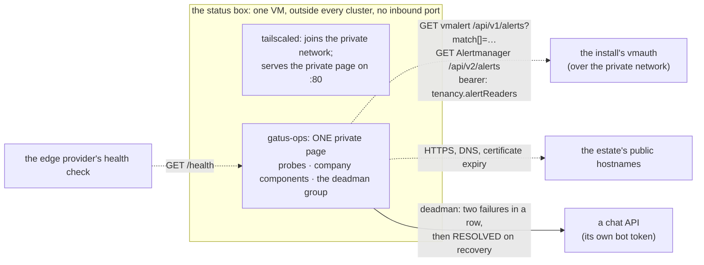
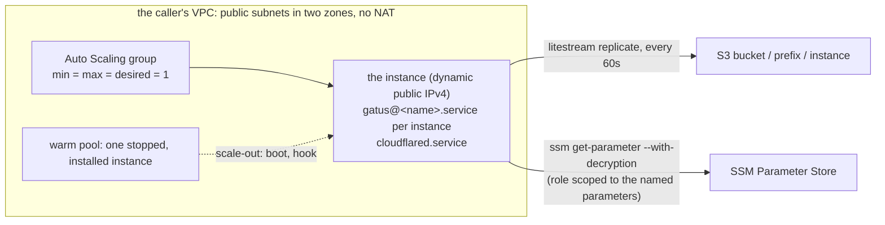

# The status box: the watcher outside

Design for `pkg/statusbox` (Pulumi, Go), the `setup.sh` release asset,
and the templates they carry.



## The problem it closes

Four jobs are conventionally bought from one vendor: a deadman that
notices when the alerting pipeline has died; probes from outside that
answer "can a customer reach us"; a public status page; and a way for an
internal alert to turn a status component red. Each needs to run
somewhere the estate's own failure cannot reach, and each is small.

Gatus does all four from one static binary and one YAML file: it
probes, it renders a page, and it alerts. Two different mechanisms carry
the first two jobs into it, and the difference between them is worth
being precise about, because an earlier design here picked the wrong one
for the second job:

- Gatus accepts pushed results on an *external endpoint* and alerts when
  the pushes stop (`heartbeat.interval`) — a bare heartbeat, no payload
  shape to agree on, which is genuinely "no adapter": whatever the
  install's alerting pipeline is, "a request landed" or "a request did
  not land" is the entire vocabulary.
- Turning an *internal* alert into a status component's colour is not
  that shape. Alertmanager's own webhook receiver POSTs a fixed JSON
  body — the same shape whether an alert is firing or resolved — to ONE
  URL it is configured with; Gatus's external-endpoint mechanism reads
  success from a QUERY PARAMETER on the request it receives instead
  (`success=true` / `success=false` on the URL Alertmanager would POST
  to). Neither side speaks the other's shape: something would have had
  to sit between them, translating a POST body's alert state into that
  query parameter. That translator is an adapter, and an earlier
  revision of this page did not count it as one — it read "no adapter"
  for the deadman above and assumed the same held here. It does not.
  The design below counts it, and picks PULL instead for exactly this
  job: Gatus's own `[BODY]` conditions read the alerting pipeline's read
  API directly, in its own vocabulary, so there is nothing to translate.
  See "internal → status, pulled" below.

This repository turns "run one or more Gatus instances, joined to a
private network, on a small box" into a package an estate calls.

## The shape

One virtual machine, provisioned by Pulumi from a package here, with no
inbound port open. Today, on it:

```
tailscaled   joins the estate's private network: SSH, the one page below, and its read of the install's alerting state
gatus-ops    ONE page, PRIVATE, reachable only over the tailnet: every company's own component (red/green) alongside cluster infrastructure (every hostname, every certificate's expiry) and the deadman — both read, not received, see "internal → status, pulled"
```

No `cloudflared` and no public page yet: nothing on the box is reachable
from outside the private network. A public, per-company status page —
`gatus-<company>`, on that company's own domain — is a SEPARATE instance
an estate adds LATER, once that hostname is delegated; see "a new
company page" in the table below. `pkg/statusbox`'s own shape
(`Instance.Public`, `Args.Hostnames`, one `cloudflared` ingress rule per
`Public` instance) already carries that step — taking it is a consumer
decision, not a mechanism this package gains later. Nothing about
taking it changes the private page: it keeps every company's own
component and every piece of cluster infrastructure, in one page, for
whoever is watching from inside the estate's own network.

Each Gatus is the same image, its own YAML, its own SQLite file on an
attached disk. There is no shared database and there are no replicas:
Gatus has no clustering or leader election, and two instances on one
database are two independent probers that both alert. Availability of
the watcher is a second, independent box in another place — never a
shared store — and it is not the starting point.

### The deadman group (`Catalogue.Deadman`)

Three pulled checks in the `platform` group, every two minutes, paging after
two consecutive failures and again when resolved, through their OWN
provider (`DeadmanChecks.Post`, a Gatus `custom` provider that POSTs
`{"channel","text"}` with `Authorization: Bearer <bot token>` to a chat
API such as Slack's `chat.postMessage`). `Providers` is not shared with
them: the company signals keep it and never reach the deadman channel.
The post is `<group>/<name> - <state text>`, and the two states read
differently (`placeholders.ALERT_TRIGGERED_OR_RESOLVED`): a recovery says
"RESOLVED: the check is passing again", never "failed twice in a row".

- `deadman`: the Watchdog is present in vmalert (`/api/v1/alerts`);
- `alertmanager-watchdog` (`AlertmanagerWatchdog`): the Watchdog is ACTIVE
  in Alertmanager, from `GET /api/v2/alerts?filter=alertname="Watchdog"
  &active=true&silenced=false&inhibited=false` on `AlertsRead.Host`
  (the response is a JSON array; the condition reads
  `[BODY][0].labels.alertname == Watchdog`). The route must admit GET
  only: see `tenancy.alertReaders[].alertmanager`;
- one check per `NotFiring` entry: that alert is NOT firing in vmalert.

**Telegram (optional).** `Catalogue.Telegram` (a `TelegramProvider`: two
`Secrets.AlertURLs` keys, the bot token and the chat id) renders Gatus's
native `alerting.telegram` and adds a `telegram` alert to every endpoint the
deadman group pages through, with the same failure threshold and
send-on-resolved as the deadman's other channel. `Providers.Telegram` adds it
to the company signals as well. Nil renders no telegram provider. In
`deploy/pulumi/status` the keys are `deadman_telegram_token` and
`deadman_telegram_chat_id`, enabled only on the instance that pages.

A chat API answers 200 even for a refusal (Slack's `not_in_channel`),
which Gatus cannot see: the bot must already be in the channel.
`hack/gatus-deadman-proof.sh` proves the three checks, the threshold, the
bot token in the header and the resolved message on the real image.

A Config built from `external-endpoints:` alone refuses to start: Gatus
panics at boot ("configuration should contain at least one endpoint or
suite") unless at least one ordinary `endpoints:` or `suites:` entry is
present too, and separately refuses any `external-endpoints:` entry with
no `token` ("you must specify a token for each external endpoint") — the
credential the pushing side has to send back on every push. Neither
constraint is optional and neither is enforced by this package; Config
is the estate's own YAML, so both are on the estate to get right. For
`gatus-ops` the first constraint costs nothing: its ordinary `endpoints:`
entries are the same hostname and certificate probes the table below
already asks it to run, so external-endpoints is never actually alone
there — but a Config that tries to make an instance JUST a deadman
receiver, with nothing else configured, will not boot.

### `pkg/statusbox`

```go
// The provider-neutral core: renders cloud-init from a version, the
// secrets, and an instance list. Nothing of the estate is in this
// package; everything of the estate is in the arguments.
type Instance struct {
    Name   string // gatus-<name>
    Port   int
    Public bool   // in the tunnel's ingress, or reachable only privately
    Config string // the Gatus YAML, rendered by the estate
}

type Secrets struct {
    TailscaleAuthKey pulumi.StringInput            // one-shot pre-authorised key; required
    TunnelToken      pulumi.StringInput            // required only if any Instance is Public
    AlertURLs        map[string]pulumi.StringInput // keyed name → ${ALERT_URL_<NAME>} in a Config
    Env              map[string]pulumi.StringInput // keyed name → ${<NAME>} in a Config, verbatim
}

type Args struct {
    Version    string          // a release of this repository; setup.sh is fetched from it
    Instances  []Instance
    Secrets    Secrets
    Hostname   string            // the box's OWN tailnet device name (`tailscale up --hostname=`)
    Hostnames  map[string]string // instance name → public hostname, for the tunnel ingress
    TrustedCAs string            // optional PEM bundle of extra roots every instance should ALSO trust
}

func CloudInit(ctx *pulumi.Context, a Args) (pulumi.StringOutput, error)

// pkg/statusbox/lightsail: the one provider implemented first. A sibling
// for another provider is a second small package over the same CloudInit.
func NewLightsail(ctx *pulumi.Context, name string, a *LightsailArgs, opts ...pulumi.ResourceOption) (*Box, error)
```

`NewLightsail` creates the instance with the rendered user-data, an
`InstancePublicPorts` that admits **exactly one** port — tailscaled's
own WireGuard port, 41641/udp, from and to `0.0.0.0/0` and `::/0` (the
firewall closed by declaration to everything else: not SSH, not the
status page itself, both of which answer only over the tailnet — see
setup.sh) — and a `Disk` + `DiskAttachment` for `/data` that survives
the instance being replaced.

That one port is not a relaxation of "closed": Lightsail's API refuses
an empty `port_info` outright (the AWS provider: "Not enough list
items. Attribute port_info requires 1 item minimum"), so "nothing
public" has to be one narrow, named port rather than zero. 41641/udp
is authenticated WireGuard only — a peer still has to hold a key
tailscaled will accept — and it is what lets the box take a direct
tailnet connection instead of always relaying through DERP.

Lightsail's launch scripts go through cloud-init like any other
provider's, and cloud-init classifies a user-data payload by its FIRST
LINE alone: `#!` makes it treat the rest as a shellscript and run it at
boot, and anything else — plain text, a bare command, a line that only
happens to decode to a script once it runs — is stored as text/plain
and never executed at all. The one real constraint Lightsail's user-data
field adds on top of that is size, not line count: the 16 KB ceiling
`CloudInit` enforces as `userDataLimit` below. So `CloudInit` renders the
whole bootstrap as an ordinary multi-line script, gzips it,
base64-encodes the result, and returns `#!/bin/bash` followed by a
`bash -c "$(echo <blob> | base64 -d | gunzip)"` line that decodes and
runs it — the shebang line is what makes cloud-init execute the rest in
the first place, not an artefact of a line-count limit that never
existed. Gzip is not about fitting into a single line; it is headroom
against the 16 KB limit below, so a script with real structure — several
instances' worth of Config, every secret staged as an environment
variable — still fits comfortably inside it.

`Secrets.AlertURLs` is how a Config asks for a push-alert credential
without carrying it as a literal — the mechanism, not one option among
several. Gatus substitutes `${VAR}` inside its own YAML at start-up, so
a Config writes `${ALERT_URL_<NAME>}` (an `AlertURLs` map key,
upper-cased) wherever it wants that value: an external endpoint's
`webhook-url`, for instance. `CloudInit` stages every entry as an
exported environment variable in the boot script; `setup.sh` collects
every `ALERT_URL_*` it finds into a `.env` file beside the box's compose
file, and every instance's compose service names that file under its own
`env_file:` — the directive that actually puts a variable into a
container's environment, which listing `.env` next to a compose file on
its own does not; `${...}` substitution WITHIN the compose file's own
text is a different mechanism and does nothing for a container that
never mentions the variable, which is exactly what `env_file:` is for
here, since `AlertURLs`'s keys are the estate's own and unknown to
`setup.sh` ahead of time. The credential still ends up in the box's
user-data in plain text — see "readable from the instance metadata
service" below — but a Config already written down (in the estate's own
repository, in its catalogue) never has to carry it.

`Secrets.Env` is the same mechanism, generalised, for a secret that is
NOT a push-alert credential — Gatus's own `security.oidc.client-secret`,
for instance, which a signed-in ops page needs and an alert page never
did. It differs from `AlertURLs` in exactly one place: a key becomes the
WHOLE variable name a Config writes as `${<NAME>}` — no `ALERT_URL_`
prefix — because there is no one shape ("a push URL for THIS instance's
alerting") to namespace it under. `CloudInit` stages each entry under an
internal `STATUSBOX_ENV_<NAME>` name in the boot script — the prefix a
`write_env` grep tells it apart from every other shell variable already
in scope (`PATH`, `STATUSBOX_VERSION`, ...) by, a problem `ALERT_URL_`
never has because that prefix already IS the variable a Config
references; `setup.sh` strips the prefix back off before writing
the real name into the same `.env` file `AlertURLs` entries land in. A
name colliding with `TS_AUTHKEY`, `TUNNEL_TOKEN`, or the `ALERT_URL_`
namespace is refused in `Args.validate` — two secrets landing in a
Config under the same `${...}` reference is worse discovered at deploy
time than in a container's environment after the fact.

### Building the Config: `RenderGatus` (0.9.0)

Every `Instance.Config` above is a Gatus YAML string the ESTATE renders
and hands in — until 0.9.0, entirely: this package took the string and
never inspected it. The combined ops page ("internal → status, pulled"
below) is the same shape for every consumer that builds one, though, so
0.9.0 moves that RENDERING — never the estate's own catalogue
derivation — into this package too:

```go
// The estate-neutral input: what to probe, and how to alert. Nothing
// here is derived by this package — every field is a plain value or a
// slice the caller already worked out from its own configuration
// (which hostnames are public, which company owns which, where the
// alerts-read path answers).
type Catalogue struct {
    PlatformHosts []string          // infrastructure hosts, the "platform" group
    HostProbes    map[string]Probe  // optional per-host probe {Path, ExpectStatus}; absent = GET / expecting 200
    Companies     []Company         // one group per company, in render order
    AlertsRead    AlertsRead        // the one pull path — see "internal → status, pulled"
    Providers     DeadmanProviders  // optional Slack/PagerDuty AlertURLs keys (company signals)
    Deadman       DeadmanChecks     // the deadman group's own provider and checks
    Security      *OIDCSecurity     // nil = private/breakglass instance
    StoragePath   string            // Gatus storage.path
}

type Company struct {
    Code, DisplayName string
    Hosts             []CompanyHost
}

type CompanyHost struct {
    Host, Env, StatusPath string // StatusPath "" = the lenient fallback condition
    Component             string // caller-side label, carried but never rendered
}

func RenderGatus(c Catalogue) (string, error)
```

What stays the ESTATE's own, deliberately: deriving a `Catalogue` from
that estate's OWN configuration (which public hostnames exist, which
one belongs to which company, where the alerts-read private name
resolves) — the same split `pkg/tenancy` already draws between "render
a filter" (this repository) and "know what a person may read" (the
estate's `cfg/access.yaml`). A consumer with its own catalogue format
writes its own small mapping from that format to `Catalogue` and calls
`RenderGatus` once per `Instance` it needs (typically two — a Public
one with `Security` set, and a private/breakglass twin with `Security:
nil`, sharing every other field so the two pages can never show two
different answers about the SAME estate).

### Trusting a private root

Most probes are ordinary public HTTPS: the box's Gatus containers verify
them against whatever public trust bundle the release image ships, the
same as any other client on the internet. One shape does not fit that:
an `endpoints:` entry whose URL is an HTTPS service inside the estate's
own private network, whose certificate is issued by the estate's own
private root rather than a publicly-trusted one — "internal → status,
pulled" above is exactly this case, and it also carries a bearer token
in its `Authorization` header. Skipping TLS verification (`-k`,
Gatus's own `insecure: true`) is not an acceptable answer here: it would
send that token to whatever answered on the address, verified or not.

`Args.TrustedCAs` is a PEM bundle of one or more extra CA certificates
every instance should trust ALONGSIDE its image's own public bundle —
never instead of it. Left empty, the ordinary case, nothing changes at
all: no file is staged, no directory is mounted, no environment variable
is set, and the rendered cloud-init is byte-for-byte what it always was.
Set, `CloudInit` validates it at render time — each PEM block must
parse as an X.509 certificate and must itself be a CA
(`BasicConstraints.IsCA`, the same field a browser or any other TLS
client relies on) — and stages it the same way an instance's own Config
travels: gzipped, base64-encoded, inside a heredoc in the rendered
script, with `manifest.json` carrying a `"trustedCAs": true` flag so
`setup.sh` knows to unpack it. `setup.sh`'s `setup_trusted_cas` writes
the bundle to `/opt/statusbox/ca/extra-roots.pem`, and `write_compose`
bind-mounts that DIRECTORY read-only into every Gatus container at
`/etc/ssl/extra-ca` and sets `SSL_CERT_DIR=/etc/ssl/extra-ca` in the
service's own environment.

That one environment variable is enough, and it is additive rather than
a replacement — a property of Go's `crypto/x509` on Linux, not an
assumption. `SSL_CERT_FILE` and `SSL_CERT_DIR` are two independent
overrides in `loadOnDiskRoots` (`crypto/x509/root.go`): setting one
never touches the other's search. The release image
(`twinproduction/gatus`, built `FROM scratch`) carries exactly one
system trust artefact, `/etc/ssl/certs/ca-certificates.crt` — Alpine's
`ca-certificates` package, copied in at the upstream image's build time
— which Go finds through its FILE search (`certFiles`, first hit wins)
regardless of `SSL_CERT_DIR`, because this box never sets
`SSL_CERT_FILE`. `SSL_CERT_DIR` only replaces the DIRECTORY search
(`certDirectories`, default `/etc/ssl/certs`), which on this image would
just re-read that very same file a second time — redundant with the
file search, never the only path those roots reach the pool through. So
pointing `SSL_CERT_DIR` at `/etc/ssl/extra-ca` alone, with no
colon-joined system path, drops nothing: the image's public roots keep
loading from `/etc/ssl/certs/ca-certificates.crt` exactly as before, and
the mounted directory is purely additive.

`hack/statusbox-ca-proof.sh` (`just statusbox-ca-proof`) is the real
proof, in Docker: a throwaway root CA and server certificate, a tiny
HTTPS server presenting it, and the real `twinproduction/gatus:v5.37.0`
image probing it with and without the mount — alongside an ordinary
public HTTPS probe in the SAME with-CA container, which still succeeds.
`hack/statusbox-ci.sh` proves the other half — that `setup_trusted_cas`
and `write_compose` actually wire a staged bundle the way this section
describes — but never asks whether Gatus's own TLS stack behaves
differently because of it; that is what the Docker proof is for.

### Checksum at deploy, verify at boot

The consumer pins only `Version`. The package fetches that release's
`checksums.txt` at deploy time and bakes the `setup.sh` sha into the
user-data; the box downloads the script from the release and refuses to
run it if the sha does not match. One input, no hand-copied hashes, and
`curl | sh` becomes content-addressed rather than a moving target.

### `setup.sh`

Idempotent, `set -euo pipefail`, a release asset. It installs a
container runtime, `tailscale` (with a one-shot pre-authorised key),
`cloudflared` (with the tunnel token), unpacks the instance configs,
writes a compose file and one systemd unit, and starts it. It knows no
hostname; the hostnames are in the tunnel ingress the estate's edge
configuration owns.

Joining the tailnet is not the same as being reachable on it: every
instance is published at `127.0.0.1:<Port>` only (see `write_compose`),
so a peer elsewhere on the tailnet still has nothing to connect to until
something on the box forwards a connection to that loopback port. For
the one instance that is not Public, `setup.sh` also registers a
`tailscale serve --tcp=80` forward to `127.0.0.1:<Port>` — this is
the path a person on the tailnet uses to load `gatus-ops`'s private
page, and it always forwards to tailnet port **80** rather than the
instance's own `Port`, so the page is `http://<Hostname>/` — no port
to remember or paste, the same way MagicDNS already lets an operator
reach the box by name alone. Plain HTTP, not `--https`: the tailnet
is WireGuard-encrypted end to end, so a second TLS termination in
front of a page nothing outside the tailnet can even address buys
nothing. (It is not the path "internal → status, pulled" rides: that
traffic runs the other way, `gatus-ops` DIALING OUT to the install's own
alerting read API — an outbound connection this box's Tailscale client
makes on its own, needing no forward and no listener on the box at all.
`serve` matters here only for the person, not the pull.) A Public
instance is never registered this way: it is reached through
cloudflared alone, and the smallest tailnet surface this box can have is
none of its public pages on it at all. Restricting *who* on the tailnet
may reach the forwarded port is the estate's own tailnet ACL to grant (a
`tag:statusbox` the box's identity carries, and a grant naming whichever
peer needs it) — `setup.sh` forwards the port; it does not decide who
may dial it. The OUTBOUND direction is a second, separate ACL grant —
`tag:statusbox` reaching whatever the estate's alerting read API answers
on — and it is the estate's own ACL to write for the identical reason.

That outbound direction is also why joining the tailnet alone is not
enough on the CLIENT side either. Everything this box reads over the
tailnet — the alerting read API above, and any other internal service a
`Config` probes by name — sits behind the estate's own subnet router,
addressed by a private DNS name this repository never carries a literal
IP or hostname for. `setup.sh` runs `tailscale up` with
`--accept-routes`, so a route that router advertises is actually
installed on this box, and `--accept-dns=true`, so MagicDNS and whatever
split-DNS routes the tailnet admin has delegated to a resolver behind
that same router actually resolve here. Neither flag makes this box a
router for anyone else — there is no `--advertise-routes` and no exit
node; accepting routes only changes what this box itself can reach.
The estate's tailnet policy is what has to grant `tag:statusbox` both
halves of that: the destination service itself, and the DNS resolver it
reads through (UDP and TCP port 53) — a route with no matching DNS grant
still cannot resolve the name it would otherwise have a path to.
Every Gatus instance also runs in its own Docker container, so the
compose file `write_compose` renders carries an explicit `dns:` entry
naming the tailnet's resolver directly, rather than relying on however
the host's own DNS ends up wired: that keeps a private name resolving
inside a container the same way regardless of which DNS-management mode
the host distribution happens to use.

Serving on port 80 is only safe because `Args.validate` refuses a
manifest with more than one non-Public instance: the box serves one
combined private page by design (every company's own component and
every piece of cluster infrastructure belong on the SAME page — see
"The shape" above), and two private instances could not both claim
port 80 on one box regardless. An estate that wants a second private
page runs a second box.

CI runs it on a plain Ubuntu runner with a fixture config and asserts
every instance answers `/health`. The first run of the script must not
be on the box, on a bad day.

## EC2 backend

`pkg/statusbox/ec2` is a second place to run the same pages: an Amazon Linux 2023 instance in an Auto Scaling group of exactly one, with a warm pool of one stopped instance. The Lightsail backend is unchanged and stays the default; an estate opts in. It has no Docker, no Tailscale and no attached disk, and no secret in user-data.



**What it creates.** A launch template (Amazon Linux 2023 image from the public SSM parameter for the architecture, IMDSv2 required, an encrypted gp3 root volume, a public IPv4 address and no Elastic IP), an instance profile and role, a security group with no inbound rule except the private page's port from `PrivateIngressCIDRs` (and TCP 22 from `SSH.IngressCIDRs` when SSH is on, below), and the Auto Scaling group with its launch hook declared on the group, so the hook exists before the first launch. `InstanceType` defaults to `t4g.nano`; a Graviton family is arm64, anything else amd64. The image is looked up when Pulumi runs and pinned in the launch template, so a newer Amazon Linux release shows up as a diff and a rolling refresh, never as a change on the next launch.

**The input is parameter names, not secrets.** `TunnelTokenParameter`, `AlertURLParameters` (the Config's `${ALERT_URL_<KEY>}`, the alerts-read token and a deadman's chat token among them) and `EnvParameters` (a whole variable name, such as `OIDC_CLIENT_SECRET`) are SSM Parameter Store names. The instance reads them at boot with `aws ssm get-parameter --with-decryption` and writes them to a tmpfs under `/run`, mode 0600, never to the root volume. The role's policy names exactly those parameter ARNs, the bucket's prefix, the one Auto Scaling group and, if `KMSKeyARN` is given, that one key; there is no managed policy on it unless `SessionManager` is set (below). A test fails if `Args` ever grows a field a secret value could be handed in through.

**Configs and the setup script are S3 objects, not user-data.** EC2 caps user-data at 16,384 bytes. An estate's two Gatus configurations (the public `ops` and the private `ops-breakglass`, near-identical) plus the setup script, SSH and self-registration do not fit even gzipped, and compressed data does not compress again. So `NewEC2` writes each rendered file as an object in the box's own bucket, `s3://<Bucket>/<BucketPrefix>/config/<sha256>.<yaml|pem|sh>` (content-addressed; `s3.BucketObjectv2`, encrypted with `KMSKeyARN` when it is set, else SSE-S3), and the user-data carries only each object's name, sha256 and key, plus the setup script's. That covers every instance's `Config`, `TrustedCAs` and the setup script itself. A test builds an estate-sized catalogue (about 40 endpoints, both instances, Telegram, ping, SSH and SelfRegister on) and asserts the user-data stays at or under 12 KiB; it was 17 KB on the same fixture before.

- **Boot ordering.** The user-data writes `params.sh`, the SSH and self-register files, then fetches the setup script (`aws s3 cp` with the instance role, five attempts) and verifies its sha256 before it runs. The install phase then fetches every config the same way, verifies each, and only then unpacks them, writes the units and starts the boot phase. Gatus starts later, from the boot phase, so it never sees an unverified file. A warm-pool instance does all of this at its first boot too.
- **Fail closed.** A fetch that fails or whose digest differs after the retries completes the lifecycle hook with `ABANDON` (and exits non-zero), so the group replaces the instance and a bad config never goes InService. Nothing unverified is staged.
- **Rolling.** The sha256 is in the user-data, so a changed config is a new launch template version and the group's instance refresh rolls the instance, as before. The launch template and the group depend on the objects, so they exist before any instance launches. An old object is deleted by Pulumi once nothing references it.
- **IAM.** No change: the role's `ReplicaObjects` statement already allows `s3:GetObject` on `<BucketPrefix>/*`, which covers `config/`. With no `BucketPrefix` it is the whole bucket, as it was. The Pulumi caller needs `s3:PutObject` (and the key, with `KMSKeyARN`) on that prefix. An instance may not be named `config` (the directory is reserved).
- **No secrets in the objects.** A Config references its secrets as `${ENV}` names (`${ALERT_URL_<KEY>}`, `${OIDC_CLIENT_SECRET}`) that the boot phase fills from SSM into `/run`; the objects hold those references only, and a test checks that no `token:` or `secret:` value in a rendered object is a literal.

**Gatus and cloudflared are systemd units.** `gatus@<instance>.service` runs each instance as `litestream replicate -exec gatus` under a dedicated user, with the instance's directory bind-mounted at `/data` so a Config's `storage.path: /data/ops.db` is the same path a container would have had. The Config must say `storage.type: sqlite` with a file directly under `/data`; `Args.validate` refuses anything else. The listener is not the Config's: the setup script writes a second file into the instance's config directory, which Gatus merges over the first, binding a public instance to `127.0.0.1` (where cloudflared dials it) and the private one to every interface (where the security group admits the peer). `cloudflared.service` runs `cloudflared tunnel run` with the token from the environment. Both are `Restart=always`. Neither unit is enabled: only the boot phase starts them, which is what the next section depends on.

**The binaries are pinned.** Gatus is built in this repository's release from the upstream tag `GatusVersion` (the same version `setup.sh` pins as the Lightsail image; a test keeps the two equal) for linux/arm64 and linux/amd64, attached as `gatus_<tag>_linux_<arch>` and listed in `checksums.txt`. The checksum is read from that file when Pulumi runs and rendered into the user-data, like `setup.sh`'s. Litestream and cloudflared are downloaded from their upstream releases; their versions and sha256 sums per architecture are constants in `pkg/statusbox/ec2/pins.go`. Every download is verified before it is installed.

**Storage: SQLite on the root volume, replicated by Litestream.** Gatus opens its SQLite database in WAL mode (`PRAGMA journal_mode=WAL` in its store, set when it opens the file), which is the mode Litestream requires, so no change to Gatus is needed. Each instance replicates to `s3://<Bucket>/<BucketPrefix>/<instance>` with `sync-interval: 60s`: a replaced instance loses at most the last minute of probe history. Gatus is not a source of truth, so that is the accepted window.

**One writer, by construction.** The user-data installs everything on the first boot, then a `statusbox-boot` unit runs on every boot and reads the Auto Scaling group's target lifecycle state from the metadata service.

- A warm-pool instance (`Warmed:*`) completes its launch hook and stops. It restores nothing, starts nothing and reads no secret.
- An instance going `InService` (a scale-out from the warm pool, or a cold launch) reads the secrets, runs `litestream restore -if-replica-exists` for each database, and only then starts the Gatus units and cloudflared. It completes the hook once every instance answers `/health`, then turns on the health timer. If any step fails it abandons the launch, and the group replaces the instance.

The replica is therefore written only by the one in-service instance. The group is `min = max = desired = 1` and the instance refresh uses `MinHealthyPercentage: 0`, so a replacement stops the old instance before the new one launches. A restore goes to a temporary file and replaces the local database only if it produced one, so a first-ever start with no replica begins empty and a failed restore never leaves half a database.

**Health.** `Restart=always` handles a crashing process. A timer runs a local check every minute: each Gatus unit active and answering `/health`, and cloudflared active when there is a tunnel. If that fails continuously for `HealthFailMinutes` (default 5), the instance calls `aws autoscaling set-instance-health --health-status Unhealthy` on itself and the group replaces it. A 1 GiB swap file and a 100 MiB journald cap keep a nano instance alive.

**Telegram and the dead-man ping (optional).** `AlertURLParameters` may carry the Telegram bot token and chat id (the keys above; see "The deadman group"), and `PingURLParameter` is an SSM SecureString holding a healthchecks.io-style ping URL. With the latter, the setup script installs `statusbox-ping.service` and `.timer`; the boot phase reads the URL into `/run/statusbox/ping.url` (mode 0600, root) and starts the timer once the instance is in service. Every 60 seconds the service GETs the URL when every local Gatus answers `/health` with 200, and `<url>/fail` otherwise. curl gets the URL on stdin (never on its command line), with a 5 s connect and 10 s total timeout and three retries; the URL appears in no unit file and no log. If the box dies, the pings stop and the external service alerts. Empty `PingURLParameter`: no ping units. In `deploy/pulumi/status`, `EC2Inputs.TelegramTokenParameter` and `TelegramChatIDParameter` (both or neither) and `EC2Inputs.PingURLParameter` carry them; on Lightsail, `Inputs.TelegramToken` and `TelegramChatID` enable Telegram (no ping).

**Not in this backend.** Tailscale: the instance reaches its peer over private routing (VPC peering) that the caller provides, and the private page is reachable on its own port from `PrivateIngressCIDRs`, not over a tailnet on port 80. The private page's port is the private instance's `Port` (`EC2Inputs.PrivatePort`, default 8081); setting it to 80 serves the page at plain `http://<name>/`. The security group opens exactly that port, the health, ping and lifecycle probes dial it, and for a port below 1024 `setup.sh` adds a drop-in to that instance's `gatus@<name>.service` with `AmbientCapabilities=CAP_NET_BIND_SERVICE` (the unit still runs as the unprivileged user with `NoNewPrivileges`). Changing the port changes the security group rule (the group is replaced only if its description changes, which this does not) and rolls the instance. Outside checks and the Gatus metrics push follow separately.

**Permissions boundary (optional).** `Args.PermissionsBoundary` (`EC2Inputs.PermissionsBoundary` in `deploy/pulumi/status`) is the full ARN of an IAM permissions boundary set on the instance role; an account that denies creating a role without its boundary needs it. Empty: the role has none. The instance role is the only IAM resource the EC2 backend creates (the Lightsail backend creates none).

**Session Manager shell (optional).** `Args.SessionManager` (`EC2Inputs.SessionManager`) attaches the AWS managed policy `AmazonSSMManagedInstanceCore` to the instance role, so the SSM agent that Amazon Linux 2023 ships registers the instance with Systems Manager and `aws ssm start-session --target <instance-id>` gives a break-glass shell with no inbound port; no user-data change is needed. Without it the agent logs credential errors and the instance has no shell. Default false, so existing stacks do not change on upgrade. A permissions boundary on the role (see above) is the caller's: it must allow the `ssm:`, `ssmmessages:` and `ec2messages:` actions, or the attached policy is capped to nothing.

**Proof.** The package's tests cover `Args.validate`, a golden of the rendered user-data, the resource shapes (group, launch template, security group, role policy) and the absence of any secret value from it. `just statusbox-ec2` runs the setup script inside an `amazonlinux:2023` container: the pinned downloads, the units and Litestream configs, a database round trip through `litestream replicate` and the script's restore, and the boot phase's ordering with `systemctl`, `aws` and the metadata service replaced by shims. It does not run systemd or an instance; the first real boot is the one thing left unproved.

### SSH (optional)

`Args.SSH` (`EC2Inputs.SSH`, an `*ec2.SSHArgs`) gives the box SSH through the estate's opkssh (OIDC sign-in) and OpenBAO-signed host certificates, installed by `pkg/hostaccess` of `github.com/truvity/tailscale` (pinned at v1.24.2; `ec2.HostaccessVersion` is the same number, and a test fails if it drifts from `go.mod`). Nil changes nothing: the user-data, the security group and its description are exactly what they were. The `ec2-user` key pair stays off, so opkssh is the only way in.

**Inputs.**

- `SSH.OPKSSH` (`hostaccess.OPKSSHPreset`): `Issuer`, `ClientID`, `Expiration` (empty: 24h), `User` (`ec2-user`) and `Group` (admitted as `oidc:groups:<Group>`).
- `SSH.HostCert` (`hostaccess.HostCertPreset`): OpenBAO `Address`, `CABundle`, `Namespace`, `AuthMount`, `AuthRole`, `ServerIDHeader`, `SSHMount`, `SSHRole` and `PrincipalPatterns`. The principal is the instance's private DNS name, from IMDS `local-hostname`, so the patterns are of the form `ip-*.<region>.compute.internal`.
- `SSH.IngressCIDRs`: the networks allowed to reach TCP 22. Required, IPv4 only, never `/0`.

The pinned opkssh and host-certificate builds are arm64, so SSH needs a Graviton `InstanceType` (the default `t4g.nano` is one); an x86 type with SSH set is refused at validation.

**What the box does.** The bootstrap writes `Bundle.Files` (under `/etc/hostaccess`), then runs one small program that installs `Bundle.Packages` with `dnf` and runs `Bundle.Commands`: it downloads `hostaccess-setup-v1.24.2.sh` from the truvity/tailscale release, refuses it unless its sha256 is the one computed from the embedded copy, and runs it. That happens before the setup script's install phase, which is what starts the boot phase that completes the Auto Scaling lifecycle hook, so an instance is InService only after SSH setup was attempted. It is fail-safe: every step logs and carries on, and the whole program is limited to ten minutes, so a failed SSH setup leaves a box without SSH, never a box that does not come in service. A warm-pool instance gets it too, on its first boot. Delivery is by download, so SSH costs about 1.1 KB of the 16 KiB user-data limit; the estate-sized test asserts the whole user-data stays at or under 12 KiB with SSH on.

**Security group.** TCP 22 from `SSH.IngressCIDRs` only. The group's description then reads "no inbound except the private page and SSH from the listed networks". A description cannot change in place, so a box that turns SSH on has its security group replaced; a box without SSH keeps the old description and is untouched.

**IAM and egress.** Nothing is added to the instance role. The box authenticates to OpenBAO's AWS auth method with `sts:GetCallerIdentity`, which every role may call. It downloads the setup script and the opkssh and host-certificate artifacts from github.com; the security group already allows all egress, and OpenBAO must be reachable from the box at `HostCert.Address`.

**Operator flow.**

```sh
opkssh login --provider="https://<issuer>,opkssh"
sluisctl ssh known-hosts
ssh -o IdentitiesOnly=yes -i ~/.ssh/id_ecdsa ec2-user@<host>
```

`https://<issuer>` is `SSH.OPKSSH.Issuer`, and `<host>` is the instance's private DNS name (the host-certificate principal), reachable from one of `IngressCIDRs`. `sluisctl ssh known-hosts` trusts the OpenBAO host CA, so the first connection needs no fingerprint prompt.

### Self-registered DNS name (optional)

`Args.SelfRegister` (`EC2Inputs.SelfRegister`, an `*ec2.SelfRegisterArgs`) keeps a stable name pointing at the current in-service instance. The private address changes on every instance replacement and every warm-pool takeover, so the box writes it into a Route 53 hosted zone itself, at every boot into service. Nil changes nothing: the user-data, the role policy and every golden are byte-identical.

- `RoleARN`: the role to assume, usually in the account that owns the zone. It is the caller's to create. It must trust exactly the instance role (`<prefix>-status`), and should be limited to changing the one record (`route53:ChangeResourceRecordSets` on the zone, with the `route53:ChangeResourceRecordSetsNormalizedRecordNames`, `...RecordTypes` and `...Actions` condition keys pinned to the record name, `A` and `UPSERT`). `GetChange` is not needed: the box does not wait for the change to propagate.
- `HostedZoneID`: the zone that holds the record (a private zone works).
- `RecordName`: the one A record, lower case, no trailing dot.
- `TTL`: seconds; 0 means 60.

**IAM.** The instance role gains one statement, `sts:AssumeRole` on exactly `RoleARN`. If the role carries a permissions boundary, the boundary must allow `sts:AssumeRole`.

**What the box does.** The bootstrap writes `/usr/local/sbin/statusbox-self-register` and a systemd drop-in on `statusbox-boot.service` with `ExecStartPost=-/usr/bin/timeout 120 ...`. `ExecStartPost` runs after the boot phase has completed the lifecycle hook, so the step can never delay InService, and the leading `-` makes its exit status irrelevant. The script does nothing unless IMDS says the target lifecycle state is `InService`, so a warm-pool instance that is only being pre-warmed never registers; the instance that takes over registers on its own boot. It reads the private IP from IMDSv2, assumes `RoleARN` with the AWS CLI that Amazon Linux 2023 ships, and UPSERTs the A record, three attempts five seconds apart. Failures are logged (to the journal, as `statusbox-self-register`) and swallowed; nothing secret is logged or written to disk, the temporary credentials live in the process environment. UPSERT on every boot means a failover heals the name. The old instance is not deregistered: the name always names the instance that booted last into service.

**Cost.** About 1.7 KB of user-data (about 2.3 KB since the setup script left it), asserted by the estate-sized test, which keeps the whole user-data at or under 12 KiB.

**Activation order.** Create the role in the zone's account first, then roll the new `SelfRegister` into the box. A box that boots before the role exists logs three failed attempts and carries on; the next boot (or a manual run of the script) registers it.

## Immutable, by construction

The provider's user-data is applied once, at creation. So a change to
any instance's config **replaces the instance**: about two minutes of
status-page blip, the disk reattached, no history lost. The alternative
— the box pulling its config — needs a credential on the box to pull
with, and the provider chosen first offers no instance role to hold one.
Immutability is the honest design; config changes here are rare.

The reattachment itself is not simultaneous with the new box coming up:
Lightsail only lets one instance hold a disk at a time, so `DiskAttachment`
is registered `DeleteBeforeReplace` and the new instance's attachment is
created only after the old one is torn down. In order: the new instance
is created and boots; the OLD box is then briefly **stopped** so the
provider can detach the disk from it (this is the provider's own
delete-time behaviour for a disk attachment, not something this package
asks for separately); the disk then attaches to the new box, which has
already finished booting; only then is the old instance deleted.
`setup.sh` waits for the disk to appear before it does anything with
`/data`, so the gap between the new box's own boot and the disk's
arrival is silent from the outside: no history is lost, and nothing on
the new box runs against `/data` before the disk it belongs to is there.

Two consequences, documented so nobody rediscovers them:

- user-data has a size limit (16 KB on the first provider); the renderer
  gzips the whole rendered script, see the shebang-plus-wrapper shape
  above, and refuses to render past the limit. (This is the Lightsail
  backend; the EC2 backend ships its configs as S3 objects, see "EC2
  backend");
- user-data is readable from the instance metadata service by any
  process on the box. The box is single-purpose, the tailnet key is
  one-shot, and an alert URL is rotated if the box is ever anything
  else.

## How the estate wires it

| Job | How |
|---|---|
| deadman, internal → status | **pulled**, both — see "internal → status, pulled" below. Gatus on the box reads the install's own alerting state directly; nothing pushes into the box at all today. |
| the deadman's alert | leaves Gatus on the deadman group's own chat provider (`Catalogue.Deadman`), which depends on nothing in the estate; the company signals' `Providers` never reach that channel |
| external probes | ordinary Gatus `endpoints:`: HTTP status, body conditions, `[CERTIFICATE_EXPIRATION]`, DNS, from outside the estate's accounts |
| the second vantage and the watcher's watcher | the edge provider's health checks: multi-region against the same hostnames, and one against the box's own `/health` |
| a new hostname | a line in the estate's catalogue; the estate's renderer emits a probe and a component; the box is replaced |
| a new company page | later, once a `status.<company domain>` hostname is delegated: a new Public `Instance`, its own tunnel ingress rule — the mechanism above already carries it |

### internal → status, pulled

The deadman and the internal-to-status bridge are the same mechanism now,
read rather than received: an ordinary Gatus `endpoints:` entry whose URL
is the install's OWN alerting read API — `tenancy.alertReaders` in
`charts/observability-stack` mints exactly this bearer token, scoped to
one route (vmalert's `/api/v1/alerts`) and nothing else — with an
`Authorization: Bearer ${ALERT_URL_<KEY>}` header (the same
`Secrets.AlertURLs` mechanism a Config already uses for a credential it
must not carry as a literal, repurposed: the value staged there is a
bearer token here, not a push URL).

Three types of checks on that one response body:

- **deadman**: the response's `data.alerts` array is non-empty when
  filtered (server-side, via the read API's own `match[]` parameter) to
  `alertname="Watchdog"` — which this install's own `Watchdog` VMRule
  (`vmalert.watchdog.enabled`, default on) is always evaluating, whether
  or not the install runs Alertmanager at all. Gatus's own condition is
  `len([BODY].data.alerts) > 0`. The deadman alerts when it goes red.
- **a company's colour**: the same shape, `match[]` filtered instead to
  `customer_facing="true", company="<code>"` — a rule an estate writes
  in its own alerting rules, not something this repository ships.
  `len([BODY].data.alerts) == 0` is green; anything else is red. A company
  signal alerts when it goes red.
- **internal infrastructure checks**: internal alerts (not customer-facing)
  that must be displayed on the status page but NEVER forwarded as alerts
  — for example, `SlackNotificationsFailing` (the alert that Slack itself is
  down). The same shape, `match[]` filtered to `alertname="<name>"` where
  the estate configures the alert names. These checks show red when firing,
  green when absent, but generate no alerts even when alert providers
  (Slack, PagerDuty) are configured for the deadman and company signals.

No condition needs a translator: the read API's own JSON is what
the condition reads, in the alerting pipeline's own vocabulary, and
`match[]` does the narrowing before the response ever reaches Gatus —
Gatus never has to filter an array of alerts itself, which its own
`[BODY]` condition language has no way to do (dot-notation and `len()`
only; no query that selects one element of an array by a field it
carries). What `match[]` cannot narrow by is an alert's `state`
(pending vs firing) — VictoriaMetrics' vmalert applies it to an alert's
own LABELS only — so a `for:` rule that is merely PENDING also counts
as present here. That is the conservative direction for a status page to
be wrong in, and it is written down rather than glossed over.

## What the estate accepts, and what it does not

The box is outside every cluster, and — on the first provider — inside
the same cloud account structure as the estate, in a separate account
and region. A running instance survives the cloud's control-plane
mistakes (an IAM or organisation policy stops API calls, not processes);
what it does not survive is account suspension and a regional
coincidence. An estate that will not accept that runs the same package
on a second provider; the core is provider-neutral for exactly that.

Rejected, with the reason, so nobody re-derives it: a container
platform at the edge provider (ephemeral disk, a deploy tool with no
infrastructure-as-code path, and it collapses the edge and the watcher
into one party); a UI-driven uptime tool (fails config-as-code at the
door); Gatus replicas with a shared database (coordinates nothing).

## Proof

- golden render of the cloud-init for a two-instance fixture;
- a unit test that the firewall admits exactly one public port —
  41641/udp, tailscaled's own — and no TCP port at all;
- `setup.sh` in CI, as above;
- fixtures for the refusals: an instance with no config, two instances
  on one port, a public instance with no hostname, two instances that
  are both not Public, user-data over the limit, `Args.TrustedCAs` that
  is not PEM, is not a CA, or carries trailing garbage;
- `Args.TrustedCAs`, in Docker, against the real release image: see
  "Trusting a private root" above and `hack/statusbox-ca-proof.sh`.
- `RenderGatus`'s own golden and fixture coverage, structural, no
  network needed (`pkg/statusbox/gatus_internal_test.go`); and, in
  Docker against the real release image, `hack/gatus-boot-proof.sh` —
  a representative multi-company `Catalogue` actually boots on
  `twinproduction/gatus:v5.37.0`, `/health` answers, and every rendered
  endpoint is live in Gatus's own API.

In a consumer: the private page answers only over the private network
(and, once a company page exists, its public page renders behind the
edge); stopping the box fires the edge health check; scaling the
install's metrics vmalert to zero (or blocking the box's read of it)
fires the deadman group on its chat channel after two probe intervals,
and posts RESOLVED when it comes back; a config change replaces the
instance — the old box stopped briefly to free the disk, the new box
already booted before the disk reaches it — and the disk comes back
with its history.
