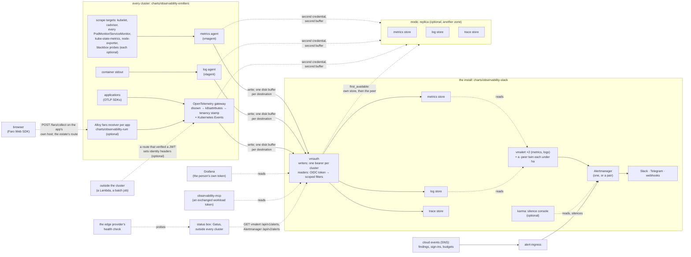
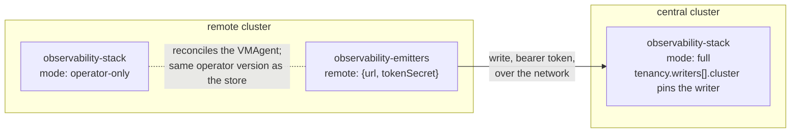

# Target state

What this repository is, the boundary between it and a consuming estate,
and the whole of what a consumer writes. This is the document to disagree
with first; the design pages it links to are each one piece of it, and
[adoption.md](adoption.md) is how a consumer installs the pieces in order.

## One sentence

A consuming estate installs the charts in this repository, supplies its
own names and secrets from its own private repository, and has — with no
other tooling — stores for metrics, logs and traces scoped to the caller
at the door, as a single install or a zone-redundant pair; collectors on
every cluster, with a receiver for telemetry born outside any cluster and
one for browsers; one router for every alert and one address every alert
reaches a human through; rules that notice a failure nobody else would
report; a watcher outside the estate that notices when the alerting
pipeline itself is dead; dashboards to read it all with, a Grafana to read
them in, and a read-only MCP surface so an agent can ask the same
questions.

## The boundary, stated once

| This repository (mechanism) | The consuming estate (data) |
|---|---|
| how a query is scoped to its caller | who the principals are and what they may read |
| how telemetry is stamped, buffered and replicated | the cluster names, the tier, the destinations |
| how an alert is routed, grouped, templated and refused | which cluster and namespace go to which channel; the bot token |
| how an event born outside the cluster becomes an alert | which topics are allowed and how each maps |
| how telemetry from outside a cluster is filed under a verified identity | which route verifies the token, and which headers it sets |
| how a browser's errors become issues, with no secret in the browser | the apps, their origins, their keys, the route on the app's host |
| how a box outside the clusters probes, pages and renders a status page | which hostnames, which companies, which domains |
| which dashboards exist and what variables they take | which of them are installed, and the estate's own |
| every refusal | every value that would have been refused |

Nothing in the left column names an account, a cluster, a hostname, a
channel, a company or a secret; `hack/leak-canary.sh` holds that in CI.
Nothing in the right column requires the estate to write a template, a
processor, a rule or a script — it writes values, and a small amount of
Pulumi that calls a package here.

## The pieces

Every piece is released; the state column says where its design page is.

| Piece | Kind | Design |
|---|---|---|
| `charts/observability-crds` | the CustomResourceDefinitions, owned separately | [adoption.md](adoption.md#the-crds-come-first-and-they-are-a-release-of-their-own) |
| `charts/observability-stack` | the stores (one install, or the primary of a pair), the proxy, the alerters, Alertmanager (one or a pair), karma, network policy, backups, optionally Grafana | [reference.md](reference.md#chartsobservability-stack), [high-availability.md](high-availability.md) |
| `charts/observability-stack`, `mode: replica` | the second half of a pair: the three stores and nothing else | [high-availability.md](high-availability.md) |
| `charts/observability-emitters` | per-cluster collection: metrics agent, log agent, OpenTelemetry gateway; optional kube-state-metrics, node-exporter, blackbox probes; the external OTLP receiver | [reference.md](reference.md#chartsobservability-emitters), [external-ingest.md](external-ingest.md) |
| `charts/platform-alerts` | the rules that catch a silent failure, and the groups for the platform components | [reference.md](reference.md#chartsplatform-alerts) |
| `pkg/tenancy` | one input, two shapes: the proxy's users or the issuer's claim | [reference.md](reference.md#pkgtenancy) |
| `notifications:` in the stack chart | the one router: receivers, routing shape, template, refusals; the store self-alerts; evaluating another store's rules (`vmalert.remoteEvaluators`) | [notifications.md](notifications.md) |
| `charts/alert-ingress` + `cmd/alert-ingress` | events born outside the cluster, into the same router | [alert-ingress.md](alert-ingress.md) |
| `pkg/statusbox` + `setup.sh` | the watcher outside: deadman, external probes, status pages | [statusbox.md](statusbox.md) |
| `charts/observability-dashboards` | the generic dashboards, and the lint every dashboard passes | [dashboards.md](dashboards.md) |
| `charts/observability-grafana` | one Grafana over several installs | [grafana.md](grafana.md) |
| `charts/observability-mcp` + `cmd/mcp-aggregator` | read-only MCP connectors over the stores and Grafana | [mcp.md](mcp.md) |
| `charts/observability-rum` | browser telemetry through Faro and Alloy; issues on the log store | [frontend.md](frontend.md) |

## How the pieces connect

One cluster running the install and its own collectors; everything
optional is marked. Solid arrows carry telemetry or alerts; dotted arrows
are reads, or paths that exist only when a feature is on.



Reading it:

- **Writers hold the redundancy.** No store here replicates across a
  zone. A cluster's three agents each send to every destination they are
  given with a disk buffer and a credential per destination; a pair of
  stores is two releases of the stack chart, and the proxy reads its own
  store first and falls over to the peer. [high-availability.md](high-availability.md)
  draws the pair's writes and reads on their own.
- **Identity is stamped where it can be seen, never where it is claimed.**
  The gateway resolves the pod behind a connection; the external receiver
  believes only the headers a route set after verifying a JWT
  ([external-ingest.md](external-ingest.md)); the browser receiver's own
  configuration is the app's identity ([frontend.md](frontend.md)). Every
  reader is scoped by the proxy to the clusters and namespaces its token
  allows, Grafana and the MCP connectors included.
- **One router.** Every alert vmalert evaluates and every event the cloud
  publishes reach a person through the same Alertmanager, routed by
  cluster × namespace × severity ([notifications.md](notifications.md)).
  The only things outside that router are the ones that must notice the
  router itself has died.

### Three parties watch each other

None of them is inside the thing it watches. The status box reads the
install's own alerting state directly — one bearer token, one route
(`tenancy.alertReaders`), the metrics vmalert's `/api/v1/alerts` and,
optionally, Alertmanager's `/api/v2/alerts` — nothing pushed into the box,
no adapter between the two vocabularies. The box probes the estate from
outside and pages on its own channel when that read goes quiet or the
Watchdog it is watching for disappears. The edge provider's health check
watches the box. A dead alerting path, a dead box or a dead estate is each
noticed by one of the other two; [statusbox.md](statusbox.md#internal--status-pulled)
has why this is a read and not a push, and why the third party is not
optional.

## Central install, remote writers

The diagram above draws one cluster running the install and its own
collectors. An estate with more than one cluster does not have to run a
second install for each: one cluster's `observability-stack` can be the
STORE for several others, each of which runs only
`charts/observability-emitters` and writes across the network to the one
that holds the data.



Two values carry the whole shape, both on `charts/observability-stack`
alone — the remote cluster's own `charts/observability-emitters` needs no
chart change to take part, only a values-level destination (`remote`, or
the low-level lists):

- **The writer's identity is minted where it runs, never handed to the
  install.** Each remote cluster mints its OWN write token locally — the
  same credential machinery every writer has always used, nothing new —
  and the install is handed the token's value (a Secret name it reads,
  never a value it generates) through whatever secret-distribution
  mechanism the estate already uses to get a value from one cluster's
  namespace into another's. This repository does not prescribe that
  mechanism; it is data, not mechanism, per the boundary above.
- **The install pins each remote writer to the cluster it is FOR.**
  `tenancy.writers[].cluster`, set, forces every series, log record and
  span that writer sends to belong to that cluster, overriding whatever
  the writer's own collector config claims — a bearer token alone proves
  nothing about which cluster it actually ran on. See
  [reference.md](reference.md#tenancy) and values.yaml's own comment on
  `tenancy.writers` for the mechanism per signal, and `tenancy.ownCluster`
  for the companion refusal that keeps a writer from being pinned to the
  install's own identity instead of a remote one.

A cluster that holds no store of its own still needs somewhere for
`charts/observability-emitters`' `VMAgent` custom resource to be
reconciled — that needs the VictoriaMetrics operator's CONTROLLER, not
just its CRDs (`charts/observability-crds` is CRDs-only, applied first,
same as everywhere else). `charts/observability-stack`'s `mode:
operator-only` is that: one chart, so a cluster running only the operator
gets the exact same operator version as the cluster running the full
stack, never a second pin to track. See [reference.md](reference.md#top-level-1)'s
`mode` row for the full contract.

A central install can itself be a pair: the remote cluster's `remote`
block then lists the replica under `replicas`, with a credential of its
own, and writes to both halves ([high-availability.md](high-availability.md#the-writers)).

## What a consumer writes, in full

For an estate with one install, one company and one edge provider — the
smallest shape that exercises everything. Every value below is invented.

**The stack** (`observability-stack`): the issuer and audience, the
principals and their grants (or the same list through `pkg/tenancy`),
the retention per store, the backup destination, the Secret names — and
the `notifications:` block: a Slack bot token Secret name, the external
URL, and the route list.

```yaml
notifications:
  externalUrl: https://grafana.example
  slack:
    workspaces:
      - name: acme
        appTokenSecret: {name: example-slack-bot, key: token}
  severities:
    critical: {receiver: slack, channel: "#alerts-critical"}
    warning:  {receiver: slack, channel: "#alerts"}
  routes:
    - match: {k8s_cluster_name: example-cluster}
      critical: "#alerts-critical"
      warning: "#alerts"
    - match: {k8s_namespace_name: example-app}
      critical: "#example-app"
      warning: "#example-app"
```

A pair adds `ha: {enabled: true, peer: {...}}`, two `zones` and a second,
stores-only release with `mode: replica`
([high-availability.md](high-availability.md#the-shape)).

**The emitters**, on every cluster: the cluster name, the tier, the
destinations (one `remote` block; with `replicas` for a pair), the
write-token Secret name. Optionally the probes, kube-state-metrics,
node-exporter, and the external receiver's header map and the route's
pods.

**The rules**: `platform-alerts` with the store list and the component
groups the cluster runs; the fleet-specific pack, if any, is the estate's
own chart.

**`alert-ingress`**: the topic allow-list and the mapping rules.

```yaml
topics:
  - "<the security-alerts topic ARN>"
mappings:
  - name: guardduty
    match: {"detail-type": "GuardDuty Finding"}
    alert:
      alertname: CloudSecurityFinding
      severity: '{{ if atLeast .detail.severity 7 }}critical{{ else }}warning{{ end }}'
      labels: {source: guardduty, account: '{{ .account }}', finding_id: '{{ .detail.id }}'}
      annotations: {summary: "{{ .detail.title }}"}
heartbeat:
  match: {"source": "alert-ingress-heartbeat"}
  interval: 15m
```

**The status box**: one Pulumi call with the release version, the
secrets, and the instance list — each instance a Gatus configuration the
estate renders from wherever it keeps its hostnames (or hands to
`statusbox.RenderGatus`). Today that list is ONE instance: a single
private page carrying every company's own component alongside cluster
infrastructure and the deadman group, reachable only over the tailnet —
no tunnel token, no public ingress, because nothing here is public yet
([statusbox.md](statusbox.md#the-shape)).

```go
statusbox.NewLightsail(ctx, "status", &statusbox.LightsailArgs{
    AvailabilityZone: "us-east-1a",
    Args: statusbox.Args{
        Version:  "v1.0.0",
        Hostname: "statusbox",
        Secrets: statusbox.Secrets{
            TailscaleAuthKey: tailnetKey,
            // opsYAML references ${ALERT_URL_ALERTS_READ}: the bearer
            // token tenancy.alertReaders minted, not a push URL — see
            // statusbox.md, "internal → status, pulled".
            AlertURLs: map[string]pulumi.StringInput{"alerts_read": alertsReadToken},
        },
        Instances: []statusbox.Instance{
            {Name: "ops", Port: 8084, Public: false, Config: opsYAML},
        },
    },
})
```

Later, once a company's own `status.<company domain>` hostname is
delegated, that company's public page is a SECOND instance added to the
same call — `TunnelToken` joins `Secrets`, a `{Name: "example-co", Port:
8081, Public: true, Config: exampleCoYAML}` entry joins `Instances`, and
its hostname joins `Hostnames: map[string]string{"example-co":
"status.example.com"}`. Nothing about the private instance above
changes when that happens.

**Dashboards and Grafana**: `observability-dashboards` with the
datasource UIDs, and either the stack's own Grafana or
`observability-grafana` with one datasource set per install; the estate's
own dashboards beside it, passing the same lint.

**Browser apps** (`observability-rum`): the OTLP gateway's address, one
entry per app (name, key Secret, origins), a route on each app's host, and
`smctl.repositoryTemplate` if the maps come from a registry.

**Agents** (`observability-mcp`): the issuer, the proxy image tag, one
`stores` entry per install and a machine principal for each in that
install's stack.

That is the whole of it. No estate writes a Helm template, an
Alertmanager routing tree, a collector pipeline, a rule expression for
the stack's own health, a cloud-init file or a shell script.

## What is deliberately not in the target

- **On-call and incident tooling.** Schedules, escalation, phone paging,
  postmortems. Alertmanager can hand an alert to any of those; this
  repository does not pick one, because that choice is about a team's
  rotation and not about telemetry.
- **Email as a receiver.** Offered by Alertmanager, not surfaced here:
  a notification to a mailbox is a notification nobody is looking at,
  and a notification to a group is one the group's mail policy may
  silently reject. An estate that wants it can add the receiver kind;
  the chart does not make it easy.
- **A second alert router.** ChatOps bots, cloud-native chat
  integrations, Grafana's own alerting — each is a second place alerts
  can go and a second place silences have to be kept. karma is not one:
  it is a console over the same Alertmanager.
- **An error tracker.** Issues are built on the log store from a
  fingerprint the receiver computes ([frontend.md](frontend.md)), not on
  a second store with a second retention.
- **Multi-vantage probing from this repository's own hosts.** One box
  is one vantage; the second vantage is the edge provider's health
  checks, which exist anyway.
- **Anything that names the estate.** By construction.

## How to read the rest

- [doctrine.md](doctrine.md) — the design and ownership rules, which
  live in the shared component contract, and the guard rails CI enforces.
- [notifications.md](notifications.md), [alert-ingress.md](alert-ingress.md),
  [statusbox.md](statusbox.md), [dashboards.md](dashboards.md),
  [grafana.md](grafana.md), [mcp.md](mcp.md), [frontend.md](frontend.md),
  [external-ingest.md](external-ingest.md), [kube-state-metrics.md](kube-state-metrics.md),
  [tenancy-owner.md](tenancy-owner.md) — one design page per piece: the
  values it takes, what it renders, what it refuses, how it is proven.
- [high-availability.md](high-availability.md) — the pair: what each
  half renders, what a zone loss costs, the writers, the runbook.
- [emitting.md](emitting.md) — the guide for whoever wires a service's
  SDK: the one address, which attributes are theirs, how to ask the
  store.
- [adoption.md](adoption.md) — install order for the complete set, and
  every upgrade that changes what runs.
- [safety.md](safety.md), [reference.md](reference.md) — every refusal,
  every value.
